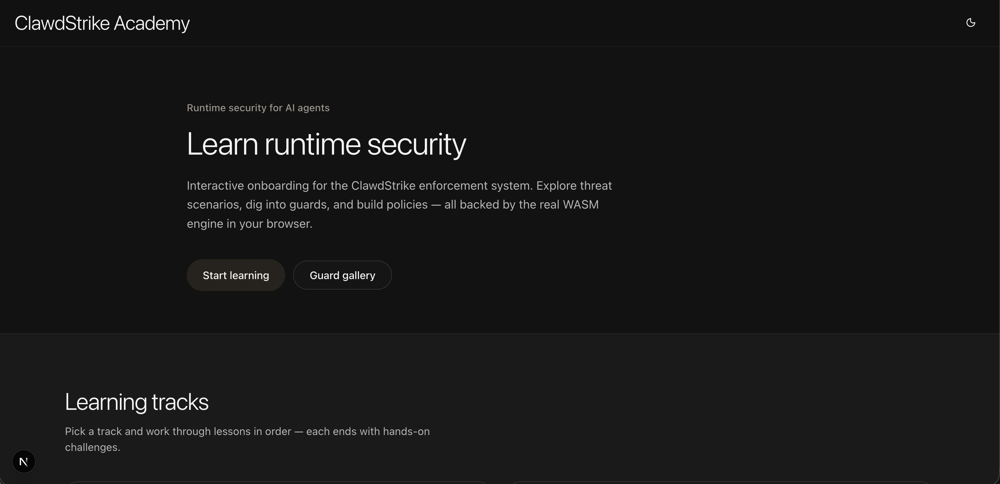
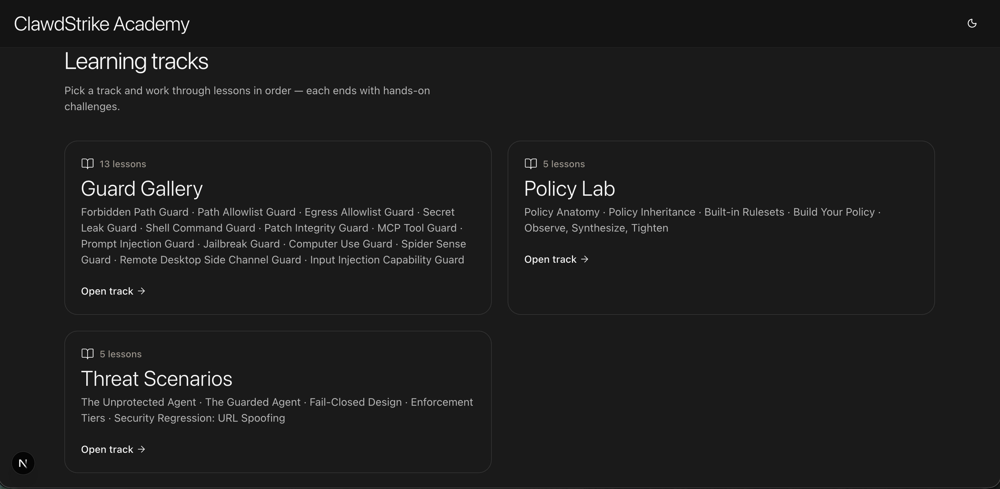

# ClawdStrike Academy

**Learn ClawdStrike by doing.** An interactive learning surface for the runtime security stack: guided tracks, a guard gallery, policy exercises, and a real policy engine compiled to **WebAssembly** — running in your browser.

---

## What you’ll find here

- **Learning tracks** — ordered lessons from first principles to deeper topics (threat scenarios, policy lab, guard deep-dives).
- **Guard Gallery** — all built-in guards in one place, with tiered explanations and hands-on pages.
- **Policy Lab** — edit YAML, compare rulesets, see inheritance — tied to how ClawdStrike actually evaluates policy.
- **No separate install for readers** — when this app is hosted or you run it locally, the heavy lifting is the same engine the project ships, just behind a friendly UI.

---

## Preview

  <strong>Landing</strong> — hero, tracks, and calls to action

  

  <strong>Guard Gallery</strong> — browse guards by tier

  

---

## More about the project

ClawdStrike is the wider **policy, receipts, and enforcement** system this Academy teaches. Start at the [repository root README](../../README.md) for install, architecture, and community links.

---

## For contributors & tooling

If you are **developing this app**, running it locally, or you are an **AI agent** changing UI or behavior, use the dedicated guide — it holds setup commands, design rules, and repo-specific notes:

**[→ Development guide (Contributors & agents)](./DEVELOPMENT.md)**
