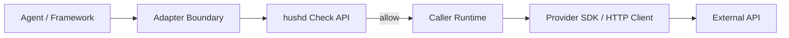

# Secret Broker -- Current State

> **Status:** Draft | **Date:** 2026-03-12
> **Audience:** implementers and reviewers

## 1. Summary

Clawdstrike already has the policy and adapter surfaces required to reason about outbound actions.
What it lacks is an execution plane that **owns secret materialization** for those actions.

Today the system can:

- classify and normalize network targets
- enforce `network_egress` through policy
- sanitize outputs for secret leakage
- wrap framework tool dispatch with fail-closed interceptors
- route evaluation through local or remote engines

Today the system cannot:

- replace raw provider credentials with secret references at execution time
- cryptographically bind "egress allowed" to "this credential was used for this request"
- return broker-origin execution evidence into the receipt lifecycle
- provide a first-class enterprise story for secret-safe provider access

## 2. Existing Building Blocks

### 2.1 Tool-boundary interception already exists

`FrameworkToolBoundary` already owns pre-execution and post-execution interception around tool
dispatch.

More importantly, the adapter-core contract already supports three useful execution handoffs:

- `modifiedInput`
- `modifiedParameters`
- `replacementResult`

That means a v1 broker path can ship without breaking `PolicyEngineLike` or rewriting every
dispatcher in the repo. A broker-aware wrapper can evaluate policy, obtain a capability, execute
through `brokerd`, and return a synthetic result through `replacementResult` while still using the
existing post-execution sanitizer path.

### 2.2 Secure tool wrappers already support synthetic execution

`wrapExecuteWithInterceptor()` and `secureToolSet()` already honor `replacementResult` and input
rewrites. That is the lowest-risk seam for broker-backed execution because it lets Clawdstrike
adopt brokering in explicit tool/provider wrappers before generalizing the framework boundary API.

### 2.3 Provider/framework wrappers already exist

`packages/adapters/clawdstrike-openai/src/secure-tools.ts` and
`packages/adapters/clawdstrike-openai/src/tool-boundary.ts` are thin wrappers around adapter-core.
That is useful because it means a first framework integration can land with small surface-area
changes and then be mirrored into `clawdstrike-claude`, `clawdstrike-opencode`, and
`clawdstrike-langchain` later.

### 2.4 Network targets are already normalized

`parseNetworkTarget()` in adapter-core already does fail-closed parsing for malformed or hostless
targets. A broker client can reuse this rather than inventing a parallel URL parser.

### 2.5 `HushEngine` already treats egress as a first-class action

`check_egress()` already exists and is consistent with the rest of the engine action model. That
means broker authorization should layer onto existing `GuardAction::NetworkEgress`, not create a
separate parallel policy universe.

### 2.6 Output controls already exist

`OutputSanitizer` already redacts secrets and sensitive data in model or tool outputs. The broker
should complement this rather than replace it.

### 2.7 `hushd` already owns identity-rich request context

The check API already knows about:

- `session_id`
- `endpoint_agent_id`
- `runtime_agent_id`
- `runtime_agent_kind`
- origin context

That is enough context to issue tightly-scoped broker capabilities.

### 2.8 Remote evaluation already has a degraded mode

`createStrikeCell()` in `clawdstrike-hushd-engine` can fall back to a local engine when `hushd` is
offline.

That is a useful existing behavior, but brokered execution should not silently inherit it.
If capability issuance or broker execution is required, the system should fail closed unless a
specific local broker authority has been configured. "Offline fallback" and "secret materialization"
should remain separate concepts.

### 2.9 The docs already describe brokered tools as Tier 2

`docs/src/concepts/enforcement-tiers.md` already defines Tier 2 as brokered tools for untrusted
code execution. That matters because the secret broker plan is directly aligned with current repo
language and product claims.

### 2.10 `hush-proxy` is utility code, not the broker

`crates/libs/hush-proxy` currently provides DNS/SNI/domain-policy helpers. Some of that code may be
reusable for hostname validation or future generic HTTPS policy support, but it should not be
treated as evidence that the repo already has a broker daemon waiting to be productized.

## 3. Current Execution Path

### 3.1 Weak point

The weak point is `Caller Runtime`.

Even if Clawdstrike approves the egress:

- credentials may already be sitting in env vars or config
- SDK clients may inject `Authorization` headers outside Clawdstrike control
- post-execution evidence is limited to caller-reported details
- the secret itself may be exposed to logs, traces, or prompt-visible tool output

## 4. Why Existing Guards Are Not Enough

### 4.1 Egress allowlist is necessary but incomplete

An allowlist can say "you may call `api.openai.com`" but it does not say:

- which credential reference may be used
- whether the credential belongs to the correct tenant / environment
- whether the request actually used the intended destination and path
- whether the runtime ever had access to the credential

### 4.2 Secret leak controls are downstream defenses

The output sanitizer and `secret_leak` guard are still required, but they are reactive to content
that exists somewhere in memory or output streams. A broker reduces the chance that the secret
material exists in the caller at all.

## 5. Constraints

1. Clawdstrike's threat model remains **tool-boundary plus proof**, not "we are now a universal
   network appliance."
2. The initial design must be **fail-closed**.
3. Provider-specific integrations are acceptable and preferred in v1.
4. Transparent TLS interception is explicitly out of scope for the first release.
5. The open repo must remain useful even if the hosted secret backend is commercial.
6. The v1 TS integration should avoid a breaking redesign of `PolicyEngineLike` unless the simpler
   wrapper-based approach proves insufficient.

## 6. Concrete Integration Points

| Layer | Files | Why it matters |
| --- | --- | --- |
| adapter-core preflight | `packages/adapters/clawdstrike-adapter-core/src/base-tool-interceptor.ts` | current place to derive broker intent, normalize dispatch input, and optionally return a synthetic broker result |
| adapter-core wrappers | `packages/adapters/clawdstrike-adapter-core/src/framework-tool-boundary.ts`, `packages/adapters/clawdstrike-adapter-core/src/secure-tool-wrapper.ts` | current execution wrappers already understand rewritten input and `replacementResult` |
| adapter-core contracts | `packages/adapters/clawdstrike-adapter-core/src/interceptor.ts`, `packages/adapters/clawdstrike-adapter-core/src/adapter.ts`, `packages/adapters/clawdstrike-adapter-core/src/engine.ts` | likely place for opt-in broker config/types while keeping engine evaluation simple |
| egress parsing | `packages/adapters/clawdstrike-adapter-core/src/policy-event-factory.ts`, `packages/adapters/clawdstrike-adapter-core/src/network-target.ts` | existing fail-closed target parsing should remain the shared normalization logic |
| framework adoption | `packages/adapters/clawdstrike-openai/src/secure-tools.ts`, `packages/adapters/clawdstrike-openai/src/tool-boundary.ts` | best first adopter because the wrappers are intentionally small |
| remote hushd client | `packages/adapters/clawdstrike-hushd-engine/src/strike-cell.ts` | documents the current degraded/offline path that broker-required actions must not bypass |
| daemon routes | `crates/services/hushd/src/api/mod.rs`, `crates/services/hushd/src/api/check.rs`, `crates/services/hushd/src/api/v1.rs` | route wiring, identity-rich request handling, and reusable API envelope patterns |
| daemon state/config | `crates/services/hushd/src/state.rs`, `crates/services/hushd/src/config.rs` | likely place for broker dependencies, secret backend config, and capability signing setup |
| policy schema | `crates/libs/clawdstrike/src/policy.rs` | place to add a broker stanza and possibly origin-aware broker overlays |
| runtime engine | `crates/libs/clawdstrike/src/engine.rs` | should stay the single authorization source of truth for egress |
| agent packaging | `apps/agent/src-tauri/src/settings.rs`, `apps/agent/scripts/prepare-bundled-hushd.sh`, `apps/agent/README.md` | local developer packaging and lifecycle management for a bundled broker |
| existing architecture docs | `docs/src/concepts/enforcement-tiers.md` | needed to keep product claims aligned with enforcement reality |

## 7. Current Gaps

| Gap | Why it matters |
| --- | --- |
| No broker capability token | No safe handoff from policy decision to execution |
| No secret reference model in policy | No way to bind egress policy to credential identity |
| No broker execution evidence | Receipts cannot prove the outbound action actually executed as approved |
| No adapter-level broker client | Framework packages cannot adopt the model incrementally |
| No broker service | There is no trusted component that can inject credentials without exposing them to the caller |

## 8. Conclusion

Clawdstrike is already close to supporting a broker tier from a **policy** perspective. The missing
work is the **execution and evidence layer** around secrets and outbound requests.

That makes this a good extension project:

- close to the existing architecture
- high differentiation value
- possible to phase in without rewriting adapters or guards
