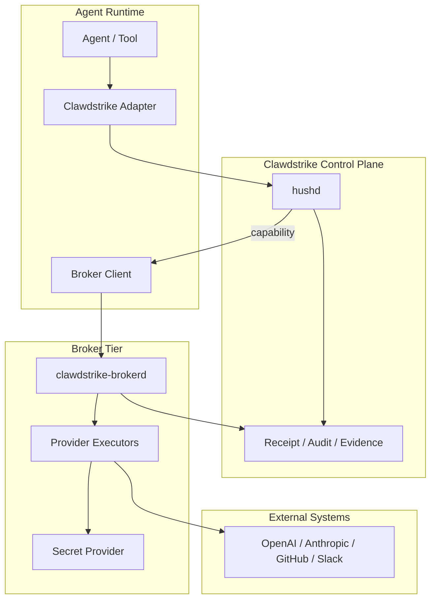
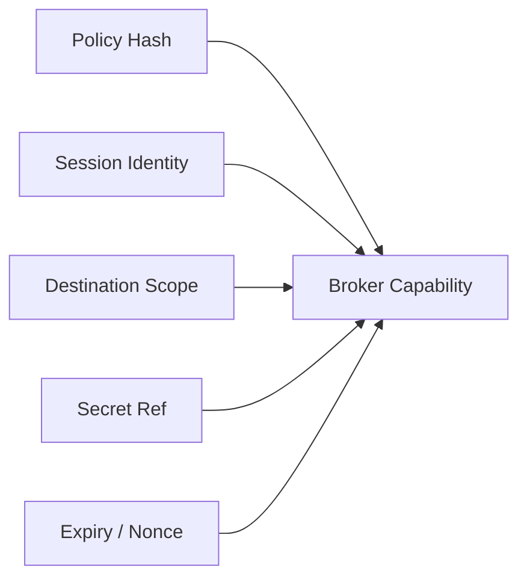
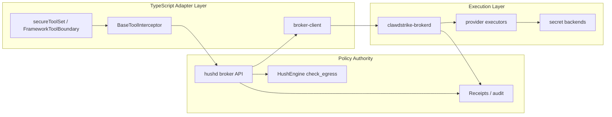

# Secret Broker -- Target Architecture

> **Status:** Draft | **Date:** 2026-03-12
> **Audience:** platform, daemon, adapter, and cloud teams

## 1. Architecture Goal

Create a new Clawdstrike enforcement tier in which outbound requests that need credentials are
executed by a trusted broker under a short-lived capability issued by `hushd`.

The broker is not the decision-maker. `hushd` remains the policy authority. The broker is the
**trusted executor** for secret-bearing outbound requests.

## 2. High-Level Shape

## 3. Trust Boundaries

### 3.1 Trusted components

- `hushd`
- `clawdstrike-brokerd`
- secret provider backend

### 3.2 Semi-trusted components

- adapter clients
- local desktop agent packaging

### 3.3 Untrusted or policy-constrained components

- model output
- user prompts
- arbitrary framework tools
- external providers

## 4. Execution Flow

### 4.1 Phase A: preflight

1. adapter identifies a provider-bound outbound operation
2. adapter calls `hushd` with intent:
   - target host/path/method
   - session/runtime identity
   - provider type
   - secret reference alias requested
3. `hushd` evaluates:
   - egress allowlist
   - posture and origin state
   - broker-specific policy constraints
4. if allowed, `hushd` issues a short-lived broker capability

### 4.2 Phase B: execution

1. broker client sends the capability and normalized request to `brokerd`
2. `brokerd` validates the capability signature and expiry
3. `brokerd` resolves `CredentialRef`
4. `brokerd` injects provider auth at the last possible point
5. request is executed by a provider-specific executor or strict HTTPS executor

### 4.3 Phase C: evidence

1. `brokerd` emits execution evidence
2. `hushd` stores evidence and binds it to receipt lineage
3. adapter receives streamed response or result payload
4. output sanitization still applies before content leaves the protected surface

### 4.4 Adapter-side handoff strategy

The current repo already supports two plausible broker handoff patterns.

#### Option A: wrapper-owned broker execution

- a broker-aware wrapper calls `hushd` for a capability
- the wrapper invokes `brokerd`
- the wrapper returns the broker result through `replacementResult`

Pros:

- no immediate redesign of `PolicyEngineLike`
- minimal change to current TS adapters
- ideal for first provider/framework integrations

Cons:

- interception and execution are coupled in the wrapper layer

#### Option B: boundary-owned broker dispatch

- interception returns a structured broker directive
- `FrameworkToolBoundary` or a sibling wrapper performs the broker call

Pros:

- cleaner separation between policy evaluation and execution
- better long-term shape for many adapters

Cons:

- requires new adapter-core interface surface

### 4.5 Recommended v1 choice

Ship **Option A** first for explicit provider/framework wrappers, then introduce a cleaner explicit
broker directive only if multiple adopters make the wrapper-owned path awkward.

## 5. Sequence Variants

### 5.1 Explicit provider mode

Best for v1.

- adapter knows it is making an OpenAI or Anthropic call
- broker executor understands provider auth semantics
- destination and path space are narrow
- easier to reason about than generic proxying

### 5.2 Explicit HTTPS mode

Useful after the provider model is stable.

- adapter passes method/url/body directly
- broker validates destination against capability
- still no transparent MITM

### 5.3 Transparent proxy mode

Deferred.

- largest operational surface
- most TLS and compatibility risk
- should only be considered after explicit broker execution proves product value

## 6. Capability Model

Capabilities should be:

- short-lived
- destination-scoped
- method-scoped
- exact-path-scoped in v1
- secret-ref-scoped
- bound to policy hash and session identity
- sender-constrained when `brokerd` is remote
- single-use or low-use-count where practical

## 7. Evidence Model

The broker must return enough information to prove:

1. the capability was valid
2. the destination matched the authorized scope
3. the request executed
4. the response shape was observed
5. the secret reference actually used matched the policy decision

Suggested evidence fields:

- capability ID
- execution timestamp
- resolved secret reference ID
- destination URL / method
- request body hash where policy allows request binding without storing raw content
- remote certificate hash if TLS
- status code
- response body hash or stream hash
- bytes sent / received

## 8. Deployment Modes

### 8.1 Local developer mode

- `brokerd` runs beside `hushd` in the desktop agent or as a sibling daemon
- secret provider may be file-backed or OS-keychain-backed
- aimed at secure developer workflows

### 8.2 Enterprise self-hosted mode

- `brokerd` runs as a service near `hushd`
- secret provider integrates with enterprise secret systems
- receipt/evidence lives in the enterprise Clawdstrike control plane

### 8.3 Managed cloud mode

- `brokerd` becomes a multi-tenant managed execution tier
- stronger isolation, billing, and policy packs are possible
- likely commercial

## 9. Failure and Degraded Behavior

### 9.1 `hushd` unavailable

- ordinary eval-only actions may continue to use the current degraded-mode semantics where
  configured
- broker-required actions must fail closed
- the presence of `offlineFallback` in `createStrikeCell()` must not imply "offline secret use"

### 9.2 `brokerd` unavailable

- requests that require broker routing are denied
- adapters should surface a broker-specific deny/error reason rather than silently falling back to
  direct SDK execution

### 9.3 Evidence ingestion unavailable

- non-streaming execution should prefer "execute only if evidence can be recorded"
- streaming execution will likely need a start event and a completion event
- if streaming transport is event-based, chunks should carry monotonic sequence numbers or event
  IDs to avoid ambiguous reconnect/replay handling
- if completion evidence cannot be persisted, the receipt chain should mark execution incomplete
  rather than pretending success

### 9.4 Local authority exceptions

If Clawdstrike later supports a fully local desktop mode where `hushd`, `brokerd`, and the secret
backend are all local trusted components, that should be treated as an explicit deployment mode,
not as an accidental side effect of remote-control-plane downtime.

## 10. Design Choices

### 10.1 Keep `hushd` as policy authority

This avoids building a second policy brain into the broker.

### 10.2 Prefer provider executors over generic proxying

Provider executors give:

- tighter semantics
- lower operational ambiguity
- less TLS complexity
- better evidence quality

### 10.3 Sender-constrain remote capability use

If the broker is reached over a network hop, the capability should not be treated as a pure bearer
token. The safer default is a DPoP-like proof, mutual TLS, or workload-identity binding so a
captured capability cannot simply be replayed by another caller.

### 10.4 Keep output sanitization in the pipeline

The broker reduces secret exposure. It does not remove the need to sanitize model and tool output.

## 11. Concrete Repo Integration Map

### 11.1 TypeScript adapter layer

| Files | Role |
| --- | --- |
| `packages/adapters/clawdstrike-adapter-core/src/base-tool-interceptor.ts` | derive broker intent, invoke broker client in v1 wrapper-owned mode |
| `packages/adapters/clawdstrike-adapter-core/src/framework-tool-boundary.ts` | later host a cleaner broker directive if needed |
| `packages/adapters/clawdstrike-adapter-core/src/secure-tool-wrapper.ts` | easiest first adoption seam for wrapped tools |
| `packages/adapters/clawdstrike-adapter-core/src/adapter.ts` / `src/interceptor.ts` | optional broker config/types |
| `packages/adapters/clawdstrike-broker-client/` | new package for capability issuance + execute calls |

### 11.2 Rust policy/control layer

| Files | Role |
| --- | --- |
| `crates/services/hushd/src/api/mod.rs` | route registration |
| `crates/services/hushd/src/api/check.rs` | source of identity/session/origin context to reuse |
| `crates/services/hushd/src/api/broker.rs` | new capability + evidence endpoints |
| `crates/services/hushd/src/state.rs` | broker dependencies and signing state |
| `crates/services/hushd/src/config.rs` | broker and secret-backend config |
| `crates/libs/clawdstrike/src/policy.rs` | broker policy schema additions |
| `crates/libs/clawdstrike/src/engine.rs` | keep canonical egress authorization path |

### 11.3 Runtime and packaging layer

| Files | Role |
| --- | --- |
| `apps/agent/src-tauri/src/settings.rs` | local broker enablement and config |
| `apps/agent/scripts/prepare-bundled-hushd.sh` | future bundling for `brokerd` beside `hushd` |
| `apps/agent/README.md` | local deployment documentation |
| `docs/src/concepts/enforcement-tiers.md` | product-claim alignment for Tier 2 |
| `crates/libs/hush-proxy/` | optional reusable utilities, not the broker service |

## 12. Proposed Repo Shape

| Area | Candidate |
| --- | --- |
| broker daemon | `crates/services/clawdstrike-brokerd/` |
| hushd broker API | `crates/services/hushd/src/api/broker.rs` |
| shared broker schemas | `packages/adapters/clawdstrike-adapter-core/src/broker-types.ts` and Rust equivalents |
| broker client package | `packages/adapters/clawdstrike-broker-client/` |
| provider integration | `packages/adapters/clawdstrike-openai/` plus future provider packages |

## 13. Success Criteria

The architecture is successful if:

1. agents no longer need raw provider credentials for covered integrations
2. every brokered request can be tied to a Clawdstrike policy decision and receipt lineage
3. adapters can adopt the broker incrementally
4. the first release does not require transparent interception or local root CA installation
