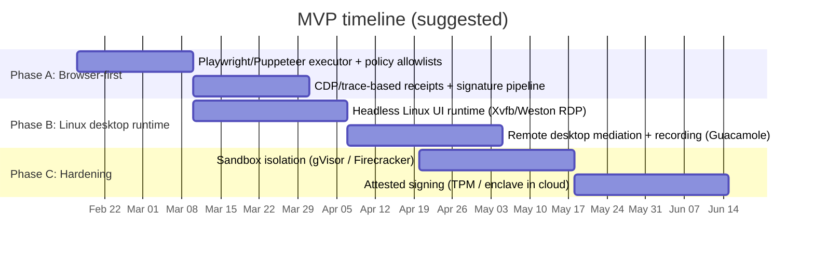

# Implementing a Clawdstrike-Style Computer‑Use Agent Gateway: 2026 Landscape and MVP Blueprint

> Review status (2026-02-18): reviewer pass #5 completed. This document contains inline correction notes and verified source links, but still includes unresolved citation tokens from the original agent export.

## Executive summary

A “computer‑use agent gateway” (desktop/OS input + UI surface) is best designed as a **controlled UI runtime** plus a **policy‑enforcing mediation layer** that is the *only* way an agent can observe pixels and cause clicks/keystrokes. The most robust designs treat the gateway as the security boundary (not the agent) and make the runtime ephemeral and compartmentalized (container/microVM/VM), with receipts signed by a key protected by a hardware root of trust when possible. citeturn8search0turn8search4turn10search0turn16search2turn9search6

A high‑leverage MVP path is **browser‑first**—because browser automation already provides structured context (DOM + accessibility tree) and deterministic instrumentation APIs. The most mature ecosystem options center on **Playwright**, **Puppeteer**, and **Selenium/WebDriver** for action execution; **Chrome DevTools Protocol (CDP)** and **WebDriver BiDi** for low‑level telemetry/event streaming; and browser‑native screenshot/trace capture for receipts. citeturn18search4turn18search0turn0search3turn0search2turn18search5

For full desktop (Windows/macOS/Linux) “click around the OS” coverage, the practical gateway patterns are:

- **Remote‑desktop‑mediated desktops** (VNC/RDP/WebRTC streaming), where the gateway is the one and only participant that speaks the protocol and enforces policy; and/or
- **Virtual display / headless compositor** approaches on Linux (Xvfb, Weston RDP backend, GNOME remote desktop) that run without physical GPU/input, simplifying containment and capture. citeturn2search4turn16search4turn4search0turn24search3turn24search2

For signed receipts, treat each action as an append‑only event with **hash‑chained evidence** (frame hashes + optional diffs + structured UI context) and produce signatures using (a) traditional keypairs (OpenSSL/libsodium) and/or (b) “keyless” or transparency‑log systems such as **Sigstore (cosign + Rekor)** for auditability and witnessability. citeturn12search0turn9search8turn9search16turn15search3turn15search13

When threat models include **malicious/compromised agents**, **host compromise**, and **insider threats**, the strongest practical posture is: isolate the UI runtime in a microVM/VM (Firecracker/KVM/QEMU/Hyper‑V/Apple Virtualization), keep signing keys out of the agent and (ideally) out of the host OS via TEEs/attestation (Nitro Enclaves / SGX / SEV‑SNP / TDX), and default to fail‑closed for sensitive actions (file exfil, credential entry, security settings changes). citeturn22search0turn8search3turn11search4turn10search0turn10search2turn10search3

## Reviewer annotations (2026-02-18)

> REVIEW-CORRECTION: The `cite...`, `entity...`, and `image_group...` tokens are unresolved export artifacts and are not verifiable citations. Keep claims, but replace tokens with concrete URLs before this report is treated as canonical.

> REVIEW-CORRECTION: Treat WebDriver BiDi as an evolving Editor's Draft and implementation matrix, not a fully stable cross-browser foundation yet. Build fallback paths for CDP and classic WebDriver.

> REVIEW-CORRECTION: Puppeteer WebDriver BiDi support is real but scoped; design your transport abstraction so unsupported commands can fall back cleanly.

> REVIEW-CORRECTION: `SendInput` is constrained by UIPI, and failure caused by UIPI is not surfaced with a special error code. Policy should assume silent failure is possible and require post-action assertions.

> REVIEW-CORRECTION: XDG RemoteDesktop/ScreenCast portals are user-consent mediated and desktop-environment dependent. They are a safer default for Wayland, but not a drop-in unattended control channel.

> REVIEW-CORRECTION: Sigstore/Rekor improves external witnessability. It does not replace local append-only storage, retention controls, or deterministic artifact hashing.

> REVIEW-GAP-FILL: This repo already has signed receipts (`create_signed_receipt`) and canonical JSON guidance. The CUA receipt proposal should be framed as an extension to existing `SignedReceipt` metadata, not as a parallel incompatible schema.

> REVIEW-GAP-FILL: Add policy parity planning early: map CUA actions into existing guard concepts (`egress_allowlist`, `mcp_tool`, `forbidden_path`, `secret_leak`) before introducing a brand-new policy DSL.

### Pass #2 reviewer focus (2026-02-18)

> REVIEW-P2-CORRECTION: Treat all numeric performance claims (latency, throughput, overhead) as environment-specific until reproduced on project benchmark fixtures.

> REVIEW-P2-GAP-FILL: Require explicit verifier contracts for every receipt evolution step (mandatory checks, error codes, backward compatibility behavior).

> REVIEW-P2-CORRECTION: During architecture hardening, preserve existing `SignedReceipt` trust paths as baseline and layer new envelope/attestation mechanisms incrementally.

### Pass #3 reviewer focus (2026-02-18)

> REVIEW-P3-CORRECTION: Treat architecture claims as enforceable properties with tests (not just component selections).

> REVIEW-P3-GAP-FILL: Require explicit acceptance criteria per topic so agent-written expansions can be validated and merged safely.

> REVIEW-P3-CORRECTION: Keep policy, evidence, and receipt evolution backward-compatible with current Clawdstrike trust/verification paths unless a deliberate migration plan is defined.

### Pass #4 reviewer focus (2026-02-18)

> REVIEW-P4-CORRECTION: Convert soft recommendations into implementation artifacts (policy matrices, verifier policies, capability manifests, migration fixtures).

> REVIEW-P4-GAP-FILL: Require machine-checkable acceptance gates per topic before promoting agent-generated deep-dive content to canonical guidance.

> REVIEW-P4-CORRECTION: Preserve a single baseline trust root and explicit migration path for any new envelope/attestation mechanism.

### Pass #5 reviewer focus (2026-02-18)

> REVIEW-P5-GAP-FILL: Consolidate per-topic TODO items into a single prioritized execution backlog with sequencing and acceptance criteria.

> REVIEW-P5-CORRECTION: Treat backlog artifacts as implementation contracts; promote deep-dive guidance to canonical only after referenced artifacts exist and pass their acceptance checks.

> REVIEW-P5-CORRECTION: Keep index/report/log cross-linked so ongoing agent output can be triaged against a single execution plan.

## Assumptions and threat model

**Assumptions (explicit because unspecified):**

- The gateway is a *service boundary* that multiple agent frameworks can call (tool boundary), and **the agent itself is untrusted** by default. This matches the “agent intent → action” boundary you described, where the gateway is the place to enforce “what is allowed” and to produce verifiable receipts. (Design assumption; corroborated by the security posture implied by sandboxing/attestation tooling referenced below.) citeturn8search1turn22search2turn10search0turn10search9
- Target platforms include **macOS, Windows, Linux**, plus a **browser‑first** mode that can run headless or headed. citeturn18search4turn11search4turn11search1turn4search0
- Receipts must support: **action logs + timestamps**, **screenshots/frame hashes/diffs**, optional **DOM/accessibility context**, and **cryptographic signatures** with a clear verification story. citeturn9search16turn15search3turn7search1

**Threat model (explicit because unspecified):**

- **Malicious/compromised agent**: tries to exfiltrate secrets, click unsafe UI paths, bypass policies, or forge receipts.
- **Host compromise**: adversary has OS‑level access on the machine running the gateway and attempts to tamper with logs/frames or steal signing keys.
- **Insider threats**: authorized operators attempt to hide/alter what happened, or over‑privilege the agent/runtime. (Mitigations emphasize append‑only logs + transparency + hardware‑anchored keys.) citeturn9search16turn10search0turn16search3turn16search18

**Security goals (operationally testable):**

- **Policy correctness**: actions are blocked/allowed exactly per policy; default‑deny available.
- **Receipt integrity**: receipts are tamper‑evident and attributable to a specific gateway build + configuration; ideally attestable.
- **Data minimization**: capture and store only what is needed; redact sensitive regions/fields where feasible.
- **Containment**: compromise of the UI runtime should not compromise the gateway, and compromise of the agent should not compromise either. citeturn8search1turn22search0turn10search2turn13search0

## Building blocks and deployment models

**Browser‑first runtime (recommended MVP starting point).** Browser automation stacks provide:
- high‑level action APIs (click, type, navigate),
- low‑level event streams (network, console, DOM mutations),
- structured UI context from DOM and accessibility trees, and
- reliable screenshot/trace primitives. citeturn18search4turn0search3turn0search2turn7search1turn12search7

In particular, accessibility capture via CDP can fetch the full accessibility tree (`Accessibility.getFullAXTree`), which is valuable for receipts and for selector‑free targeting strategies (e.g., “click the button named ‘Submit’”). citeturn7search1

**Linux desktop runtime (lowest friction for “real desktop” MVP).** Linux gives multiple “headless desktop” options:

- **X11 virtual framebuffer**: Xvfb runs an X server with no display hardware (“virtual memory framebuffer”)—useful for running GUI apps in containers/servers. citeturn4search0  
- **Wayland headless compositor + remote backend**: Weston can run headless and (notably) includes an **RDP backend** that lets users interact *only* by connecting with RDP—handy for controlled environments without physical GPU/input devices. citeturn24search3turn4search9turn24search11  
- **GNOME remote desktop server**: supports RDP/VNC backends; uses PipeWire for pixel streaming and separate plumbing for input; suitable when you want “a real desktop environment” but need to respect Wayland’s security model. citeturn24search2turn13search0

**Windows/macOS desktop runtime (higher friction; best via isolation).**
- Windows capture can use the **Desktop Duplication API** (DXGI) that exposes the current desktop frame via `AcquireNextFrame`, designed to support desktop collaboration/remote desktop scenarios. citeturn4search3turn4search7  
- macOS capture can use **ScreenCaptureKit** (“high‑performance frame capture of screen and audio content”). citeturn5search0turn5search4  

Input injection, however, is platform‑policy constrained:
- Windows `SendInput` inserts events into the input stream but is subject to **UIPI integrity‑level restrictions** (cannot inject into higher integrity processes). citeturn5search2  
- macOS low‑level event handling and event taps are exposed via Quartz Event Services. citeturn5search1turn5search12  

Practically, **treat Windows/macOS UI runtimes as VMs** (Hyper‑V / Apple Virtualization framework) and mediate UI via remote desktop protocols, so the gateway logic can remain consistent and the host OS doesn’t need broad injection privileges across arbitrary apps. citeturn11search1turn11search4turn14search1turn2search3

**Deployment models (local vs remote vs cloud).**

- **Local VM/container** (developer workstation / on‑prem): fastest iteration; threat is “agent compromise” more than “cloud operator compromise.” Use Docker/containerd plus optional sandbox runtime (gVisor) for quick starts; microVMs (Firecracker/Kata) for stronger containment. citeturn11search18turn11search3turn8search1turn19search3turn19search0  
- **Remote desktop gateway** (self‑hosted): centralizes policy and audit across users/agents. Apache Guacamole is a mature “clientless remote desktop gateway” supporting VNC/RDP/SSH, and it includes session recording support via Guacamole protocol dumps. citeturn2search4turn18search7turn16search4turn16search8  
- **Cloud‑hosted**: best for elastic scaling and stronger hardware isolation, but you must assume insider risk at the infrastructure layer. Use confidential computing + attestation (e.g., Nitro Enclaves with KMS integration; Azure Attestation) if receipts must remain trustworthy even under partial host compromise. citeturn10search0turn10search9turn10search12

> REVIEW-NOTE: `image_group` token removed from trust path; replace with concrete image assets or links if diagrams are required for docs publishing.

## Comparative tables

Notes on interpretation: “maturity” below is operational (production adoption, stability signals like long‑lived repos/specs/releases) rather than marketing. License and language are from official repos/specs where available.

### Browser automation

| Project | Use-case fit | Platforms | API surface | Security features | Performance | Ease of integration | Recommended role in MVP |
|---|---|---|---|---|---|---|---|
| Playwright (Apache‑2.0; JS/TS+Python+etc; mature) citeturn0search4turn0search0turn18search0turn18search4 | Best “browser‑first computer use”; strong tracing and cross‑engine | Windows/macOS/Linux; Chromium/WebKit/Firefox citeturn18search4 | High‑level automation; rich tooling (tracing, screenshots) citeturn18search4 | Depends on your sandbox; great observability primitives | Typically fast; designed for reliable automation | High (official bindings/docs) citeturn18search0 | Primary browser executor + evidence capture for MVP |
| Puppeteer (Apache‑2.0; JS/TS; mature) citeturn0search5turn0search1turn18search5turn18search9 | Excellent Chromium‑first; BiDi support for Firefox/Chrome where available | Cross‑platform; Chrome/Firefox citeturn0search5 | CDP by default; supports WebDriver BiDi with limits citeturn18search5turn18search9 | Same sandbox caveats; protocol‑level introspection | Very good for CDP‑centric telemetry | High (Node ecosystem) | Alternative/secondary browser executor; good for CDP‑native logging |
| Selenium/WebDriver (Apache‑2.0; multi-language; mature) citeturn1search0turn1search4turn0search18 | Cross‑browser standardization; grid scaling | Cross‑platform; major browsers; standard WebDriver citeturn0search18turn1search0 | WebDriver classic + evolving WebDriver BiDi ecosystem citeturn0search2turn0search6 | Standard protocol boundaries; depends on runtime isolation | Overhead varies; good at scale via Selenium server/grid | Medium (more moving parts) citeturn1search1 | Use when you need cross‑browser standard compliance or Selenium Grid |
| Chrome DevTools Protocol (spec; Chromium‑centric; mature) citeturn0search3 | Lowest‑level browser instrumentation; receipts/fine telemetry | Chromium‑family browsers | WebSocket JSON RPC (domains: Runtime, Accessibility, Page, etc.) citeturn0search3turn7search1 | Enables deep introspection; security depends on where CDP socket is exposed | High throughput; low overhead but verbose | Medium (you build guardrails) | Telemetry backbone; also enables DOM/A11y capture for receipts |
| chromedp (MIT; Go; mature) citeturn1search3turn1search11 | Lightweight Go CDP client; nice for gateway services | Any CDP browser | Go CDP client; no external deps citeturn1search11 | Security depends on sandbox; compact codebase may be easier to audit | Very fast in Go services | Medium‑high (if your stack is Go) | Good fit for a Go‑based gateway control plane |
| chromedp‑proxy (Go; tooling; niche) citeturn20search1 | “CDP proxy” for logging/mediation at protocol layer | Wherever CDP runs | Proxies and logs CDP WebSocket messages citeturn20search1 | Useful for policy enforcement at protocol boundary (allow/deny CDP methods) | Adds minimal hop latency | Medium | Use for CDP method allowlists, redaction, and deterministic CDP logs |
| cdp‑proxy‑interceptor (MITM CDP; niche) citeturn20search5 | CDP MITM with plugin system | Wherever CDP runs | Intercept/modify/inject/filter CDP messages citeturn20search5 | Powerful; also increases attack surface (MITM is sharp tool) | Additional hop; depends on plugins | Medium | Use only if you need message‑level rewriting/redaction |

### Remote desktop and virtual display

| Project | Use-case fit | Platforms | API surface | Security features | Performance | Ease of integration | Recommended role in MVP |
|---|---|---|---|---|---|---|---|
| Apache Guacamole (Apache‑2.0; Java/C; mature) citeturn2search4turn18search7turn18search3 | “Clientless” RD gateway; ideal as policy choke point + web UI | Server‑side; supports VNC/RDP/SSH citeturn2search4 | Documented API + protocol (guacd); supports file transfer citeturn2search8turn18search11 | Session recording via protocol dumps + playback extension citeturn16search4turn16search8 | Often better than raw VNC; RDP generally faster than VNC in practice (and Guacamole notes bandwidth improvements) citeturn2search20 | High (turnkey) | Strong candidate for “controlled desktop” web gateway + recording pipeline |
| noVNC (MPL‑2.0; JS; mature) citeturn2search1turn23search0turn23search4 | Web‑delivered VNC; simplest browser client | Any browser client; pairs with VNC server | WebSockets+Canvas client; often via websockify citeturn2search1turn14search3 | Security depends on TLS + auth + network isolation | OK for many uses; higher latency than WebRTC; depends on encoding | High | Use for quick “desktop in browser” for Linux runtimes (esp. Xvfb+VNC) |
| TigerVNC (GPL‑2.0; C/C++; mature) citeturn2search2turn2search18 | VNC server/viewer; common baseline | Server: Linux; viewer cross‑platform citeturn2search2 | RFB/VNC protocol | Protocol itself needs TLS/auth hardening; integrate with tunnels/gateways | Good, but VNC can be bandwidth heavy | Medium | Use as VNC server in headless Linux sessions when you need simplicity |
| FreeRDP (Apache‑2.0; C; mature) citeturn2search3turn2search15 | RDP client/server lib; core building block for RDP mediation | Cross‑platform | Library + CLI clients; RDP implementation citeturn2search3 | RDP supports encryption; implementation security depends on patch hygiene | Typically better graphics/latency than VNC under many conditions | Medium | Use as RDP client inside gateway, or as dependency for RDP backends |
| xrdp (Apache‑2.0; C; mature) citeturn14search1turn23search5turn23search1 | RDP server for Linux desktops | Linux/Unix‑like | RDP server; interoperates with common RDP clients; TLS by default citeturn14search1 | TLS transport by default; still needs auth hardening citeturn14search1 | Generally strong for Linux desktops | Medium | Use as RDP server inside Linux VM/container desktop runtime |
| Weston RDP backend (MIT; C; mature) citeturn24search3turn23search15turn4search9 | Headless Wayland compositor + RDP access (no GPU/input needed) | Linux | RDP backend runs Weston headless; interact only via RDP citeturn24search3 | Removes need for local input devices; fits containment well | Designed for correctness/predictability; performance depends on renderer and RDP clients citeturn4search9 | Medium | Excellent Linux “controlled desktop” runtime for Wayland‑native stacks |
| Xvfb (X.Org; C; very mature) citeturn4search0 | Virtual display for X11 apps in headless envs | Unix‑like | X11 display server in memory citeturn4search0 | Security depends on container isolation; X11 itself is permissive to clients | Lightweight; no GPU needed | High | Use as simplest headless display in Linux containers |
| GNOME Remote Desktop (GPL‑2.0+; C; mature) citeturn24search2turn13search0 | Wayland‑aligned remote desktop w/ PipeWire and RDP+VNC backends | Linux GNOME | Remote desktop daemon; uses PipeWire + backends citeturn24search2 | Aligns with portal / Wayland security patterns; still needs policy layer | PipeWire emphasizes low‑latency processing citeturn13search4 | Medium | Use if you want “a real GNOME session” and can accept GNOME dependency |
| WebRTC (spec + implementations; mature) citeturn3search0turn12search3 | Lowest‑latency interactive streaming (video + data channel) | Browsers + native | RTCPeerConnection; data channels; getDisplayMedia for capture citeturn12search3turn13search2 | DTLS/SRTP; still must enforce auth/ICE restrictions | Often best latency; complexity higher | Medium | Use for high‑fps remote UI streaming when VNC/RDP insufficient |
| Amazon DCV (proprietary service/protocol; mature) citeturn14search4turn14search17 | High‑performance remote display in cloud/data center | Multi‑client; common in HPC/graphics | Server + web client SDK citeturn14search7 | Designed for secure delivery; details depend on deployment | High‑performance focus citeturn14search4 | Medium | Consider for enterprise/HPC deployments; less ideal for open-source MVP constraints |

### Input injection libraries and control surfaces

| Project | Use-case fit | Platforms | API surface | Security features | Performance | Ease of integration | Recommended role in MVP |
|---|---|---|---|---|---|---|---|
| Linux uinput (kernel module; very mature) citeturn5search3 | High‑fidelity virtual input devices (keyboard/mouse) | Linux | Create virtual device by writing to `/dev/uinput` citeturn5search3 | Requires permission to `/dev/uinput`; can be tightly controlled by OS policy | Very fast; kernel‑level delivery | Medium | Use when gateway runs near the desktop stack and you want device‑level injection |
| libevdev uinput helpers (C; mature) citeturn5search17 | Convenience layer around uinput | Linux | Create/clone virtual devices | Same as uinput (permission gating) | Minimal overhead | Medium | Use to simplify device creation and capability management |
| XTEST/XTestFakeInput (spec; mature) citeturn17search1 | “Fake input” for X11 sessions (testing/automation) | X11 environments | Extension to send synthetic events to X server citeturn17search1turn17search9 | X11 trust model is weak; any X client can often observe/inject | Fast | Medium | Use only inside isolated X11 containers/VMs; avoid on shared desktops |
| Win32 SendInput (Win32; mature) citeturn5search2 | Canonical low‑level input injection | Windows | `SendInput` inserts INPUT events serially citeturn5search2 | Subject to UIPI integrity restrictions citeturn5search2 | Fast | Medium | Use inside Windows VM runtime agent, not on shared host system |
| Quartz Event Services (macOS; mature) citeturn5search1turn5search12 | Low‑level input event taps and injection primitives | macOS | Event taps + low‑level input stream APIs | Requires permissions and is monitored by OS security controls | Fast | Medium | Use inside macOS runtime under explicit user/admin consent; prefer VM isolation |
| PyAutoGUI (BSD‑3; Python; mature) citeturn6search0turn6search4 | Simple cross‑platform automation API | Windows/macOS/Linux | High‑level `moveTo/click/typewrite` etc. citeturn6search4 | Thin wrapper; inherits platform permission constraints | Adequate; not optimized for high‑fps | High | Use for prototypes, not for high‑assurance gateways (harder to attest correctness) |
| Windows UI Automation (UIA) (platform API; mature) citeturn6search7turn6search11 | Semantic targeting (“Invoke button X”), richer receipt context | Windows | UIA tree + patterns (Invoke, Text, etc.) citeturn7search23turn7search12 | Access governed by OS; reduces coordinate‑only brittleness | Good | Medium | Use to enrich receipts and reduce clickjacking; pair with pixel evidence |
| XDG Desktop Portal RemoteDesktop (spec/API; mature) citeturn17search2turn17search18 | Wayland‑aligned remote input mediation | Linux (Wayland desktops) | Portal D‑Bus API defines device types (keyboard/pointer/touch) citeturn17search2 | Enforces user‑mediated access patterns; pairs with sandboxing | Good | Medium | Preferred “official-ish” control plane for Wayland remote desktop sessions |
| KDE fake input protocol (compositor extension; niche) citeturn17search13 | Wayland fake input for testing/integration | KDE/KWin | Protocol for fake input events; compositor may ignore requests citeturn17search13 | Explicitly warns compositor should not trust clients citeturn17search13 | Good | Low‑medium | Use only for KDE‑specific environments; not portable enough for core gateway |

### Session recording and screen capture

| Project | Use-case fit | Platforms | API surface | Security features | Performance | Ease of integration | Recommended role in MVP |
|---|---|---|---|---|---|---|---|
| FFmpeg (LGPL/GPL; C; very mature) citeturn12search0turn12search4 | Universal recorder/transcoder for session artifacts | Cross‑platform | CLI + libraries; encode video/audio | Security depends on invocation + sandboxing | Great performance; GPU accel possible; licensing must be managed citeturn12search0 | High | Primary “receipt video” encoder + artifact normalization |
| OBS Studio (GPL‑2.0+; C/C++; mature) citeturn12search5turn12search1 | Rich capture/compositing; less ideal as embedded component | Cross‑platform | App + plugin APIs | Requires careful hardening if embedded | High | Medium | Use for internal tooling; less ideal as headless gateway dependency |
| Apple ScreenCaptureKit (platform framework; mature) citeturn5search0turn5search4 | High‑performance macOS screen capture | macOS | ScreenCaptureKit framework; `SCStream` citeturn5search24 | OS permission‑gated | High‑performance by design citeturn5search0 | Medium | Best‑in‑class capture for macOS runtimes (especially inside controlled VMs) |
| Windows Desktop Duplication API (platform API; mature) citeturn4search3turn4search7 | Fast frame capture for Windows desktop collaboration | Windows | `IDXGIOutputDuplication::AcquireNextFrame` etc. citeturn4search3 | Requires correct privilege boundary; avoid leaking higher‑integrity app content | Designed for desktop sharing scenarios citeturn4search7 | Medium | Capture primitive for Windows runtimes; pairs with input gating |
| PipeWire + portals (Linux; mature) citeturn13search0turn13search1turn13search4 | Wayland‑aligned capture mediated via portals | Linux | Portal is D‑Bus interface; PipeWire daemon outside sandbox citeturn13search0turn13search9 | Stronger UX/security model for capture permissions | PipeWire emphasizes very low latency citeturn13search4 | Medium | Preferred capture for Wayland desktops (GNOME/KDE), esp. “secure by design” builds |
| Apache Guacamole recordings + guacenc (mature) citeturn16search4turn16search8 | Protocol‑level recording (not raw video) + playback | Server side | Records Guacamole protocol dumps; `guacenc` converts to video citeturn16search4 | Reduces need to store raw pixels; playback without re‑encode possible citeturn16search8 | Efficient for what it records | High | Strong “receipt source” if Guacamole is your gateway; great for audit UX |
| CDP screenshot capture (browser; mature) citeturn12search2turn0search3 | Deterministic page screenshots for browser‑first receipts | Chromium | `Page.captureScreenshot` etc. citeturn12search6 | Must protect CDP socket; can leak sensitive content | Fast; can be per‑action | Medium | Pair with browser automation: pre/post action screenshots + hashes |
| W3C Screen Capture API (spec; mature) citeturn12search3 | Web‑native screen/window/tab capture | Browsers | `getDisplayMedia()` + recording/sharing citeturn12search3turn12search7 | User consent mediated by browser UI | Good; depends on codec and load | Medium | Use for WebRTC‑based remote desktop streaming and lightweight capture clients |

### Attestation, sandboxing, and signing

| Project | Use-case fit | Platforms | API surface | Security features | Performance | Ease of integration | Recommended role in MVP |
|---|---|---|---|---|---|---|---|
| TPM 2.0 spec (standard; mature) citeturn9search6turn9search2 | Hardware root of trust for key protection + measurements | Broad (PCs/servers) | TCG library spec; commands/capabilities citeturn9search6 | Hardware‑backed key protection; supports integrity baselines | High | Medium | Anchor gateway signing keys + device identity (when available) |
| tpm2‑tss + tpm2‑tools (open source; mature) citeturn15search2turn15search6 | Practical TPM integration stack | Linux (and more) | TSS implementation + tooling | Enables sealing/using keys in TPM boundaries | Good | Medium | Use to manage gateway signing keys and measurements on Linux |
| AWS Nitro Enclaves attestation (managed TEE; mature) citeturn10search0turn10search12 | Strong key isolation + attestation docs in entity["company","Amazon Web Services","cloud provider"] | AWS | Attestation documents + KMS integration citeturn10search0turn10search8 | Built‑in attestation; KMS can ingest enclave attestation docs citeturn10search0 | Good; enclave constraints apply | Medium | Best for cloud receipt signing with strong host‑compromise resistance |
| Azure Attestation (managed attestation; mature) citeturn10search9turn10search13 | Remote verification of platform trustworthiness + integrity | Azure | Generates signed JWT attestation tokens citeturn10search13 | Attestation as a service; integrates with TEEs | Good | Medium | Cloud option for attested signing and policy decisions |
| Intel SGX DCAP (TEE; mature but complex) citeturn9search3turn9search7 | App‑level enclaves + remote attestation | Intel SGX platforms | DCAP tooling/collateral for remote attestation citeturn9search3 | Enclave isolation; attestation chains | Performance overhead; complexity high | Low‑medium | Consider if you need enclave‑protected receipt signing outside cloud‑managed TEEs |
| AMD SEV / SEV‑SNP (confidential VMs; mature) citeturn10search2turn10search6 | VM memory encryption + integrity protections | AMD platforms | KVM SEV docs; vendor guidance citeturn10search2 | VM memory encryption; SNP adds integrity protections citeturn10search6 | Near‑native | Medium | Strong for cloud‑hosted “desktop runtime” microVM/VM isolation in hostile hosts |
| Intel TDX (confidential VMs; emerging/maturing) citeturn10search3turn10search7 | Isolate VMs from hypervisor; includes remote attestation | Intel platforms | TDX specs/docs citeturn10search3turn10search15 | Confidential VM isolation + attestation primitives citeturn10search7 | Near‑native; platform‑dependent | Medium | Consider for high‑assurance cloud desktop runtimes + gateway signing enclaves |
| Sigstore (cosign + Rekor) (Apache‑2.0; mature) citeturn9search8turn9search16turn9search4 | “Keyless” signing + transparency log for receipts/artifacts | Cross‑platform | cosign CLI/APIs; Rekor REST log citeturn9search16 | Transparency logging; inclusion proofs; supports hardware/KMS signing citeturn9search4 | Good | Medium | Recommended for “witnessable” receipts and audit trails (optional but powerful) |
| COSE (IETF standard; mature) citeturn15search3 | Compact signature envelopes for JSON/CBOR workflows | Cross‑platform | Protocol for signatures/MAC/encryption using CBOR citeturn15search3 | Standardized verification; good for constrained environments | High | Medium | Good default for signing receipts (especially if you want binary compactness) |
| Apple Secure Enclave (platform TEE; mature) citeturn16search2turn16search18 | Protect private keys (signing) on Apple devices via entity["company","Apple","consumer electronics company"] platforms | iOS/macOS devices | Key management APIs; SecureEnclave signing types citeturn16search6turn16search10 | Hardware‑backed keys; keys not extractable from enclave in typical models citeturn16search18 | High | Medium | Use to protect signing keys for local macOS gateway deployments |

### Orchestration and containerization

| Project | Use-case fit | Platforms | API surface | Security features | Performance | Ease of integration | Recommended role in MVP |
|---|---|---|---|---|---|---|---|
| Docker Engine / Moby (Apache‑2.0; Go; mature) citeturn11search18turn11search2 | Standard container runtime ecosystem | Cross‑platform | Docker API; OCI images | Depends on kernel isolation; good tooling | High | High | Development + deployment baseline; pair with stronger sandboxing when needed |
| containerd (Apache‑2.0; Go; mature) citeturn11search3turn11search7 | Production container runtime; plugin/shim architecture | Linux (and more) | gRPC API; OCI runtime integration citeturn11search11 | Works with sandbox runtimes via shims/handlers | High | Medium | Use as control plane substrate if you plan microVM/sandbox integrations |
| gVisor (Apache‑2.0; Go; mature) citeturn8search1turn8search9turn22search2 | “Application kernel” sandbox for containers | Linux | runsc + containerd shims citeturn19search2 | Limits host kernel surface reachable by container citeturn8search1 | Some syscall overhead; often acceptable for untrusted workloads | Medium | Strong default for isolating untrusted UI runtimes in a container‑native MVP |
| Firecracker (Apache‑2.0; Rust; mature) citeturn8search4turn22search0turn8search0 | MicroVMs for strong isolation + fast startup | Linux hosts (KVM) | VMM API; microVM lifecycle | Minimal device model; designed for serverless isolation; deployed in Lambda/Fargate citeturn22search3 | Fast microVM boot; low overhead citeturn22search6turn22search0 | Medium | Best isolation/perf trade for cloud/on‑prem Linux “desktop runtimes” |
| firecracker‑containerd (project; mature) citeturn19search3turn19search10 | Manage microVMs like containers using containerd | Linux | containerd integration | Adds hypervisor isolation vs containers citeturn19search3 | Good | Medium | Use if you want container‑like UX but microVM isolation |
| KVM (kernel feature; very mature) citeturn8search3turn8search11 | Hardware virtualization foundation on Linux | Linux | ioctl‑based API citeturn8search3 | Strong isolation base for VMs/microVMs | Near‑native | Medium | Underlies Firecracker/QEMU/Kata; treat as foundational |
| QEMU (GPL‑2.0; C; very mature) citeturn8search2turn8search6 | General VM emulator/virtualizer; broad device model | Cross‑platform | CLI + QMP; integrates with KVM for speed citeturn8search6 | Isolation depends on configuration; large attack surface vs microVM VMMs | Good with KVM; heavier than Firecracker | Medium | Use when you need broad device/guest flexibility (Windows VMs, GPU passthrough, etc.) |
| Kata Containers (Apache‑2.0; Go/Rust; mature) citeturn19search0turn19search1 | “Containers that are actually lightweight VMs” | Linux | OCI runtime integration | VM boundary for each pod/container citeturn19search0 | Good | Medium | Strong option for multi‑tenant UI runtimes without building Firecracker tooling yourself |

## Receipt schema and signing approach

### Receipt design principles

**Receipts should be verifiable without trusting the agent.** Concretely: the gateway emits receipts, and the gateway (not the agent) holds the signing key. If you can protect that key via hardware (TPM/Secure Enclave) or TEEs with attestation, you reduce the “host compromise” and “insider tampering” attack surface. citeturn16search3turn16search2turn10search0turn9search6

**Hash‑chain the event stream.** For every action step, include:
- pre‑action frame hash,
- post‑action frame hash,
- optional diff summary hash,
- contextual metadata hashes (DOM snapshot hash, accessibility snapshot hash),
- and a `prev_event_hash` so the sequence is tamper‑evident.

This is a design recommendation (not a standard); COSE is a strong candidate for compact signatures and standardized verification, and Sigstore’s Rekor can be used to publish/check inclusion proofs for receipts you want publicly or semi‑publicly auditable. citeturn15search3turn9search16turn9search4

### Reviewer gap-fill: align with existing Clawdstrike receipts first

Before introducing `clawdstrike.receipt.v1`, model the CUA event chain as metadata that can be merged into the existing signed receipt flow:

- Keep `SignedReceipt` as the cryptographic envelope.
- Add CUA-specific fields under namespaced metadata keys (for example `clawdstrike.cua.events`).
- Use canonical JSON serialization already documented in this repo to preserve cross-language verification guarantees.
- Add a deterministic hash over artifact manifests (frames/video/diffs) and sign that digest through the existing engine path.

This preserves compatibility with current verification tooling while allowing CUA-specific evidence growth.

**Capture structured UI context whenever possible.**
- Browser-first: CDP supports fetching the full accessibility tree, and WebDriver BiDi is aiming at a stable bidirectional automation protocol. citeturn7search1turn0search2turn0search6
- Windows desktop: UI Automation exposes a tree rooted at the desktop and control patterns for semantic actions (Invoke/Text etc.). citeturn6search11turn7search23turn7search12
- macOS desktop: AXUIElement is the core accessibility object primitive for inspecting UI elements. citeturn7search0
- Linux: AT‑SPI is the core accessibility stack for many desktops; portals mediate screen casting and remote desktop sessions under Wayland. citeturn6search6turn13search1turn17search2

### Recommended receipt schema (JSON) and example

Below is a **practical JSON receipt schema** optimized for:
- deterministic action logging,
- evidence hashing,
- structured UI context capture (DOM/A11y),
- redaction hooks,
- and multi‑signature (gateway + optional witness).

```json
{
  "schema_version": "clawdstrike.receipt.v1",
  "gateway": {
    "gateway_id": "gw-prod-us-east-1a-01",
    "build": {
      "git_commit": "abc123...",
      "binary_digest": "sha256:...",
      "config_digest": "sha256:..."
    },
    "platform": {
      "host_os": "linux",
      "runtime_type": "microvm",
      "runtime_engine": "firecracker",
      "runtime_image": "oci://clawdstrike-desktop:2026-02-10"
    },
    "attestation": {
      "type": "nitro_enclave|tpm2|none",
      "evidence_ref": "sha256:...",
      "claims": {
        "measurement": "sha256:...",
        "verified_at": "2026-02-17T21:33:12Z"
      }
    }
  },
  "session": {
    "session_id": "sess_01HXYZ...",
    "run_id": "run_01HXYZ...",
    "policy_profile": "prod-default-guardrail",
    "mode": "observe|guardrail|fail_closed",
    "started_at": "2026-02-17T21:30:00Z",
    "ended_at": "2026-02-17T21:45:33Z"
  },
  "events": [
    {
      "event_id": 1,
      "ts": "2026-02-17T21:30:05.123Z",
      "type": "computer.use",
      "action": {
        "kind": "click",
        "pointer": { "x": 812, "y": 614, "button": "left", "clicks": 1 },
        "intent": "open_settings",
        "target_hint": {
          "window_title": "Browser",
          "app_id": "chromium",
          "url": "https://example.com/account"
        }
      },
      "policy": {
        "decision": "allow",
        "rule_id": "ui.allow.browser.example.com",
        "explanations": ["domain_allowlist_match"]
      },
      "evidence": {
        "pre": {
          "frame_hash": "sha256:...",
          "frame_phash": "phash:...",
          "artifact_ref": "blob://frames/pre/000001.png"
        },
        "post": {
          "frame_hash": "sha256:...",
          "frame_phash": "phash:...",
          "artifact_ref": "blob://frames/post/000001.png"
        },
        "diff": {
          "diff_hash": "sha256:...",
          "changed_regions": [
            { "x": 600, "y": 540, "w": 420, "h": 180 }
          ]
        },
        "ui_context": {
          "browser": {
            "dom_snapshot_hash": "sha256:...",
            "selector": "button[data-testid='settings']"
          },
          "accessibility": {
            "ax_tree_hash": "sha256:...",
            "target_node": { "role": "button", "name": "Settings" }
          }
        },
        "redactions": [
          {
            "kind": "blur_rect",
            "reason": "potential_pii",
            "rect": { "x": 120, "y": 220, "w": 540, "h": 60 }
          }
        ]
      },
      "chain": {
        "prev_event_hash": "sha256:0000...0000",
        "event_hash": "sha256:..."
      }
    }
  ],
  "artifacts": {
    "storage": "s3|local|none",
    "bundle_digest": "sha256:...",
    "encryption": {
      "scheme": "age|kms-envelope|none",
      "key_ref": "kms://..."
    }
  },
  "signatures": [
    {
      "signer": "gateway",
      "format": "cose_sign1|jws",
      "key_id": "kid:gw-prod-01",
      "sig": "base64url(...)"
    },
    {
      "signer": "witness",
      "format": "cose_sign1|jws",
      "key_id": "kid:witness-01",
      "sig": "base64url(...)"
    }
  ]
}
```

**Why these fields map well to existing standards/projects:**
- COSE provides standardized signing/verification semantics for compact envelopes. citeturn15search3  
- Sigstore provides “keyless” signing flows and transparency logging if you want receipts to be auditable beyond your own storage (optional). citeturn9search8turn9search16  
- Browser accessibility trees can be captured via CDP (`Accessibility.getFullAXTree`) for richer context. citeturn7search1  
- Cloud TEEs/attestation services can provide “this gateway build is what you think it is” proofs (Nitro Enclaves / Azure Attestation). citeturn10search0turn10search13  

## MVP architecture

### MVP architecture proposal

The MVP below assumes:
- browser‑first is the primary mode,
- Linux “real desktop” is the next mode (headless compositor / remote desktop),
- Windows/macOS come later (through VM isolation + remote desktop mediation),
- receipts are signed server‑side, optionally anchored to a hardware root of trust.

```mermaid
flowchart LR
  A[Agent / Orchestrator\n(Clawdstrike run graph)] -->|computer.use JSON RPC| B[Computer-Use Gateway API]
  B --> C[Policy Engine\n(allowlists, redaction, approvals)]
  C -->|allow| D[Action Executor]
  C -->|block/ask approval| H[Human Approval Hook\n(UI or workflow)]
  D --> E[UI Runtime Controller]
  E --> F[Controlled UI Runtime\n(browser / desktop VM)]
  F -->|pixels + context| G[Evidence Collector\n(frames, DOM/A11y)]
  G --> I[Receipt Builder\n(hash chain + schema)]
  I --> J[Signer\n(TPM/Secure Enclave/TEE optional)]
  J --> K[Artifact Store\n(frames/video/logs)]
  J --> L[Receipt Store\n(append-only ledger)]
  L --> A
  K --> A
```

This architecture intentionally separates:
- **policy evaluation** from **action execution**,
- **runtime** from **receipt signing**,
- **artifact storage** from **receipt storage** (so you can redact/encrypt artifacts while keeping a public hash+signature trail). citeturn9search16turn10search0turn16search3turn16search2

### Timeline and phased delivery



Firecracker’s design goals and deployment context (Lambda/Fargate) are described in the NSDI paper, which can guide performance and isolation expectations. citeturn22search0turn22search3

### API schema for `computer.use` calls (JSON Schema)

A practical `computer.use` schema should:
- allow **coordinate‑based** actions (lowest common denominator),
- support **semantic targets** (DOM selector, accessibility node) when available,
- include **expected‑state assertions** (to reduce TOCTOU misclicks),
- accept **capture directives** (what evidence to collect),
- and return a signed receipt reference.

```json
{
  "$schema": "https://json-schema.org/draft/2020-12/schema",
  "$id": "https://clawdstrike.example/schemas/computer.use.v1.json",
  "title": "computer.use.v1",
  "type": "object",
  "required": ["session_id", "action", "capture"],
  "properties": {
    "session_id": { "type": "string" },
    "action_id": { "type": "string" },
    "action": {
      "type": "object",
      "required": ["kind"],
      "properties": {
        "kind": {
          "type": "string",
          "enum": [
            "click", "double_click", "right_click",
            "move_pointer", "scroll",
            "type_text", "key_chord",
            "drag_drop",
            "wait",
            "navigate",
            "upload_file",
            "copy", "paste",
            "screenshot"
          ]
        },
        "pointer": {
          "type": "object",
          "properties": {
            "x": { "type": "integer", "minimum": 0 },
            "y": { "type": "integer", "minimum": 0 },
            "button": { "type": "string", "enum": ["left", "middle", "right"] },
            "clicks": { "type": "integer", "minimum": 1, "maximum": 3 }
          }
        },
        "scroll": {
          "type": "object",
          "properties": {
            "dx": { "type": "integer" },
            "dy": { "type": "integer" },
            "units": { "type": "string", "enum": ["pixels", "lines"] }
          }
        },
        "text": { "type": "string" },
        "keys": {
          "type": "array",
          "items": { "type": "string" }
        },
        "target": {
          "type": "object",
          "description": "Optional structured target for semantic actions.",
          "properties": {
            "window": { "type": "string" },
            "app_id": { "type": "string" },
            "url": { "type": "string" },
            "dom_selector": { "type": "string" },
            "ax_query": {
              "type": "object",
              "properties": {
                "role": { "type": "string" },
                "name": { "type": "string" }
              }
            }
          }
        },
        "expect": {
          "type": "object",
          "description": "Optional assertions to prevent TOCTOU errors.",
          "properties": {
            "pre_frame_hash": { "type": "string" },
            "visible_text_contains": { "type": "string" },
            "url_is": { "type": "string" }
          }
        }
      },
      "additionalProperties": false
    },
    "capture": {
      "type": "object",
      "required": ["pre", "post"],
      "properties": {
        "pre": { "type": "boolean" },
        "post": { "type": "boolean" },
        "diff": { "type": "boolean" },
        "dom": { "type": "boolean" },
        "accessibility": { "type": "boolean" },
        "video": { "type": "boolean" }
      },
      "additionalProperties": false
    },
    "policy_context": {
      "type": "object",
      "properties": {
        "intent": { "type": "string" },
        "sensitivity": { "type": "string", "enum": ["low", "medium", "high"] }
      }
    }
  },
  "additionalProperties": false
}
```

### Policy primitives

A gateway policy language must be able to express at least:

- **Surface allowlists**
  - window/app allowlist (e.g., allow “Chromium” only),
  - URL/domain allowlist for browser sessions,
  - protocol allowlist for remote desktop (RDP/VNC only; block clipboard/file transfer by default). citeturn2search8turn14search1  
- **Data‑flow control**
  - file upload/download allowlists,
  - clipboard read/write rules,
  - network egress policies (environment level; recommended).
- **Redaction**
  - always‑redact regions (password fields, known sensitive UI),
  - content‑based redaction (OCR/DOM detection) (implementation choice; the capture APIs support selective capture but redaction is gateway‑side logic). citeturn7search1turn12search7  
- **Human approval hooks**
  - “two‑person rule” for sensitive actions (login, payment, security settings),
  - approvals bound to deterministic evidence (the pre‑action frame hash).  
- **Rate limits & safety**
  - click/keystroke rate limits to prevent runaway actions,
  - maximum navigation depth / timeouts,
  - fail‑closed toggles per policy bucket.

### Three response modes and enforcement mechanics

**Observe**
- Allow actions; collect receipts and artifacts.
- Enforcement: post‑facto alerts; audit only.
- Best for early product iteration and policy tuning.

**Guardrail**
- Allow low‑risk actions automatically; gate high‑risk actions behind approval or stronger assertions.
- Enforcement: policy engine returns `allow_with_constraints` (must match expected URL/frame hash) or `needs_approval`.
- A practical example: allow clicking navigation links within an allowlisted domain, but require approval for file uploads or password entry (because Guacamole and other RD stacks can support file transfer and clipboard, which are common exfil paths). citeturn2search8turn16search4

**Fail‑closed**
- Default deny; only allow explicitly permitted action kinds and targets.
- Enforcement: if evidence cannot be collected (capture failure) or target is ambiguous (no DOM/A11y match), block and surface a deterministic “why”.
- Strongly recommended for production environments with untrusted agents and high‑value desktops.

### Reviewer gap-fill: bridge CUA actions into existing guard model

To reduce implementation risk, define an adapter that maps CUA `computer.use` requests into existing policy events and guard checks:

- Map navigation/network side effects into `egress_allowlist` checks.
- Map tool invocation and shell fallbacks into `mcp_tool`/command restrictions.
- Map file upload/download flows into `forbidden_path` and `secret_leak` checks.
- Emit audit events through existing hushd pathways so CUA and non-CUA decisions share the same SIEM surface.
- Add a dedicated CUA guard only for UI-specific assertions (frame hash preconditions, DOM/AX target matching, redaction enforcement).

## Risks, bypass vectors, and mitigations

### Bypass vector: agent escapes the tool boundary

If the agent can access the real desktop directly (e.g., running code with OS privileges), it can bypass the gateway and produce unsound receipts. Mitigation: run agents outside the controlled desktop and only let them interact via the gateway; isolate the controlled runtime in containers/microVMs with restricted host interfaces (gVisor/Firecracker/Kata). citeturn8search1turn19search3turn19search0turn22search0

### Bypass vector: policy‑unsafe input injection privileges (especially on Linux)

Granting broad `/dev/uinput` permissions allows any process with access to emulate input devices; this is powerful and dangerous. Mitigation: avoid granting uinput to arbitrary processes; prefer remote desktop protocol injection inside a contained runtime, or strictly scope device permissions to a dedicated gateway process. citeturn5search3turn5search17

### Bypass vector: Wayland security model mismatch

Wayland intentionally centralizes input and capture in the compositor, and “fake input” is not universally standardized. Mitigation: on Wayland, prefer portal‑mediated RemoteDesktop/ScreenCast APIs where possible; treat compositor‑specific fake input protocols (e.g., KDE fake input) as non‑portable and potentially unsafe. citeturn17search2turn13search1turn17search13turn13search0

### Bypass vector: clickjacking / UI spoofing inside the runtime

A compromised desktop app can present deceptive UI (“Approve” button is really “Delete account”). Mitigations:
- require semantic target matches (DOM selector or accessibility role/name) in addition to coordinates (CDP A11y tree, Windows UIA tree),
- require pre‑action frame hash assertions for high‑risk actions,
- keep machine‑verifiable receipts (pre/post frames + hashes) so auditors can detect deception. citeturn7search1turn6search11turn6search7

### Bypass vector: receipt tampering under host compromise or insider manipulation

If the host OS can alter stored receipts or steal signing keys, integrity is lost. Mitigations:
- store receipts append‑only and/or transparency‑logged (Sigstore Rekor),
- protect signing keys with hardware roots (TPM / Secure Enclave) or TEEs with attestation (Nitro Enclaves / Azure Attestation),
- include build/config digests in receipts and bind signatures over everything. citeturn9search16turn16search3turn16search2turn10search0turn10search13turn9search6

### Operational limitation: license constraints

Some projects that are technically attractive have licensing implications:
- FFmpeg can be LGPL or GPL depending on enabled components. citeturn12search0  
- Some remote desktop/capture stacks are copyleft (OBS GPL; TigerVNC GPL; Xpra GPL). citeturn12search1turn2search18turn23search2  
- Some “CDP proxy”/browser services are under server‑side licenses (e.g., Browserless terms reference SSPL compatibility), which may not be acceptable if you intend to embed them in proprietary products. citeturn20search3turn1search2turn20search22  

Mitigation: decide early whether the gateway must be permissively licensed; if so, prefer Apache/MIT/BSD components for core runtime, and isolate copyleft tools as external processes when feasible.

## Prioritized sources

Primary/official documentation and specs (highest leverage for implementation decisions):

- W3C: WebDriver and WebDriver BiDi specifications via entity["organization","W3C","web standards body"]. citeturn0search18turn0search2  
- Chrome DevTools Protocol (CDP) reference, including the Accessibility domain. citeturn0search3turn7search1  
- Playwright official docs (platforms, supported languages). citeturn18search4turn18search0  
- Puppeteer official docs on WebDriver BiDi support and limitations. citeturn18search5turn18search9  
- Apache Guacamole (project overview, manuals, recording/playback). Under entity["organization","Apache Software Foundation","open source foundation"]. citeturn2search4turn16search4turn16search8turn18search7  
- X.Org Xvfb manual (virtual framebuffer display server). citeturn4search0  
- Weston documentation + `weston-rdp` man page (RDP backend headless compositor). citeturn4search9turn24search3turn24search11  
- PipeWire portal access control + XDG Desktop Portal ScreenCast/RemoteDesktop APIs. citeturn13search0turn13search1turn17search2  
- Apple ScreenCaptureKit and Secure Enclave docs (macOS capture + key protection). citeturn5search0turn16search2turn16search18  
- Windows Desktop Duplication API and SendInput docs (capture + injection constraints). From entity["company","Microsoft","technology company"] documentation. citeturn4search3turn5search2turn6search3  
- Firecracker NSDI’20 paper (design, isolation, performance context) and Firecracker official site. Developed at entity["company","Amazon Web Services","cloud provider"]. citeturn22search0turn8search0turn8search4  
- gVisor: Google open‑sourcing announcement and gVisor docs. From entity["company","Google","technology company"]. citeturn22search2turn8search1turn19search2  
- Sigstore cosign and Rekor docs (signing + transparency logging), supported by entity["organization","OpenSSF","open source security foundation"] ecosystem. citeturn9search8turn9search16turn9search4  
- TPM 2.0 resources via entity["organization","Trusted Computing Group","hardware trust standards"]; Intel SGX DCAP docs and confidential computing docs from entity["company","Intel","semiconductor company"]; AMD SEV‑SNP from entity["company","AMD","semiconductor company"]. citeturn9search6turn9search3turn10search6turn10search3

## Verified references (review pass: 2026-02-18)

- W3C WebDriver BiDi draft: https://w3c.github.io/webdriver-bidi/
- W3C WebDriver recommendation: https://www.w3.org/TR/webdriver2/
- Chrome DevTools Protocol (`Accessibility.getFullAXTree`): https://chromedevtools.github.io/devtools-protocol/tot/Accessibility/#method-getFullAXTree
- Playwright docs: https://playwright.dev/docs/intro
- Puppeteer WebDriver BiDi guide: https://pptr.dev/webdriver-bidi
- Apache Guacamole docs: https://guacamole.apache.org/doc/gug/
- Guacamole recording/playback and `guacenc`: https://guacamole.apache.org/doc/gug/configuring-guacamole.html#recording-playback
- Weston RDP backend (`weston-rdp`): https://manpages.debian.org/unstable/weston/weston-rdp.7.en.html
- Xvfb reference: https://manpages.debian.org/unstable/xvfb/Xvfb.1.en.html
- XDG Desktop Portal RemoteDesktop API: https://flatpak.github.io/xdg-desktop-portal/docs/doc-org.freedesktop.portal.RemoteDesktop.html
- XDG Desktop Portal ScreenCast API: https://flatpak.github.io/xdg-desktop-portal/docs/doc-org.freedesktop.portal.ScreenCast.html
- Microsoft Desktop Duplication API: https://learn.microsoft.com/en-us/windows/win32/direct3ddxgi/desktop-dup-api
- Microsoft `SendInput` (UIPI caveat): https://learn.microsoft.com/en-us/windows/win32/api/winuser/nf-winuser-sendinput
- Firecracker project + paper: https://firecracker-microvm.github.io/ and https://www.usenix.org/conference/nsdi20/presentation/agache
- gVisor docs: https://gvisor.dev/docs/
- Sigstore docs: https://docs.sigstore.dev/
- COSE standard (RFC 9052): https://www.rfc-editor.org/rfc/rfc9052
- AWS Nitro Enclaves attestation + KMS: https://docs.aws.amazon.com/enclaves/latest/user/set-up-attestation.html
- Azure Attestation overview: https://learn.microsoft.com/en-us/azure/attestation/overview

## Continuous review workflow (applied to this file)

- Keep original agent text intact where plausible.
- Insert reviewer notes directly near risky claims (`REVIEW-CORRECTION`, `REVIEW-GAP-FILL`).
- Add concrete source links in `Verified references`.
- Promote stable recommendations into per-topic files under `docs/roadmaps/cua/research/`.
