# 05 - Attestation, TEEs, and Cryptographic Signing

> Comprehensive research document for the Clawdstrike Computer-Use Agent (CUA) Gateway.
> Covers hardware roots of trust, trusted execution environments, signing standards,
> and architecture recommendations for receipt integrity.

---

## Table of Contents

1. [Overview and Motivation](#1-overview-and-motivation)
2. [Current Clawdstrike Signing Implementation](#2-current-clawdstrike-signing-implementation)
3. [Ed25519 Signing Foundations](#3-ed25519-signing-foundations)
4. [TPM 2.0](#4-tpm-20)
5. [AWS Nitro Enclaves](#5-aws-nitro-enclaves)
6. [Azure Attestation (MAA)](#6-azure-attestation-maa)
7. [Intel SGX and DCAP](#7-intel-sgx-and-dcap)
8. [AMD SEV / SEV-SNP](#8-amd-sev--sev-snp)
9. [Intel TDX](#9-intel-tdx)
10. [Apple Secure Enclave](#10-apple-secure-enclave)
11. [Sigstore Ecosystem](#11-sigstore-ecosystem)
12. [COSE (RFC 9052/9053)](#12-cose-rfc-90529053)
13. [Hash Chain Design and Tamper Evidence](#13-hash-chain-design-and-tamper-evidence)
14. [Comparison Matrix](#14-comparison-matrix)
15. [Architecture Recommendations](#15-architecture-recommendations)

---

## 1. Overview and Motivation

A CUA gateway produces **receipts** -- signed attestations that a particular
agent action was evaluated against policy, that pixel/DOM evidence was captured,
and that the gateway itself was running a known, trusted build. The signing and
attestation stack determines:

- **Who can forge receipts?** (key protection)
- **Can the host tamper with receipts after the fact?** (append-only logs, TEE isolation)
- **Can a third party verify receipts without trusting the gateway operator?** (transparency, remote attestation)

The threat model from the source report identifies three adversaries:
**malicious agents**, **compromised hosts**, and **insider threats**. Each
requires progressively stronger signing and attestation guarantees.

### Design Principles

1. **Fail-closed**: Unknown signing backends reject operations; unsigned receipts are invalid.
2. **Pluggable signers**: The `Signer` trait (already in Clawdstrike) abstracts over in-memory keys, TPM-sealed seeds, and future TEE-backed keys.
3. **Layered trust**: MVP uses software keys; production adds hardware anchors; high-assurance adds TEE attestation and transparency logs.

### Pass #2 reviewer notes (2026-02-18)

- REVIEW-P2-CORRECTION: Throughput and latency values in this document are planning estimates unless tied to reproducible benchmark conditions.
- REVIEW-P2-GAP-FILL: Add verifier policy requirements explicitly (nonce freshness window, accepted attestation issuers, required claim set, clock-skew tolerance).
- REVIEW-P2-CORRECTION: Keep MVP compatibility with current Clawdstrike `SignedReceipt` verification as a hard requirement during signer/attestation upgrades.

### Pass #2 execution criteria

- Verifier rejects receipts missing required signature, schema-version, and provenance checks.
- Attestation-backed signing paths bind nonce and runtime claims to the signed receipt identity.
- Key rotation and revocation behavior is testable with deterministic pass/fail outcomes.
- Hardware-backed and software-backed signers produce equivalent canonical-verification results.

### Pass #4 reviewer notes (2026-02-18)

- REVIEW-P4-CORRECTION: Attestation trust is verifier-policy-dependent; document accepted issuers, claim requirements, and freshness windows as code/config, not prose.
- REVIEW-P4-GAP-FILL: Add migration sequencing from current signer path to hardware/TEE-backed paths with explicit rollback strategy.
- REVIEW-P4-CORRECTION: "High assurance" claims must require both key protection and independent witness/transparency verification to avoid single-operator trust collapse.

### Pass #4 implementation TODO block

- [x] Define `attestation_verifier_policy` (issuer allowlist, nonce TTL, claim schema, clock skew). *(`./attestation_verifier_policy.yaml`, Pass #7)*
- [x] Add signer migration plan with dual-sign period, verifier compatibility window, and rollback triggers. *(`./signer-migration-plan.md`, Pass #7)*
- [x] Add test vectors for stale nonce, wrong issuer, mismatched runtime measurement, and revoked key. *(`../../../../fixtures/receipts/cua-migration/cases.json`, `./verifier-flow-spec.md`, Pass #8/#12)*
- [x] Add end-to-end verification bundle format that includes receipt, attestation evidence, and verification transcript. *(`./verification_bundle_format.yaml`, `../../../../fixtures/receipts/verification-bundle/v1/cases.json`, Pass #12)*

---

## 2. Current Clawdstrike Signing Implementation

Clawdstrike already implements a well-structured signing pipeline in Rust.

### Core Signing (`hush-core/src/signing.rs`)

The `Signer` trait is the central abstraction:

```rust
/// Signing interface used by hush-core (e.g., receipts).
/// Implementations may keep keys in-memory (Keypair) or unseal on demand (TPM-backed).
pub trait Signer {
    fn public_key(&self) -> PublicKey;
    fn sign(&self, message: &[u8]) -> Result<Signature>;
}
```

Key implementation properties:
- **Algorithm**: Ed25519 via `ed25519-dalek` crate
- **Key generation**: `SigningKey::generate(&mut OsRng)` -- cryptographically secure randomness
- **Deterministic signatures**: Ed25519 is inherently deterministic (no nonce reuse risk)
- **Zeroization**: `Keypair` implements `Drop` with `zeroize` to clear private key material from memory
- **Serde support**: Hex-encoded serialization for both keys and signatures
- **Key derivation**: `from_seed(&[u8; 32])` for reproducible key generation from sealed material

### Receipt Schema (`hush-core/src/receipt.rs`)

Receipts follow schema version `1.0.0` with:
- **Canonical JSON** (RFC 8785 sorted keys) for deterministic hashing
- **SHA-256 and Keccak-256** hash computation options
- **Primary + co-signer** dual signature support via `Signatures` struct
- **Fail-closed version validation**: Unsupported schema versions are rejected at both sign and verify time
- **Builder pattern**: `Receipt::new().with_id().with_provenance().with_metadata()`

The signing flow:
```rust
pub fn sign_with(receipt: Receipt, signer: &dyn Signer) -> Result<Self> {
    receipt.validate_version()?;       // Fail-closed on unknown versions
    let canonical = receipt.to_canonical_json()?;  // RFC 8785 canonical form
    let sig = signer.sign(canonical.as_bytes())?;  // Delegate to Signer trait
    Ok(Self { receipt, signatures: Signatures { signer: sig, cosigner: None } })
}
```

Verification:
```rust
pub fn verify(&self, public_keys: &PublicKeySet) -> VerificationResult {
    // 1. Validate version (fail-closed)
    // 2. Recompute canonical JSON
    // 3. Verify primary signature (required)
    // 4. Verify co-signer signature (optional, if present)
}
```

### TPM Integration (`hush-core/src/tpm.rs`)

Already implemented via `tpm2-tools` CLI:
- `TpmSealedBlob::seal(secret)` -- seals bytes into TPM via `tpm2_createprimary` + `tpm2_create`
- `TpmSealedBlob::unseal()` -- retrieves bytes via `tpm2_load` + `tpm2_unseal`
- `TpmSealedSeedSigner` -- implements the `Signer` trait by unsealing Ed25519 seed per-sign call, constructing an ephemeral `Keypair`, signing, then dropping key material
- Transient context cleanup via `tpm2_flushcontext`

### Spine Envelope System (`spine/src/envelope.rs`)

The Spine subsystem implements **hash-chained signed envelopes**:
- Each envelope contains `prev_envelope_hash` for chain integrity
- Canonical JSON bytes (RFC 8785) are signed with Ed25519
- Issuer identity format: `aegis:ed25519:<hex-pubkey>`
- Verification strips `envelope_hash` and `signature`, recomputes canonical bytes, and validates
- Sequence numbers (`seq`) provide ordering
- `capability_token` field supports future authorization binding

### Spine Attestation (`spine/src/attestation.rs`)

Node attestation facts bind Spine issuers to system identities:
- **SPIFFE workload identity** (spiffe://aegis.local/ns/\<ns\>/sa/\<sa\>)
- **Kubernetes metadata**: namespace, pod, node, service account, container image + digest
- **Tetragon kernel-level execution evidence**: binary, IMA hash, PID, exec_id, capabilities, namespaces
- **Cross-reference attestation chain**: links tetragon_exec_id, spire_svid_hash, clawdstrike_receipt_hash, and aegisnet_envelope_hash

### Gaps for CUA Extension

| Gap | Impact | Priority |
|---|---|---|
| No COSE envelope support (JSON-only) | Larger receipts, no standard binary format | Medium |
| No transparency log integration | Cannot prove receipt existence to third parties | Medium |
| TPM signer shells out to CLI | Latency, error handling, process overhead | Low (functional) |
| No key rotation mechanism | Key compromise has unbounded blast radius | High |
| No attestation binding in receipts | Cannot prove which build/config signed | High |
| Single algorithm (Ed25519) | Cannot use Secure Enclave (P-256) | Medium |

---

## 3. Ed25519 Signing Foundations

### Algorithm Properties

| Property | Value |
|---|---|
| Curve | Twisted Edwards curve (Curve25519) |
| Key size | 32-byte private seed, 32-byte public key |
| Signature size | 64 bytes |
| Security level | ~128-bit |
| Deterministic | Yes (no nonce needed; immune to nonce reuse attacks) |
| Standard | RFC 8032 |

### Why Ed25519 for Receipts

1. **Deterministic**: Eliminates nonce reuse attacks that plague ECDSA implementations
2. **Fast**: performance is generally favorable, but concrete throughput depends on implementation and hardware profile
3. **Compact**: 32-byte keys, 64-byte signatures (half the size of ECDSA P-256 in DER format)
4. **Widely supported**: `ed25519-dalek` (Rust), `libsodium` (C), `tweetnacl` (JS), Go stdlib, `PyNaCl` (Python)
5. **Side-channel resistant**: Constant-time implementations are available and well-audited

### Key Management Tiers for CUA Gateway

```
+----------------------------+     +----------------------+     +------------------+
| Key Generation             |     | Key Storage          |     | Signing          |
+----------------------------+     +----------------------+     +------------------+
| OsRng -> 32-byte seed     | --> | In-memory (dev)      | --> | sign(canonical)  |
|                            |     | TPM sealed (on-prem) |     | -> 64-byte sig   |
|                            |     | KMS envelope (cloud) |     |                  |
|                            |     | TEE-held (enclave)   |     |                  |
+----------------------------+     +----------------------+     +------------------+
```

### Key Rotation Strategy

For CUA gateway production deployments:

1. **Generation epoch**: Generate new keypair every N days or on deployment
2. **Key registry**: Publish public keys with validity windows to a verifier-accessible registry
3. **Overlap period**: Old key remains valid for verification during transition
4. **Revocation**: Publish revocation list for compromised keys
5. **Receipts reference key ID**: `kid` field in signature metadata identifies which key signed

---

## 4. TPM 2.0

### Architecture

The Trusted Platform Module (TPM) 2.0 is a hardware security module conforming to the
TCG (Trusted Computing Group) specification. It provides a hardware root of trust for
key protection, integrity measurements, and platform attestation.

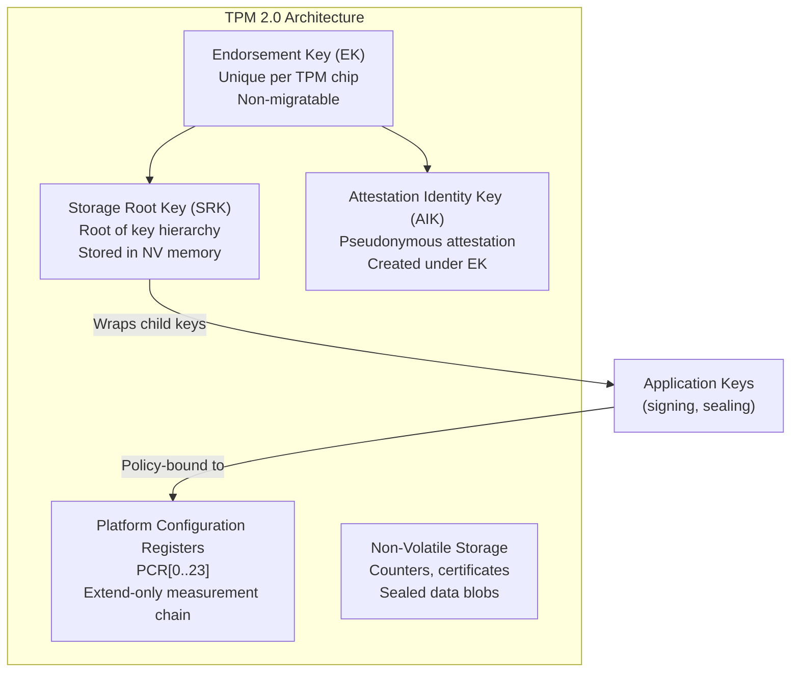

### Key Hierarchy

| Key | Purpose | Lifetime | Extractable |
|---|---|---|---|
| **Endorsement Key (EK)** | Device identity root provisioned by the TPM manufacturer; used for endorsement/attestation trust chains | Permanent | No (private never leaves TPM) |
| **Storage Root Key (SRK)** | Root of key hierarchy; wraps all child keys. Created by TPM, stored in NV memory | Per-owner | No |
| **Attestation Identity Key (AIK)** | Pseudonymous identity for remote attestation | Per-purpose | No |
| **Application Keys** | Signing, encryption, sealing for applications | User-defined | Wrapped by parent key |

### Platform Configuration Registers (PCRs)

PCRs are extend-only registers that record platform state. The extend operation is irreversible:

```
PCR_new = SHA-256(PCR_old || measurement)
```

A typical TPM has 24 PCRs (indices 0-23):

| PCR Range | Measures |
|---|---|
| 0 | BIOS/UEFI firmware code |
| 1 | BIOS/UEFI configuration |
| 2 | Option ROMs |
| 3 | Option ROM configuration |
| 4-5 | MBR/bootloader |
| 7 | Secure Boot policy |
| 8-15 | OS-defined (kernel, initrd, systemd, etc.) |
| 16-23 | Application-defined (available for CUA gateway) |

### Sealing and Unsealing

Sealing binds data to specific PCR values, preventing unseal when the platform state changes:

```bash
# Create primary key under owner hierarchy
tpm2_createprimary -C o -c primary.ctx

# Seal secret, bound to PCR policy (PCR 0, 1, 7 must match current values)
tpm2_create -C primary.ctx -u sealed.pub -r sealed.priv \
  -i secret.bin -L sha256:0,1,7

# Load sealed object
tpm2_load -C primary.ctx -u sealed.pub -r sealed.priv -c sealed.ctx

# Unseal (only succeeds if PCR 0, 1, 7 still match)
tpm2_unseal -c sealed.ctx
```

### Software Stack: tpm2-tss and tpm2-tools

| Component | Language | Layer | Purpose |
|---|---|---|---|
| `tpm2-tss` (SAPI) | C | System API | Direct TPM command construction |
| `tpm2-tss` (ESAPI) | C | Enhanced System API | Session management, encryption, HMAC |
| `tpm2-tss` (FAPI) | C | Feature API | High-level policy, key management |
| `tpm2-tools` | C (CLI) | CLI | Command-line wrappers for tpm2-tss |
| `tpm2-openssl` | C | Engine | OpenSSL engine/provider for TPM-backed keys |
| `tss-esapi` | Rust | Bindings | Rust crate wrapping ESAPI |

### Existing Clawdstrike TPM Integration

The `TpmSealedSeedSigner` pattern in `hush-core/src/tpm.rs`:

```rust
impl Signer for TpmSealedSeedSigner {
    fn sign(&self, message: &[u8]) -> Result<Signature> {
        let seed = self.unseal_seed()?;      // tpm2_load + tpm2_unseal
        let keypair = Keypair::from_seed(&seed);  // Ephemeral in-memory key
        Ok(keypair.sign(message))             // Sign, then keypair drops (zeroized)
    }
}
```

**Advantages of this pattern**:
- Private key never stored in cleartext on disk
- Platform binding prevents key theft via disk cloning (if PCR policy is used)
- `Signer` trait makes TPM backend transparent to the receipt pipeline
- Key material is ephemeral in memory (zeroized on drop)

**Limitations**:
- ~10-50ms per TPM round-trip (seal/unseal involves multiple TPM commands)
- CLI process spawning overhead (current implementation shells out to `tpm2-tools`)
- No PCR policy enforcement in current code (seals without PCR binding)
- Remote attestation of key provenance requires additional TPM quote protocol

### Production Recommendations

1. **Replace CLI with `tss-esapi`**: Eliminate process spawning, gain proper error types
2. **Add PCR policy**: Bind Ed25519 seed to PCR 0,7 (firmware + Secure Boot) + custom PCR 16 (gateway binary)
3. **Cache unsealed key**: For high-throughput, unseal once at startup and hold in protected memory (trade-off: longer key exposure window)
4. **TPM quote for attestation**: Generate TPM quotes that prove the platform state to remote verifiers

---

## 5. AWS Nitro Enclaves

### Architecture

AWS Nitro Enclaves provide isolated compute environments on EC2 instances with
hardware-enforced isolation and cryptographic attestation.

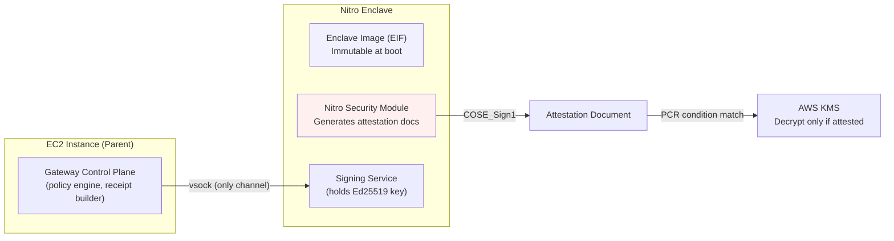

### Attestation Document Structure

The attestation document is a **CBOR-encoded, COSE_Sign1-signed** structure:

```
COSE_Sign1 [
    protected: { alg: ECDSA-384 },
    unprotected: {},
    payload: {
        module_id: "i-0abc123...-enc0abc123...",
        timestamp: 1708123456789,
        digest: "SHA384",
        pcrs: {
            0: <bytes: hash of enclave image file>,
            1: <bytes: hash of Linux kernel in EIF>,
            2: <bytes: hash of application code in EIF>,
            3: <bytes: hash of IAM role ARN (if assigned)>,
            4: <bytes: hash of instance ID>,
            8: <bytes: hash of enclave signing certificate>
        },
        certificate: <DER-encoded leaf certificate>,
        cabundle: [<DER intermediate certs... up to root>],
        public_key: <optional: from enclave's NSM request>,
        user_data: <optional: up to 512 bytes from request>,
        nonce: <optional: up to 512 bytes from request>
    },
    signature: <ECDSA-384 signature by NSM>
]
```

### PCR Values in Detail

| PCR | Content | Use for CUA Gateway |
|---|---|---|
| 0 | SHA-384 of the Enclave Image File (EIF) | Pin to specific gateway signer build |
| 1 | SHA-384 of the Linux kernel and bootstrap | Ensure kernel hasn't been tampered |
| 2 | SHA-384 of the application code | Pin to specific signing service version |
| 3 | SHA-384 of the IAM role ARN | Restrict which IAM roles can use the enclave |
| 4 | SHA-384 of the instance ID | Bind to specific EC2 instance (optional) |
| 8 | SHA-384 of the EIF signing certificate | Verify who built the enclave image |

### KMS Integration Pattern

```json
{
    "Version": "2012-10-17",
    "Statement": [{
        "Effect": "Allow",
        "Principal": { "AWS": "arn:aws:iam::123456789012:role/cua-enclave-role" },
        "Action": "kms:Decrypt",
        "Resource": "*",
        "Condition": {
            "StringEqualsIgnoreCase": {
                "kms:RecipientAttestation:PCR0": "abc123def456...",
                "kms:RecipientAttestation:PCR2": "789012abc345..."
            }
        }
    }]
}
```

The flow:
1. Enclave boots from immutable EIF image
2. Enclave calls NSM to generate attestation document (includes its ephemeral public key)
3. Sends `kms:Decrypt` request with attestation document as `Recipient` parameter
4. KMS verifies the attestation chain (NSM cert -> AWS Nitro root CA)
5. KMS checks PCR conditions in key policy
6. KMS re-encrypts the data key under the enclave's ephemeral public key
7. Only the enclave (holding the matching private key) can decrypt the signing seed

### Deployment Constraints

| Constraint | Detail | Impact on CUA |
|---|---|---|
| No persistent storage | All state is ephemeral; must receive secrets at boot via vsock or KMS | Signing key must be provisioned each boot |
| No network access | Only vsock to parent instance | Cannot call external services directly |
| Immutable image | Cannot modify code after enclave boot | Code updates require EIF rebuild + re-deploy |
| Memory allocation | Pre-allocated from parent instance's memory | Must size appropriately for signing workload |
| Platform | EC2 instances with Nitro hypervisor only | AWS-only deployment |
| CPU allocation | Dedicated vCPUs assigned from parent | Must reserve enough for signing throughput |

### CUA Gateway Signing Flow with Nitro

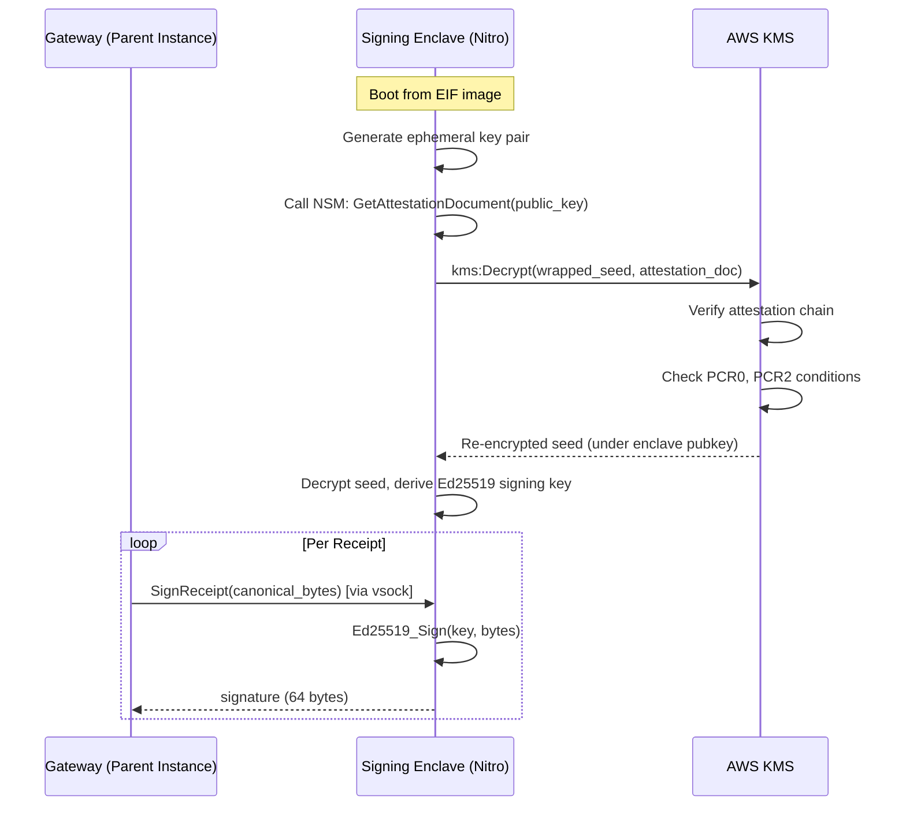

**Advantages**:
- Signing key is never accessible to the parent instance OS
- Attestation document proves exactly which code version is signing
- AWS manages the attestation PKI (Nitro root CA)
- KMS policy enforces that only specific enclave builds can access keys

**Limitations**:
- AWS-only (no portability to other clouds without equivalent TEE)
- vsock communication adds ~0.5-2ms latency per signing operation
- No GPU access inside enclave (CUA desktop runtime runs outside, in parent or separate VM)
- Image rebuild required for any code change

---

## 6. Azure Attestation (MAA)

### Overview

Microsoft Azure Attestation (MAA) is a managed attestation service that provides a
unified verification framework for multiple TEE implementations.

### Supported TEE Types

| TEE | Integration Status (2026) | Attestation Input |
|---|---|---|
| Intel SGX | Production | SGX quote |
| AMD SEV-SNP | Production | SNP attestation report |
| Intel TDX | Production | TDX quote |
| TPM | Production | TPM quote |
| VBS (Virtualization-Based Security) | Production | VBS report |

### Attestation Flow

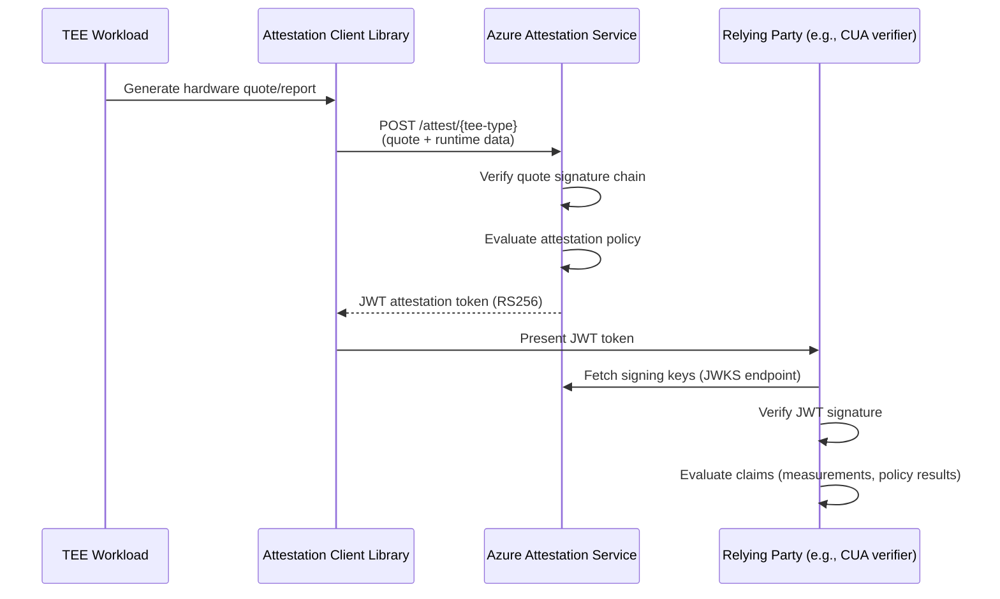

### JWT Token Structure

```json
{
    "header": {
        "alg": "RS256",
        "jku": "https://myinstance.attest.azure.net/certs",
        "kid": "...",
        "typ": "JWT"
    },
    "payload": {
        "exp": 1708123456,
        "iat": 1708119856,
        "iss": "https://myinstance.attest.azure.net",
        "nbf": 1708119856,
        "x-ms-attestation-type": "sevsnpvm",
        "x-ms-sevsnpvm-launchmeasurement": "<SHA-384 measurement>",
        "x-ms-sevsnpvm-hostdata": "<host-provided data>",
        "x-ms-sevsnpvm-guestsvn": 1,
        "x-ms-sevsnpvm-is-debuggable": false,
        "x-ms-compliance-status": "azure-compliant-cvm",
        "x-ms-policy-hash": "<hash of applied policy>",
        "x-ms-ver": "1.0"
    }
}
```

### Policy-Based Evaluation

MAA supports custom attestation policies that control token issuance:

```
version=1.0;
authorizationrules {
    // Only allow non-debuggable VMs
    c:[type=="x-ms-sevsnpvm-is-debuggable", value==false]
        => permit();
};
issuancerules {
    // Add custom claim if measurement matches expected value
    c:[type=="x-ms-sevsnpvm-launchmeasurement", value=="<expected_hash>"]
        => issue(type="trusted-cua-runtime", value=true);

    // Always include the security version
    c:[type=="x-ms-sevsnpvm-guestsvn"]
        => issue(type="security-version", value=c.value);
};
```

### Relevance to CUA Gateway

- **Multi-TEE**: Single verification API regardless of backend hardware (SGX, SNP, TDX, TPM)
- **JWT format**: Widely understood, easy to validate with standard JWT libraries
- **Policy engine**: Custom rules for what constitutes a "trusted" CUA runtime
- **Azure-native**: Best for Azure-hosted CUA deployments
- **Cross-cloud potential**: Can verify non-Azure TEE quotes (Intel Trust Authority adapter)

---

## 7. Intel SGX and DCAP

### Enclave Lifecycle

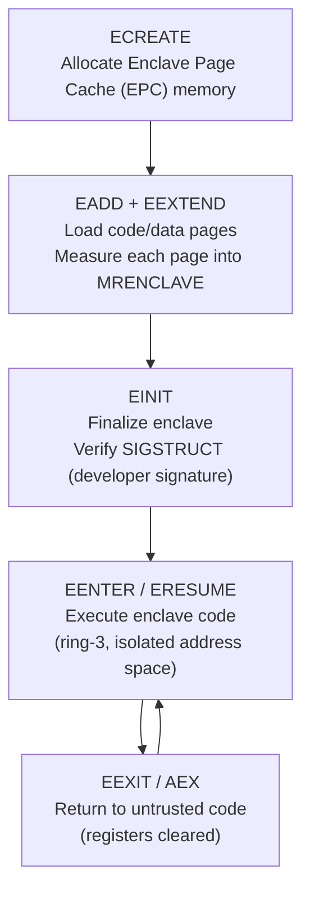

### Key Measurements

| Measurement | Description |
|---|---|
| **MRENCLAVE** | SHA-256 hash of enclave code, data layout, and page permissions; unique per build |
| **MRSIGNER** | SHA-256 hash of the enclave signing key; identifies the developer/organization |
| **ISVPRODID** | 16-bit product ID assigned by the developer |
| **ISVSVN** | 16-bit Security Version Number (monotonically increasing for patches) |

### DCAP (Data Center Attestation Primitives)

DCAP replaced the older EPID-based attestation. EPID reached end-of-life in April 2025.

**Quote Generation Flow**:

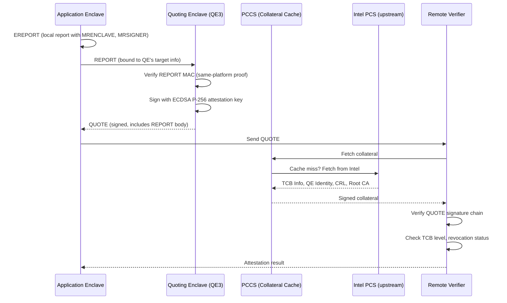

### Collateral Components

| Collateral | Content | Purpose |
|---|---|---|
| **TCB Info** | Mapping of platform TCB level to security status | Determine if platform is up-to-date |
| **QE Identity** | Expected MRENCLAVE/MRSIGNER for the Quoting Enclave | Verify QE is genuine Intel code |
| **CRL** | Certificate Revocation List | Detect compromised platforms |
| **Root CA Cert** | Intel SGX Root CA certificate | Anchor the trust chain |

### Current Status and Deprecation Concerns (2025-2026)

| Aspect | Status |
|---|---|
| EPID attestation | End-of-life April 2025 |
| SGX-TDX-DCAP-QuoteVerificationService | Archived October 2025 (read-only on GitHub) |
| Consumer SGX | Deprecated on Intel 12th gen+ consumer CPUs |
| Server SGX | Active on Intel Xeon Scalable (3rd, 4th gen) |
| Intel direction | Shifting focus to TDX for VM-level confidential computing |
| EPC memory limit | Typically 128-256MB (constrains enclave size) |

### Relevance to CUA Gateway

SGX provides the strongest **application-level** isolation (enclave within a process), but:
- **Complexity**: High operational burden (collateral management, PCCS, SGX driver)
- **Limited EPC**: 128-256MB; not enough to run a CUA desktop runtime inside the enclave
- **Deprecation trajectory**: Consumer SGX gone; server SGX continues but Intel favors TDX
- **Best use case**: A small, security-critical **signing key enclave** separate from the CUA runtime
- **Quote verification service archived**: Must self-host or use Intel Trust Authority

---

## 8. AMD SEV / SEV-SNP

### Architecture Evolution

| Generation | Feature | Protection Level |
|---|---|---|
| **SEV** | VM memory encryption (AES-128-XEX) | Confidentiality vs hypervisor |
| **SEV-ES** | + Encrypted register state (VMSA) | + Register confidentiality |
| **SEV-SNP** | + RMP integrity + attestation | + Memory integrity + remote verification |

### SEV-SNP Key Concepts

**Reverse Map Table (RMP)**:
A hardware-enforced data structure that tracks ownership of every 4KB page of physical memory. The hypervisor cannot read or write to guest-owned pages, and any violation triggers a #PF exception.

```
RMP Entry (per physical page):
{
    assigned: bool,       // Page assigned to a guest?
    guest_id: u64,        // Owning VM (ASID)
    validated: bool,      // Guest accepted this page?
    vmpl: u8,             // VM Privilege Level (0-3)
    gpa: u64,             // Guest Physical Address mapping
    immutable: bool,      // Mapping locked?
    page_size: enum,      // 4KB or 2MB
}
```

**VM Privilege Levels (VMPL)**:
Four hardware-enforced privilege levels within a single VM:

| VMPL | Typical Use | Permissions |
|---|---|---|
| 0 | Firmware, vTPM, security monitor | Full control over VM |
| 1 | Hypervisor communication layer | Restricted by VMPL 0 |
| 2 | Guest kernel | Restricted by VMPL 0, 1 |
| 3 | Guest userspace | Most restricted |

This enables a **virtual TPM at VMPL 0** that is isolated from the guest OS kernel at VMPL 2, protecting signing keys even if the guest kernel is compromised.

### Attestation Report Format

The SEV-SNP attestation report is a 1184-byte structure signed by the AMD Secure Processor (ASP) using ECDSA P-384:

```
struct snp_attestation_report {
    version: u32,                // Report format version (currently 2)
    guest_svn: u32,              // Guest Security Version Number
    policy: u64,                 // Guest policy flags (debug, migration, etc.)
    family_id: [u8; 16],         // Family identifier
    image_id: [u8; 16],          // Image identifier
    vmpl: u32,                   // VMPL of the requesting vCPU
    signature_algo: u32,         // 1 = ECDSA P-384 with SHA-384
    platform_version: u64,       // TCB version (microcode, SNP fw, etc.)
    platform_info: u64,          // Platform flags (SMT enabled, TSME, etc.)
    author_key_en: u32,          // Author key digest used?
    report_data: [u8; 64],       // USER-SUPPLIED: nonce, public key hash, etc.
    measurement: [u8; 48],       // SHA-384 of initial guest memory (LAUNCH_DIGEST)
    host_data: [u8; 32],         // Host-provided data (optional binding)
    id_key_digest: [u8; 48],     // SHA-384 of ID signing key
    author_key_digest: [u8; 48], // SHA-384 of author key
    report_id: [u8; 32],         // Unique per-VM report ID
    report_id_ma: [u8; 32],      // Migration agent report ID
    reported_tcb: u64,           // Reported TCB version
    chip_id: [u8; 64],           // Unique chip identifier (if allowed by policy)
    committed_tcb: u64,          // Committed (minimum) TCB version
    // ... additional fields ...
    signature: [u8; 512],        // ECDSA P-384 signature by VCEK or VLEK
}
```

### Remote Attestation Flow

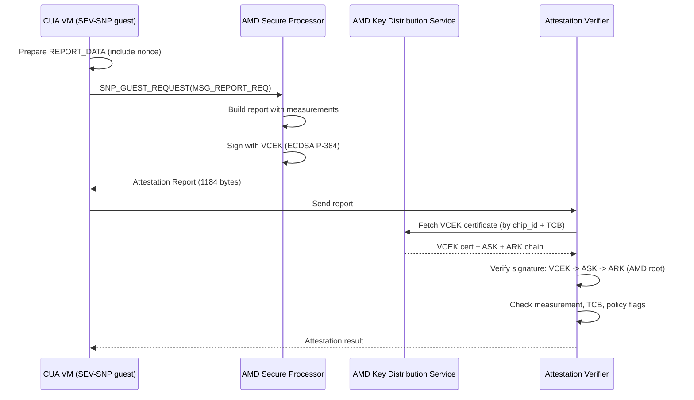

**Certificate chain**: VCEK (per-chip) -> ASK (per-generation) -> ARK (AMD root CA)

### Security Note (2026)

AMD-SB-3020 (January 2026): A race condition in RMP initialization could allow a
malicious hypervisor to manipulate initial RMP content before guest boot. Mitigation
requires updated ASP firmware. This underscores the need to verify `reported_tcb` and
`committed_tcb` in attestation reports.

### Relevance to CUA Gateway

- **VM-level isolation**: Entire CUA desktop runtime (Xvfb, browser, etc.) runs in an SEV-SNP VM
- **Near-native performance**: Memory encryption overhead is 1-5%
- **Cloud availability**: AWS (M6a, C6a, R6a), Azure (DCas_v5, ECas_v5), GCP (N2D, C2D)
- **Attestation binding**: Receipt metadata can include `LAUNCH_DIGEST` measurement
- **VMPL for key isolation**: Run signing service at VMPL 0, CUA runtime at VMPL 2
- **Best for**: Cloud-hosted CUA where the hypervisor/host operator is untrusted

---

## 9. Intel TDX

### Trust Domain Architecture

Intel Trust Domain Extensions (TDX) provides VM-level confidential computing with
hardware-enforced isolation from the hypervisor (Virtual Machine Monitor).

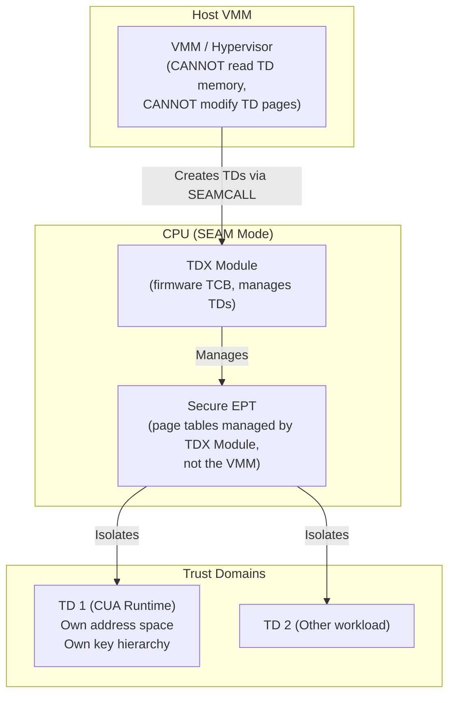

### Measurements

| Register | Content | Analogous To |
|---|---|---|
| **MRTD** | SHA-384 of initial TD memory (set at build time) | SGX MRENCLAVE |
| **RTMR[0]** | Runtime measurement register 0 (firmware) | PCR |
| **RTMR[1]** | Runtime measurement register 1 (OS loader) | PCR |
| **RTMR[2]** | Runtime measurement register 2 (OS kernel) | PCR |
| **RTMR[3]** | Runtime measurement register 3 (application-defined) | PCR |

RTMRs are extend-only (like TPM PCRs), allowing the TD guest to record runtime state changes.

### Two-Step Attestation Process

**Step 1: TDREPORT (local)**
- Generated via `TDCALL[TDG.MR.REPORT]`
- Contains: MRTD, RTMR[0-3], platform version, 64-byte REPORTDATA (user nonce)
- MAC-protected: can only be verified on the same physical platform
- Purpose: local proof to the SGX Quoting Enclave

**Step 2: TDQUOTE (remote)**
- SGX Quoting Enclave verifies the TDREPORT MAC locally
- Re-signs as a remotely-verifiable ECDSA quote
- Includes full TDREPORT body + QE attestation chain
- Verifiable by any party with Intel's root CA certificate

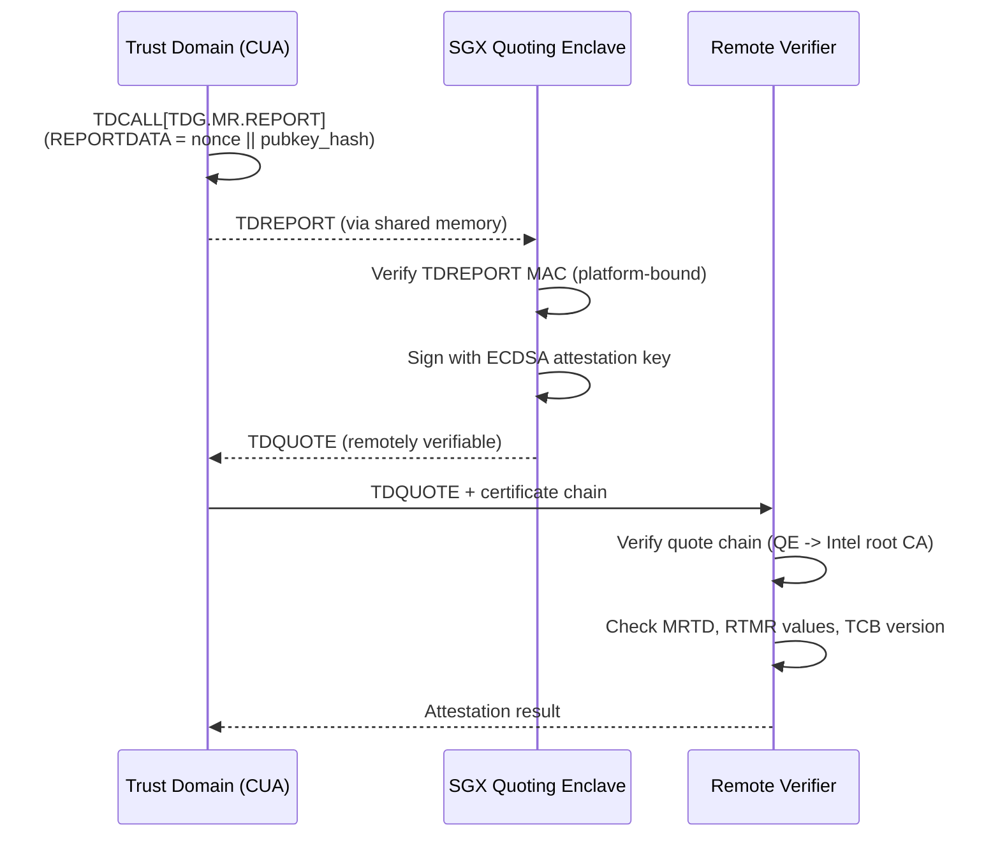

### Maturity Status (2025-2026)

| Aspect | Status |
|---|---|
| Linux kernel support | Mainline since 5.19 (basic), 6.x for full feature set |
| Cloud availability | Azure (DCes_v5), GCP (C3 + TDX), Alibaba Cloud |
| AWS support | Not yet available (Nitro Enclaves is the AWS equivalent) |
| Intel DCAP support | Quote generation and verification libraries support TDX |
| Virtual TPM | TD-based vTPM under active development |
| Performance | Near-native; encryption adds ~1-3% overhead |

### Relevance to CUA Gateway

- **VM-level isolation** similar to SEV-SNP but in the Intel ecosystem
- **Leverages existing SGX Quoting Enclave** for remote attestation
- **RTMR registers** allow runtime measurement (track gateway state changes during session)
- **Less cloud availability than SEV-SNP** (no AWS support)
- **Best for**: Intel-based cloud deployments where SEV-SNP is not available
- **RTMR[3] for CUA**: Extend with gateway config hash, policy hash at boot

---

## 10. Apple Secure Enclave

### Architecture

The Secure Enclave is an isolated hardware subsystem on Apple Silicon, separate from
the main CPU cores, with its own boot ROM, AES engine, and secure memory.

### Key Properties

| Property | Detail |
|---|---|
| **Algorithm** | NIST P-256 (ECDSA) -- not Ed25519 |
| **Key generation** | On-chip random number generator; key never leaves hardware |
| **Key extraction** | Impossible; private keys are non-exportable by design |
| **Key backup** | Encrypted blob exportable, but only restorable on same Secure Enclave |
| **Signing** | ECDSA P-256 via CryptoKit SecureEnclave API |
| **Biometric binding** | Keys can require Face ID / Touch ID authentication |
| **Availability** | All Apple Silicon Macs (M1+), iPhones (A7+), iPads, Apple Watch |

### CryptoKit SecureEnclave API

```swift
import CryptoKit

// Generate a P-256 signing key in the Secure Enclave
let privateKey = try SecureEnclave.P256.Signing.PrivateKey()

// Export public key (for distribution to verifiers)
let publicKey = privateKey.publicKey
let publicKeyData = publicKey.rawRepresentation  // 65 bytes (uncompressed P-256)

// Sign data
let data = "canonical receipt JSON".data(using: .utf8)!
let signature = try privateKey.signature(for: data)

// Verify (can be done anywhere with the public key)
let isValid = publicKey.isValidSignature(signature, for: data)
```

### App Attest Service

For device-level attestation (proving the signing device is genuine Apple hardware):

1. Generate key pair in Secure Enclave: `DCAppAttestService.generateKey()`
2. Submit key ID to Apple for attestation: `attestKey(keyId, clientDataHash:)`
3. Apple returns attestation object binding key to device + app identity
4. Subsequent assertion requests signed by attested key

### Integration Pattern for CUA Gateway

Since Clawdstrike uses Ed25519 and the Secure Enclave only supports P-256, two patterns:

**Option A: P-256 as alternative signing algorithm**
```rust
// Add P-256 support to the Signer trait
pub enum SignatureAlgorithm {
    Ed25519,
    EcdsaP256,
}

// SecureEnclaveSigner wraps Apple CryptoKit via FFI
pub struct SecureEnclaveSigner { /* opaque handle to SE key */ }
impl Signer for SecureEnclaveSigner {
    fn sign(&self, message: &[u8]) -> Result<Signature> {
        // Call CryptoKit via Swift/ObjC bridge
    }
}
```

**Option B: Secure Enclave protects Ed25519 seed (wrapping key)**
- Generate AES-256 wrapping key in Secure Enclave
- Encrypt Ed25519 seed with Secure Enclave key
- At signing time: decrypt seed via Secure Enclave, construct ephemeral Ed25519 keypair
- This keeps the Ed25519 algorithm but adds hardware protection

### Relevance to CUA Gateway

- **macOS local development**: Strongest key protection available on developer machines
- **Algorithm mismatch**: P-256 only; requires either algorithm flexibility or wrapping pattern
- **Non-extractable**: Keys genuinely cannot be exported, even with root access
- **No remote attestation**: Unlike Nitro/SGX, cannot prove Secure Enclave state to remote verifier
  (App Attest is app-identity, not TEE-measurement based)
- **Apple-only**: Not portable to Linux/Windows

---

## 11. Sigstore Ecosystem

### Overview

Sigstore provides tools for **keyless artifact signing** with transparency logging.
It eliminates long-lived signing keys by binding signatures to short-lived certificates
tied to OIDC identities.

### Components

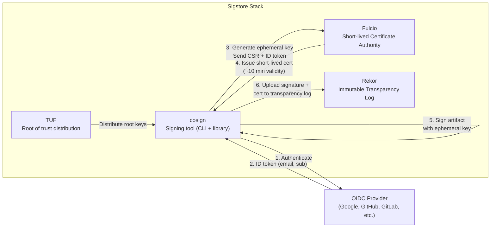

### Keyless Signing Flow (Detailed)

1. **Identity binding**: Developer authenticates via OIDC (e.g., `user@company.com`)
2. **Ephemeral key**: Cosign generates an ECDSA P-256 key pair in memory
3. **Certificate request**: Cosign sends CSR + OIDC ID token to Fulcio
4. **Fulcio verification**: Fulcio verifies the OIDC token, issues X.509 certificate with:
   - Subject: OIDC email/subject
   - Public key: from the CSR
   - Validity: ~10 minutes
   - Extensions: OIDC issuer URL
5. **Signing**: Cosign signs the artifact hash with the ephemeral private key
6. **Transparency logging**: Signature + certificate + artifact hash uploaded to Rekor
7. **Key destruction**: Ephemeral private key is discarded (never stored)

### Rekor Transparency Log

Rekor is a Merkle-tree-based append-only log (built on Google Trillian):

```json
{
    "uuid": "24296fb24b8ad77a...",
    "body": {
        "apiVersion": "0.0.1",
        "kind": "hashedrekord",
        "spec": {
            "data": {
                "hash": {
                    "algorithm": "sha256",
                    "value": "abc123..."
                }
            },
            "signature": {
                "content": "MEUCIQ...(base64 DER signature)",
                "publicKey": {
                    "content": "MIIB...(base64 certificate)"
                }
            }
        }
    },
    "logID": "c0d23d6ad406973...",
    "logIndex": 12345678,
    "integratedTime": 1708123456,
    "verification": {
        "inclusionProof": {
            "checkpoint": "rekor.sigstore.dev - 123456\n50000\nhash_base64\n\n- rekor.sigstore.dev ...",
            "hashes": ["abc...", "def...", "..."],
            "logIndex": 12345678,
            "rootHash": "789abc...",
            "treeSize": 50000000
        },
        "signedEntryTimestamp": "MEYCIQ...(base64 RFC 3161-style)"
    }
}
```

**Key properties**:
- Append-only: entries cannot be removed or modified
- Merkle tree: O(log n) inclusion proofs, O(log n) consistency proofs
- Signed checkpoints (tree heads): detect split-view attacks
- Signed entry timestamps: prove when an entry was logged

### Verification Flow

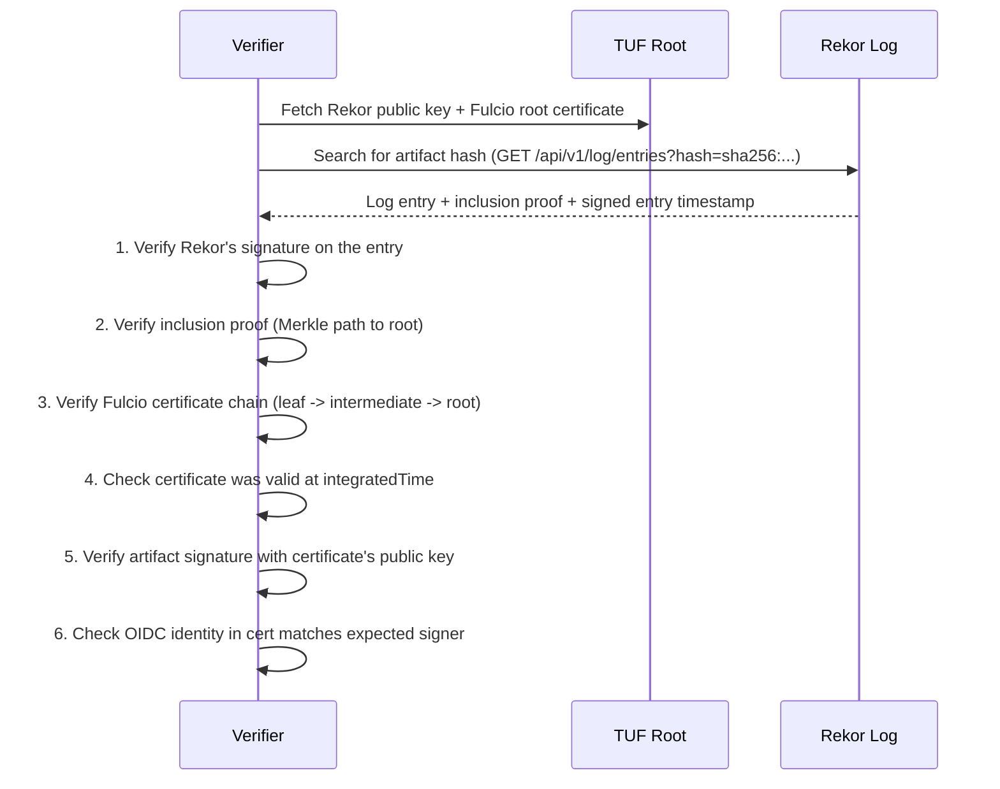

### Self-Hosted Sigstore Stack

For private CUA gateway deployments:

| Component | Self-Hosted Setup | Storage Backend |
|---|---|---|
| **Fulcio** | Deploy with custom OIDC (Dex, Keycloak, Okta) | Certificate log (CT log or Trillian) |
| **Rekor** | Deploy with Trillian backend | MySQL or PostgreSQL |
| **TUF root** | Generate custom root metadata, host at known URL | Any static file server |
| **Cosign** | Configure custom `--fulcio-url`, `--rekor-url` | N/A |

```bash
# Sign with self-hosted Sigstore infrastructure
cosign sign \
    --fulcio-url=https://fulcio.internal.company.com \
    --rekor-url=https://rekor.internal.company.com \
    --oidc-issuer=https://auth.internal.company.com \
    registry.internal.company.com/cua-gateway:v1.2.3
```

### CUA Gateway Integration Points

**1. Gateway image signing** (build-time):
- Sign gateway container images with cosign
- Pin to expected image digest in deployment manifests
- Verifier checks signature before allowing gateway to start

**2. Receipt transparency** (runtime):
- Log receipt hashes in Rekor as `hashedrekord` entries
- Each receipt gets an inclusion proof and signed timestamp
- Third parties can verify: "receipt X existed at time T in the log"

**3. Keyless receipt signing** (future):
- Gateway authenticates via service account OIDC
- Fulcio issues ephemeral certificate: "this receipt was signed by gateway-prod-01@company.com"
- No long-lived signing key to protect or rotate
- Trade-off: requires Fulcio/Rekor availability per signing operation (~100ms latency)

---

## 12. COSE (RFC 9052/9053)

### Overview

CBOR Object Signing and Encryption (COSE) defines compact binary structures for
signing, MACing, and encrypting data. It is the binary counterpart to JOSE/JWS/JWT,
using CBOR encoding instead of JSON/Base64.

### COSE_Sign1 Structure

COSE_Sign1 is the single-signer structure, identified by CBOR tag 18:

```
COSE_Sign1 = #6.18([
    protected   : bstr,     // Serialized protected headers (CBOR map)
    unprotected : {* label => any},  // Unprotected headers (CBOR map)
    payload     : bstr / nil,        // Signed content (or nil for detached)
    signature   : bstr               // The signature bytes
])
```

### Signature Computation (Sig_structure)

The input to the signature algorithm is a CBOR-encoded array:

```
Sig_structure = [
    context        : "Signature1",       // Literal string for COSE_Sign1
    body_protected : bstr,               // Serialized protected headers
    external_aad   : bstr,               // External Additional Authenticated Data
    payload        : bstr                // The content being signed
]

signature = Sign(key, CBOR_Encode(Sig_structure))
```

This means protected headers are authenticated (included in signature computation)
but unprotected headers are not.

### Algorithm Identifiers (RFC 9053)

| Algorithm | COSE ID | Key Type | Curve/Params | Use for CUA |
|---|---|---|---|---|
| **EdDSA** | -8 | OKP | Ed25519 or Ed448 | Primary (matches existing Clawdstrike) |
| ES256 | -7 | EC2 | P-256 + SHA-256 | Apple Secure Enclave compatibility |
| ES384 | -35 | EC2 | P-384 + SHA-384 | Nitro Enclaves (attestation doc uses this) |
| ES512 | -36 | EC2 | P-521 + SHA-512 | Rarely needed |
| PS256 | -37 | RSA | RSASSA-PSS + SHA-256 | Legacy interop |

### EdDSA with COSE for CUA Receipts

Since Clawdstrike uses Ed25519, COSE_Sign1 with EdDSA (alg: -8) is the natural fit:

```
// Concrete COSE_Sign1 for a CUA receipt
protected = { 1: -8 }  // alg: EdDSA

unprotected = {
    4: h'67772D70726F642D3031',    // kid: "gw-prod-01" (key ID)
    // Custom headers (registered in IANA COSE headers or private range)
    -65537: "clawdstrike.receipt.v1"  // receipt schema version
}

payload = h'7B22...'  // Canonical JSON receipt bytes (RFC 8785)

// Construct Sig_structure
sig_input = ["Signature1", h'A10127', h'', payload]
signature = Ed25519_Sign(key, CBOR_Encode(sig_input))

// Final COSE_Sign1
envelope = #6.18([h'A10127', {4: ..., -65537: ...}, payload, signature])
```

### Rust Implementation with `coset` Crate

```rust
use coset::{CoseSign1Builder, HeaderBuilder, iana, Label};

fn sign_receipt_cose(
    receipt_canonical_json: &[u8],
    signer: &dyn Signer,
    key_id: &[u8],
) -> Result<Vec<u8>> {
    let protected = HeaderBuilder::new()
        .algorithm(iana::Algorithm::EdDSA)
        .build();

    let unprotected = HeaderBuilder::new()
        .key_id(key_id.to_vec())
        .build();

    let cose_sign1 = CoseSign1Builder::new()
        .protected(protected)
        .unprotected(unprotected)
        .payload(receipt_canonical_json.to_vec())
        .create_signature(b"", |sig_input| {
            signer.sign(sig_input)
                .expect("signing failed")
                .to_bytes()
                .to_vec()
        })
        .build();

    let mut buf = Vec::new();
    ciborium::into_writer(&cose_sign1, &mut buf)?;
    Ok(buf)
}
```

### Comparison: COSE vs JWS

| Property | COSE (CBOR) | JWS (JSON) |
|---|---|---|
| **Encoding** | Binary (CBOR) | Text (Base64URL JSON) |
| **Size** | ~30-50% smaller for same payload | Larger due to Base64 overhead |
| **Parsing** | Requires CBOR library | Standard JSON parser |
| **Ecosystem** | IoT, attestation (Nitro, SCITT, mDL) | Web APIs, OAuth, JWT |
| **Standard** | RFC 9052/9053 (2022) | RFC 7515 (2015) |
| **Countersignatures** | RFC 9338 (well-defined) | Not standardized |
| **Human readability** | Low (binary, needs hex dump) | Medium (Base64, but decodable) |
| **Detached payloads** | Native support (payload = nil) | Supported but less common |
| **Header protection** | Protected + unprotected buckets | Protected header only |

### SCITT Alignment

IETF SCITT (Supply Chain Integrity, Transparency, and Trust) uses COSE as the envelope
for supply chain statements. This maps well to CUA receipts:

| SCITT Concept | CUA Equivalent |
|---|---|
| Statement | CUA receipt (action + evidence + policy decision) |
| Envelope | COSE_Sign1 wrapper with gateway key |
| Transparency Service | Rekor log or self-hosted Merkle tree |
| Receipt (SCITT sense) | Inclusion proof from the transparency log |

### Recommendation

Use **COSE_Sign1 with EdDSA** as the production receipt envelope format:
- Keeps the receipt body as canonical JSON (human-debuggable)
- Signs over the JSON bytes using COSE's Sig_structure
- Compact binary output for storage and transmission
- Aligned with AWS Nitro attestation format (also COSE_Sign1)
- Countersignature support (RFC 9338) for witness/co-signer patterns

Keep the current JCS + hex signature format for backward compatibility during migration.

---

## 13. Hash Chain Design and Tamper Evidence

### Principles

A hash chain ensures the receipt event stream is **append-only** and **tamper-evident**:
modifying or removing any event invalidates all subsequent hashes.

### Linear Hash Chain (Current Clawdstrike Approach)

The Spine envelope system implements a linear hash chain via `prev_envelope_hash`:

```
Envelope[0]:
    seq: 1
    fact: { action: "click", ... }
    prev_envelope_hash: null
    envelope_hash: SHA-256(canonical(envelope_0_unsigned))

Envelope[1]:
    seq: 2
    fact: { action: "type", ... }
    prev_envelope_hash: Envelope[0].envelope_hash
    envelope_hash: SHA-256(canonical(envelope_1_unsigned))

Envelope[n]:
    seq: n+1
    fact: { ... }
    prev_envelope_hash: Envelope[n-1].envelope_hash
    envelope_hash: SHA-256(canonical(envelope_n_unsigned))
```

**Properties**:
- O(1) append
- O(n) full chain verification (must walk from genesis to tip)
- Tampering with event k invalidates events k+1, k+2, ..., n
- Single-verifier model: must trust the chain publisher not to fork

### Merkle Tree (Certificate Transparency Model)

For multi-party transparency and efficient verification, a Merkle hash tree (RFC 6962):

```
                      Root Hash (H01234567)
                     /                      \
              H0123                          H4567
             /     \                        /     \
          H01       H23                  H45       H67
         /   \     /   \                /   \     /   \
       H(E0) H(E1) H(E2) H(E3)     H(E4) H(E5) H(E6) H(E7)
        |     |     |     |          |     |     |     |
       E0    E1    E2    E3         E4    E5    E6    E7
```

**Properties**:
- O(1) append (amortized)
- O(log n) **inclusion proof**: prove event E is in the tree
- O(log n) **consistency proof**: prove tree at size S1 is a prefix of tree at size S2
- Multi-verifier: anyone with the signed root hash (STH) can verify proofs
- Standard: RFC 6962 (Certificate Transparency), also used by Go module proxy, Sigstore Rekor

### Inclusion Proof Example

To prove E2 is in the tree (size 8):

```
Verifier has: signed root hash, E2

Prover provides: [H(E3), H01, H4567]   // 3 nodes = log2(8)

Verification:
  h2     = SHA-256(0x00 || E2)         // Leaf hash
  h23    = SHA-256(0x01 || h2 || H(E3))  // Internal node
  h0123  = SHA-256(0x01 || H01 || h23)   // Internal node
  root   = SHA-256(0x01 || h0123 || H4567)
  assert(root == known_root_hash)       // Proves inclusion
```

Only **O(log n)** hashes needed. For a log with 1 billion entries, that is ~30 hashes.

### Consistency Proof Example

To prove the tree grew correctly from size 4 to size 8:

```
Old root (size 4): R4 = H0123
New root (size 8): R8 = H01234567

Prover provides: [H0123, H4567]

Verification:
  assert(H0123 == R4)                           // Old root is embedded
  new_root = SHA-256(0x01 || H0123 || H4567)
  assert(new_root == R8)                         // Consistent growth
```

This proves no entries from the old tree were modified, removed, or reordered.

### Signed Tree Heads (STH)

The log operator periodically signs and publishes tree heads:

```json
{
    "tree_size": 50000000,
    "timestamp": 1708123456789,
    "sha256_root_hash": "base64(root_hash)",
    "tree_head_signature": "base64(Ed25519_Sign(root_hash || size || timestamp))"
}
```

**Gossiping protocol**: Multiple independent monitors fetch STHs and compare.
If the log operator publishes different STHs for the same tree_size (split-view attack),
the conflicting signed STHs are **cryptographic proof of log misbehavior**.

### Comparison

| Property | Linear Chain | Merkle Tree | Blockchain |
|---|---|---|---|
| Append | O(1) | O(1) amortized | O(1) + consensus |
| Verify single event | O(n) | O(log n) | O(1) lookup |
| Prove consistency | O(n) | O(log n) | Inherent (consensus) |
| Detect split-view | Requires full chain | STH comparison | Consensus prevents |
| Multi-verifier | No (single publisher trust) | Yes (STH + proofs) | Yes (replicated) |
| Complexity | Low | Medium | High |
| Standard | Custom | RFC 6962 | Various |

### Recommendation for CUA Gateway

| Phase | Mechanism | Justification |
|---|---|---|
| **MVP** | Linear hash chain (Spine envelopes) | Already implemented; sufficient for single-operator |
| **Production** | Merkle tree with periodic STH signing | Enables efficient verification, multi-party audit |
| **High-assurance** | Merkle tree + Rekor integration | Public verifiability, third-party monitoring |

---

## 14. Comparison Matrix

### Signing Backends

> REVIEW-P2-CORRECTION: Latency numbers below are order-of-magnitude estimates for signer operations only; end-to-end receipt issuance includes serialization, hashing, storage, and transport overhead.

| Backend | Algorithm | Key Protection | Latency per Sign | Portability | Maturity | CUA Phase |
|---|---|---|---|---|---|---|
| In-memory Ed25519 | Ed25519 | None (process memory) | <1us | Universal | Production | MVP |
| TPM 2.0 sealed seed | Ed25519 (sealed) | Hardware (TPM chip) | 10-50ms | Linux/Windows PCs | Production | Production |
| AWS Nitro Enclave | Ed25519 (in enclave) | TEE (isolated VM) | ~1-2ms (vsock) | AWS only | Production | Production |
| Apple Secure Enclave | P-256 ECDSA | Hardware (on-chip, non-extractable) | <1ms | Apple only | Production | Dev (macOS) |
| Intel SGX enclave | Ed25519 or P-256 | TEE (enclave memory) | <0.1ms | Intel Xeon (declining) | Production | Niche |
| AMD SEV-SNP VM | Ed25519 (in CVM) | TEE (encrypted VM, RMP) | <1us (in-VM) | AMD EPYC, cloud CVMs | Production | Production |
| Intel TDX | Ed25519 (in TD) | TEE (Trust Domain) | <1us (in-TD) | Intel Xeon 4th+ gen | Maturing | Future |
| Sigstore keyless | ECDSA P-256 (ephemeral) | None (ephemeral + log) | ~100-200ms | Universal | Production | High-assurance |

### Attestation Services

| Service | TEE Support | Output Format | Self-Hostable | Nonce Binding | Cloud |
|---|---|---|---|---|---|
| AWS Nitro attestation | Nitro Enclaves | COSE_Sign1 (CBOR) | No | Yes (user_data, nonce) | AWS |
| Azure Attestation (MAA) | SGX, SNP, TDX, TPM, VBS | JWT (RS256) | No | Yes (runtime_data) | Azure |
| Intel Trust Authority | SGX, TDX | JWT | No | Yes | Multi-cloud |
| TPM 2.0 quotes | TPM | Raw TPM structures | Yes (local hardware) | Yes (nonce in quote) | Any with TPM |
| Sigstore Rekor | N/A (identity-based) | JSON (Rekor entry) | Yes (Trillian backend) | Yes (timestamp) | Any |

### Transparency Mechanisms

| Mechanism | Proof Type | Verify One Event | Multi-Verifier | Standard |
|---|---|---|---|---|
| Linear hash chain | Sequential | O(n) | No | Custom (Spine) |
| Merkle tree (CT-style) | Inclusion + consistency | O(log n) | Yes (STH gossip) | RFC 6962 |
| Sigstore Rekor | Inclusion + STH | O(log n) | Yes (public) | Sigstore spec |
| SCITT | COSE + Merkle | O(log n) | Yes | IETF draft |

### Envelope Formats

| Format | Encoding | Signature Size (Ed25519) | Ecosystem Fit | CUA Recommendation |
|---|---|---|---|---|
| JCS + hex (current) | JSON text | ~200 bytes (hex-encoded) | Clawdstrike existing | MVP (backward compat) |
| COSE_Sign1 | CBOR binary | ~80 bytes (raw + headers) | Attestation, IoT, SCITT | Production |
| JWS (compact) | Base64URL JSON | ~180 bytes | Web APIs, OAuth | Alternative |
| JWS (JSON serialization) | JSON | ~250 bytes | Multi-signer web | Not recommended |

---

## 15. Architecture Recommendations

### Phase 1: MVP -- Software Keys + Linear Hash Chain

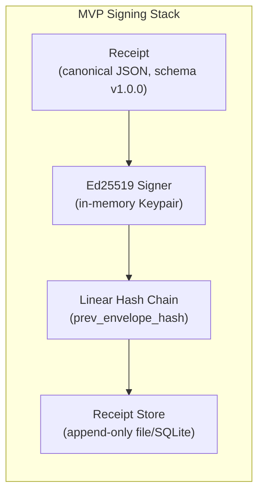

**What to build**:
- Extend existing `Receipt` schema with CUA-specific evidence fields (frame hashes, UI context)
- Use Spine envelope's `prev_envelope_hash` for chain integrity
- Store receipts in append-only storage (SQLite WAL mode, or S3 with versioning)
- Add `kid` (key ID) field to receipt signatures for future key rotation

**Key management**:
- Generate keypair at gateway startup from environment secret or file
- Publish public key to verifier-accessible endpoint
- Zeroize on shutdown (already implemented)

**Estimated effort**: Low -- extends existing code with minimal new dependencies.

### Phase 2: Production -- Hardware Keys + COSE Envelopes

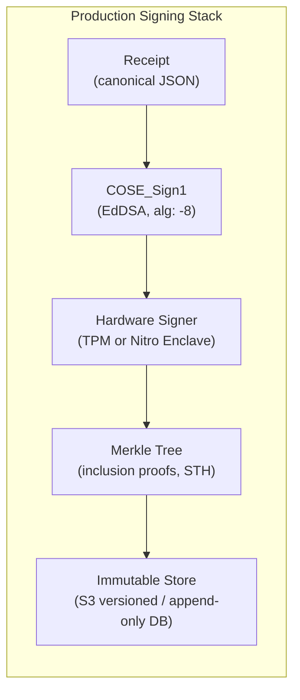

**What to build**:
- Add `coset` + `ciborium` crates for COSE_Sign1 envelope support
- Implement `NitroEnclaveSigner` (vsock-based, for AWS deployments)
- Upgrade `TpmSealedSeedSigner` to use `tss-esapi` Rust crate (replace CLI)
- Add Merkle tree accumulator for receipt log (periodically sign tree head)
- Add `attestation` field to receipt metadata (platform measurement, build hash)

**Key management**:
- TPM: Seal Ed25519 seed with PCR policy (bind to boot chain)
- Nitro: KMS-wrapped seed, decryptable only inside attested enclave
- Key rotation: Generate new key, add to key registry with validity window

**New Rust dependencies**:

| Crate | Purpose |
|---|---|
| `coset` | COSE_Sign1 builder/parser |
| `ciborium` | CBOR encoding/decoding |
| `tss-esapi` | Direct TPM 2.0 integration |

### Phase 3: High-Assurance -- TEE Attestation + Transparency + Multi-Signer

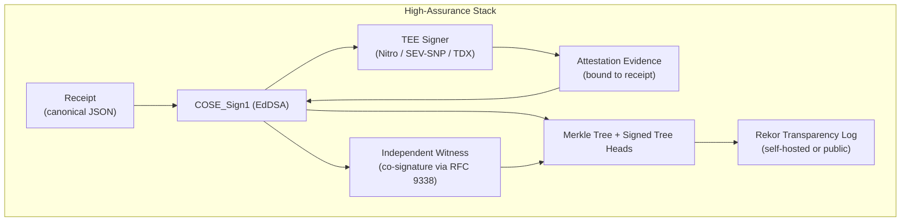

**What to build**:
- TEE-hosted signing service (Nitro Enclave or within SEV-SNP CVM)
- Attestation evidence bundled with receipt (`attestation.type`, `attestation.evidence_ref`, `attestation.claims`)
- Multi-signer: gateway signature + independent witness countersignature (COSE RFC 9338)
- Rekor integration: log receipt hashes for public/semi-public auditability
- Consistency monitoring: detect if the log operator publishes conflicting tree heads

**Attestation binding in receipts**:
```json
{
    "attestation": {
        "type": "nitro_enclave",
        "evidence_ref": "sha384:<attestation_doc_hash>",
        "claims": {
            "pcr0": "<enclave image hash>",
            "pcr2": "<application code hash>",
            "verified_at": "2026-02-18T12:00:00Z"
        }
    }
}
```

### Migration Path Summary

```
Phase 1 (MVP)              Phase 2 (Production)          Phase 3 (High-Assurance)
-----------                ----------------------         --------------------------
Ed25519 in-memory     -->  TPM-sealed / Nitro Enclave --> TEE-held + attestation bound
JSON hex signatures   -->  COSE_Sign1 envelopes       --> COSE + countersignatures
Linear hash chain     -->  Merkle tree + STH           --> Merkle + Rekor transparency
Single signer         -->  Signer + co-signer          --> Signer + witness + Rekor
File/SQLite storage   -->  S3 versioned + Merkle       --> Immutable + transparency log
No attestation        -->  Build hash in metadata       --> Full TEE attestation binding
```

### Deployment Decision Matrix

| Deployment Context | Signing Backend | Attestation | Transparency | Notes |
|---|---|---|---|---|
| Local development | In-memory Ed25519 | None | Linear chain | Fastest iteration |
| On-prem Linux server | TPM-sealed Ed25519 | TPM PCR quotes | Merkle tree (local) | Hardware key protection |
| AWS cloud | Nitro Enclave Ed25519 | Nitro attestation + KMS | Rekor (self-hosted) | Strongest cloud isolation |
| Azure cloud | SEV-SNP CVM signing | Azure MAA (JWT) | Rekor (self-hosted) | Multi-TEE support |
| macOS developer | Secure Enclave P-256 | App Attest (limited) | Linear chain | Non-extractable keys |
| Multi-cloud SaaS | Sigstore keyless | OIDC identity binding | Public Rekor | No key management |

---

## References

### Standards and Specifications
- [RFC 8032 - Edwards-Curve Digital Signature Algorithm (EdDSA)](https://www.rfc-editor.org/rfc/rfc8032)
- [RFC 8785 - JSON Canonicalization Scheme (JCS)](https://www.rfc-editor.org/rfc/rfc8785)
- [RFC 9052 - COSE: Structures and Process](https://datatracker.ietf.org/doc/rfc9052/)
- [RFC 9053 - COSE: Initial Algorithms](https://www.rfc-editor.org/rfc/rfc9053.html)
- [RFC 9338 - COSE Countersignatures](https://www.rfc-editor.org/rfc/rfc9338)
- [RFC 6962 - Certificate Transparency](https://www.rfc-editor.org/rfc/rfc6962.html)

### TPM 2.0
- [TPM 2.0 Part 1 Architecture - TCG](https://trustedcomputinggroup.org/wp-content/uploads/TPM-Rev-2.0-Part-1-Architecture-01.07-2014-03-13.pdf)
- [TPM Key Hierarchy - Eric Chiang](https://ericchiang.github.io/post/tpm-keys/)
- [What Can You Do with a TPM? - Red Hat](https://next.redhat.com/2021/05/13/what-can-you-do-with-a-tpm/)
- [tpm2-tss GitHub](https://github.com/tpm2-software/tpm2-tss)

### AWS Nitro Enclaves
- [Cryptographic Attestation - AWS Docs](https://docs.aws.amazon.com/enclaves/latest/user/set-up-attestation.html)
- [Using Attestation with KMS - AWS Docs](https://docs.aws.amazon.com/enclaves/latest/user/kms.html)
- [Validating Attestation Documents - AWS Blog](https://aws.amazon.com/blogs/compute/validating-attestation-documents-produced-by-aws-nitro-enclaves/)
- [Notes on Nitro Enclaves - Trail of Bits](https://blog.trailofbits.com/2024/02/16/a-few-notes-on-aws-nitro-enclaves-images-and-attestation/)

### Azure Attestation
- [Azure Attestation Overview - Microsoft Learn](https://learn.microsoft.com/en-us/azure/attestation/overview)
- [Attestation Token Examples - Microsoft Learn](https://learn.microsoft.com/en-us/azure/attestation/attestation-token-examples)
- [Confidential VM Guest Attestation - Microsoft Learn](https://learn.microsoft.com/en-us/azure/confidential-computing/guest-attestation-confidential-virtual-machines-design)

### Intel SGX
- [Intel SGX DCAP Orientation Guide](https://www.intel.com/content/dam/develop/public/us/en/documents/intel-sgx-dcap-ecdsa-orientation.pdf)
- [Quote Verification Grace Periods](https://www.intel.com/content/www/us/en/developer/articles/technical/grace-periods-for-intel-sgx-dcap.html)
- [SGX-TDX-DCAP-QuoteVerificationService](https://github.com/intel/SGX-TDX-DCAP-QuoteVerificationService)

### AMD SEV-SNP
- [SEV-SNP White Paper](https://www.amd.com/content/dam/amd/en/documents/epyc-business-docs/white-papers/SEV-SNP-strengthening-vm-isolation-with-integrity-protection-and-more.pdf)
- [SNP Attestation - Establishing Trust](https://www.amd.com/content/dam/amd/en/documents/developer/lss-snp-attestation.pdf)
- [SEV Firmware ABI Specification](https://www.amd.com/content/dam/amd/en/documents/developer/56860.pdf)
- [CoRIM Profile for SNP - IETF Draft](https://www.ietf.org/archive/id/draft-deeglaze-amd-sev-snp-corim-profile-02.html)
- [AMD SB-3020 Security Bulletin](https://www.amd.com/en/resources/product-security/bulletin/amd-sb-3020.html)

### Intel TDX
- [TDX Linux Kernel Documentation](https://docs.kernel.org/arch/x86/tdx.html)
- [EAT Profile for Intel TDX - IETF Draft](https://www.ietf.org/archive/id/draft-kdyxy-rats-tdx-eat-profile-02.html)
- [Intel TDX DCAP Quoting Library API](https://download.01.org/intel-sgx/latest/dcap-latest/linux/docs/Intel_TDX_DCAP_Quoting_Library_API.pdf)

### Apple Secure Enclave
- [Apple Platform Security Guide](https://support.apple.com/guide/security/the-secure-enclave-sec59b0b31ff/web)
- [SecureEnclave.P256.Signing - Apple Developer](https://developer.apple.com/documentation/cryptokit/secureenclave/p256/signing)
- [Protecting Keys with the Secure Enclave](https://developer.apple.com/documentation/security/protecting-keys-with-the-secure-enclave)

### Sigstore
- [Sigstore Cosign Overview](https://docs.sigstore.dev/cosign/signing/overview/)
- [Sigstore Quickstart](https://docs.sigstore.dev/quickstart/quickstart-cosign/)
- [Sigstore Security Model](https://docs.sigstore.dev/about/security/)
- [Scaling Supply Chain Security with Sigstore - OpenSSF](https://openssf.org/blog/2024/02/16/scaling-up-supply-chain-security-implementing-sigstore-for-seamless-container-image-signing/)

### Hash Chains and Transparency
- [Transparent Logs for Skeptical Clients - Russ Cox](https://research.swtch.com/tlog)
- [Certificate Transparency - MDN](https://developer.mozilla.org/en-US/docs/Web/Security/Defenses/Certificate_Transparency)
- [ct-merkle - Rust implementation of RFC 6962 log](https://github.com/rozbb/ct-merkle)
