# 06 - Orchestration, Containerization & Isolation

> Comprehensive research document for the Clawdstrike Computer-Use Agent (CUA) Gateway.
> Covers container runtimes, sandbox technologies, microVMs, hypervisors, and platform
> virtualization for isolating CUA desktop sessions.

---

## Table of Contents

1. [Overview and Motivation](#1-overview-and-motivation)
2. [Docker Engine / Moby](#2-docker-engine--moby)
3. [containerd](#3-containerd)
4. [gVisor (runsc)](#4-gvisor-runsc)
5. [Firecracker](#5-firecracker)
6. [firecracker-containerd](#6-firecracker-containerd)
7. [Kata Containers](#7-kata-containers)
8. [KVM](#8-kvm)
9. [QEMU](#9-qemu)
10. [Apple Virtualization Framework](#10-apple-virtualization-framework)
11. [Hyper-V](#11-hyper-v)
12. [Comparison Matrix](#12-comparison-matrix)
13. [Architecture Recommendations](#13-architecture-recommendations)

---

## 1. Overview and Motivation

A CUA gateway runs **untrusted agent actions** inside a controlled UI runtime (browser,
desktop session). The isolation stack determines:

- **Can a compromised agent escape to the host?** (container/VM boundary)
- **Can a compromised runtime affect other sessions?** (multi-tenancy isolation)
- **How fast can sessions start and stop?** (startup latency, resource overhead)
- **Can the gateway enforce the security posture it claims?** (measurable isolation properties)

The threat model from the source report identifies the **malicious/compromised agent** as
the primary adversary for orchestration: it tries to escape the controlled UI runtime,
access other sessions, exfiltrate data, or manipulate the host.

### Pass #3 reviewer notes (2026-02-18)

- REVIEW-P3-CORRECTION: Isolation claims must be expressed as tested properties, not runtime brand names (e.g., "no host filesystem write", "no unsanctioned egress").
- REVIEW-P3-GAP-FILL: Add explicit fallback behavior when sandbox features are unavailable on a host (deny launch vs degraded mode with warning).
- REVIEW-P3-CORRECTION: Startup latency guidance must include image pull/warm-cache assumptions; otherwise SLO expectations will be misleading.

### Pass #3 execution criteria

- Session launch validates runtime policy digest, image digest, and network profile before first action.
- Broker path is the only side-effect channel; direct runtime I/O attempts are denied and audited.
- Teardown guarantees workspace/data disposal and emits verifiable cleanup markers.
- Isolation tests include breakout attempts (filesystem, network, process namespace) with expected fail-closed outcomes.

### Isolation Spectrum

```
Weaker isolation                                          Stronger isolation
<----------------------------------------------------------------->
  Process     Container     Sandboxed      MicroVM      Full VM
  isolation   (runc)        container      (Firecracker) (QEMU/KVM)
                            (gVisor)
```

Each step rightward reduces the host kernel attack surface available to the workload,
at the cost of higher startup latency and resource overhead.

### Key Requirements for CUA

| Requirement | Why |
|---|---|
| **Display/GUI support** | CUA runtimes need a virtual display (Xvfb, Weston, VNC) |
| **Network control** | Egress must be policy-controlled per session |
| **Ephemeral sessions** | Sessions should be disposable; clean state per agent run |
| **Fast startup** | Interactive agent workflows require <5s session provisioning |
| **Resource efficiency** | Running multiple concurrent sessions per host |
| **Evidence capture** | Isolation boundary must support screenshot/recording export |
| **Attestable state** | Runtime image digest, policy hash included in receipts |

---

## 2. Docker Engine / Moby

### Architecture

Docker Engine (the Moby project) is the standard container runtime ecosystem.
It provides a high-level API for building, distributing, and running OCI-compliant
containers.

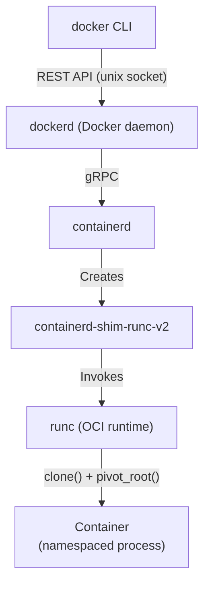

### OCI Runtime Spec

The Open Container Initiative (OCI) defines two specs:
- **Image Spec**: How container images are built and distributed (layers, manifests)
- **Runtime Spec**: How containers are created and run (config.json with namespaces, cgroups, mounts)

Every compliant runtime (runc, runsc, kata-runtime) implements the same lifecycle:
`create -> start -> (running) -> kill -> delete`

### Container Networking Modes

| Mode | Description | CUA Use Case |
|---|---|---|
| **bridge** (default) | Container gets IP on docker0 bridge; NAT to host | Basic session isolation with outbound access |
| **host** | Container shares host's network namespace | NOT recommended (no network isolation) |
| **none** | No network interfaces | Air-gapped sessions (evidence collected via volume) |
| **macvlan/ipvlan** | Container gets its own MAC/IP on physical network | Advanced: direct network policy enforcement |
| **custom bridge** | User-defined bridge with DNS resolution | Multi-container CUA setups (browser + VNC server) |

### Volume and Bind Mount Security

| Mount Type | Security Consideration |
|---|---|
| **Named volumes** | Docker-managed; isolated from host filesystem |
| **Bind mounts** | Direct host path access; avoid unless necessary |
| **tmpfs** | In-memory; no host disk exposure; good for ephemeral session data |
| **Read-only mounts** | Use `ro` flag for all mounts except session workspace |

For CUA: mount the session workspace as a tmpfs (ephemeral, no disk persistence),
and bind-mount only specific evidence export directories.

### Security Mechanisms

#### Seccomp Profiles

Secure Computing Mode restricts which syscalls a container can invoke:

```json
{
    "defaultAction": "SCMP_ACT_ERRNO",
    "architectures": ["SCMP_ARCH_X86_64"],
    "syscalls": [
        {
            "names": ["read", "write", "open", "close", "stat", "fstat",
                       "mmap", "mprotect", "munmap", "brk", "ioctl",
                       "clone", "execve", "exit_group", "..."],
            "action": "SCMP_ACT_ALLOW"
        }
    ]
}
```

Docker's default seccomp profile blocks ~44 of 300+ syscalls, including:
- `mount`, `umount2` (prevent filesystem manipulation)
- `reboot`, `swapon`, `swapoff` (prevent host interference)
- `init_module`, `finit_module` (prevent kernel module loading)
- `bpf` (prevent eBPF program loading)

For CUA, consider a **custom restrictive profile** that additionally blocks:
- `ptrace` (prevent debugging/tracing of other processes)
- `userfaultfd` (prevent use in exploits)
- `keyctl` (prevent kernel keyring access)

#### AppArmor / SELinux

**AppArmor** (profile-based, primarily Ubuntu/Debian):
```
# Docker default AppArmor profile
profile docker-default flags=(attach_disconnected,mediate_deleted) {
    # Deny writing to /proc and /sys
    deny /proc/** w,
    deny /sys/** w,

    # Allow network access
    network,

    # Allow file operations within container rootfs
    /** rw,
}
```

**SELinux** (label-based, primarily RHEL/Fedora):
```
# Container processes run with container_t type
# Can only access files labeled container_file_t
# Cannot access host files labeled host_file_t
```

For CUA: use AppArmor or SELinux with a profile that denies:
- Access to `/dev` devices except virtual display (uinput if needed)
- Raw network socket creation (enforce proxy-only egress)
- Write access to any host path

#### Rootless Mode

Docker rootless runs the daemon and containers as an unprivileged user:
- Container escape yields unprivileged host user (not root)
- Uses user namespaces for UID/GID mapping
- Trade-off: some features unavailable (e.g., apparmor, certain network modes)

For CUA: rootless mode is recommended for development and low-trust deployments.

### CUA-Specific Docker Configuration

```yaml
# docker-compose.yml for CUA desktop session
services:
  cua-session:
    image: clawdstrike/cua-desktop:latest
    runtime: runsc  # gVisor for sandbox (see section 4)
    security_opt:
      - seccomp:cua-seccomp.json  # Custom restrictive profile
      - apparmor:cua-apparmor     # Custom AppArmor profile
      - no-new-privileges         # Prevent privilege escalation
    cap_drop:
      - ALL                        # Drop all capabilities
    cap_add:
      - NET_BIND_SERVICE           # Only if needed for internal services
    read_only: true                # Read-only rootfs
    tmpfs:
      - /tmp:size=512m             # Ephemeral session workspace
      - /run:size=64m
    networks:
      - cua-isolated               # Isolated network with egress policy
    deploy:
      resources:
        limits:
          cpus: '2'
          memory: 2g
        reservations:
          memory: 512m
```

---

## 3. containerd

### Architecture

containerd is the industry-standard container runtime that Docker delegates to. It
provides the core container lifecycle management via a gRPC API.

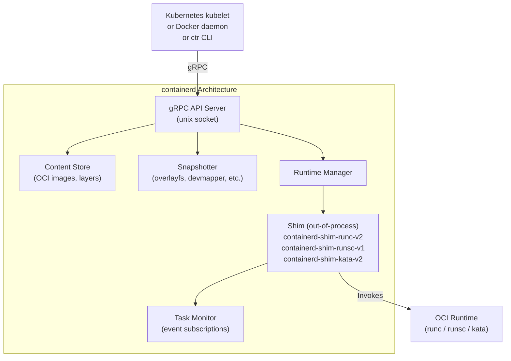

### gRPC API

As of containerd 2.0, the gRPC API provides stable interfaces:

| Service | Purpose |
|---|---|
| `Containers` | Container metadata CRUD |
| `Content` | Image content storage (blobs) |
| `Images` | Image metadata and resolution |
| `Snapshots` | Filesystem snapshot management |
| `Tasks` | Container lifecycle (create, start, kill, delete, exec) |
| `Events` | Subscribe to container lifecycle events |
| `Namespaces` | Multi-tenant namespace isolation |
| `Leases` | Garbage collection reference management |

### Runtime Shims

The shim architecture is key to containerd's extensibility. Each container runs
with its own shim process, which:
- Manages the container's stdio
- Handles signal forwarding
- Reports exit status
- Communicates with containerd via gRPC or tTRPC

| Shim | Backend | Isolation Level | CUA Use Case |
|---|---|---|---|
| `containerd-shim-runc-v2` | runc | Linux namespaces + cgroups | Base container (development) |
| `containerd-shim-runsc-v1` | gVisor runsc | Application kernel | Sandboxed container (staging) |
| `containerd-shim-kata-v2` | Kata Containers | Lightweight VM | VM-isolated container (production) |
| `containerd-shim-fc-v2` | firecracker-containerd | Firecracker microVM | MicroVM (production) |

### Snapshotter Architecture

Snapshotters manage the filesystem layers that make up container images:

| Snapshotter | Backend | Performance | CUA Note |
|---|---|---|---|
| **overlayfs** | Linux overlayfs | Best for most workloads | Default choice for container-based CUA |
| **devmapper** | Device mapper | Good; required for Firecracker | Required for microVM-based CUA |
| **stargz** | Remote lazy loading | Reduces image pull time | Useful for large CUA desktop images |
| **native** | Copy-on-write directories | Simple, slower | Fallback |

### Plugin System

containerd supports plugins for:
- **Runtime handlers**: Add new OCI runtimes
- **Snapshotters**: Add new storage backends
- **Content stores**: Custom content distribution
- **Services**: Extend the gRPC API
- **Stream processors**: Transform content on ingest

For CUA: register `runsc` and `kata` as runtime handlers, use devmapper snapshotter
for Firecracker deployments.

### containerd Configuration for CUA

```toml
# /etc/containerd/config.toml

version = 2

[plugins."io.containerd.grpc.v1.cri"]
  sandbox_image = "registry.k8s.io/pause:3.9"

  [plugins."io.containerd.grpc.v1.cri".containerd]
    default_runtime_name = "runc"

    [plugins."io.containerd.grpc.v1.cri".containerd.runtimes.runc]
      runtime_type = "io.containerd.runc.v2"

    [plugins."io.containerd.grpc.v1.cri".containerd.runtimes.runsc]
      runtime_type = "io.containerd.runsc.v1"

    [plugins."io.containerd.grpc.v1.cri".containerd.runtimes.kata]
      runtime_type = "io.containerd.kata.v2"
```

---

## 4. gVisor (runsc)

### Architecture

gVisor is an **application kernel** that implements the Linux system call interface
in user space, intercepting container syscalls before they reach the host kernel.

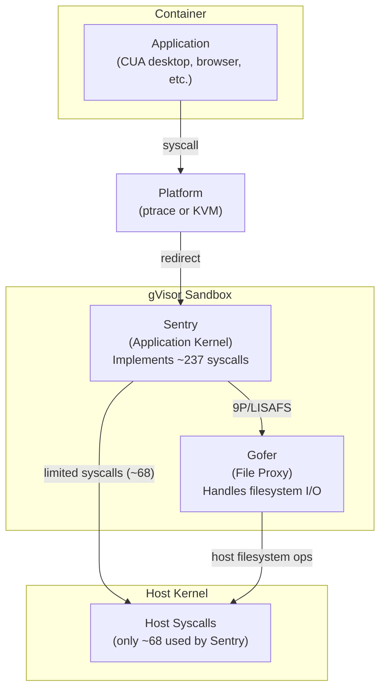

### Key Components

**Sentry** (Application Kernel):
- Runs as a regular user-space process
- Implements ~237 of Linux's ~350 syscalls
- Uses only ~68 host syscalls itself
- Maintains its own virtual filesystem, network stack, and memory management
- Each container gets its own isolated Sentry instance

**Gofer** (File Proxy):
- Separate process from the Sentry (defense in depth)
- Handles all filesystem operations on behalf of the Sentry
- Communicates via LISAFS protocol over a shared memory channel
- Runs with minimal host privileges

**Platform** (Syscall Interception):
- **ptrace**: Uses PTRACE_SYSEMU to intercept syscalls; works everywhere, slower
- **KVM**: Uses hardware virtualization to trap syscalls; faster, requires /dev/kvm

### Containerd Integration

```bash
# Install gVisor
wget https://storage.googleapis.com/gvisor/releases/release/latest/$(uname -m)/runsc
chmod +x runsc && mv runsc /usr/local/bin/

# Install containerd shim
wget https://storage.googleapis.com/gvisor/releases/release/latest/$(uname -m)/containerd-shim-runsc-v1
chmod +x containerd-shim-runsc-v1 && mv containerd-shim-runsc-v1 /usr/local/bin/

# Configure containerd (add to config.toml)
# [plugins."io.containerd.grpc.v1.cri".containerd.runtimes.runsc]
#   runtime_type = "io.containerd.runsc.v1"

# Run with gVisor
docker run --runtime=runsc myimage
# or: ctr run --runtime io.containerd.runsc.v1 myimage
```

### Threat Model and Protection

**What gVisor protects against**:
- Host kernel exploit via syscall bugs (Sentry handles syscalls, not host kernel)
- Container escape via filesystem vulnerabilities (Gofer mediates all FS access)
- Network-based attacks on the host (Sentry has its own network stack)
- Privilege escalation via kernel features (most kernel features not exposed)

**What gVisor does NOT protect against**:
- Side-channel attacks (Sentry runs on the same physical CPU)
- Attacks through the ~68 host syscalls Sentry does use
- Attacks through /dev/kvm (if KVM platform is used)
- Denial-of-service via resource exhaustion

### Performance Overhead

| Operation | Overhead vs runc | Impact on CUA |
|---|---|---|
| Simple syscalls (read, write) | 2-3x slower | Minor for GUI workloads |
| File open/close (tmpfs) | ~216x slower (external tmpfs) | Use overlay on rootfs instead |
| File open/close (overlay rootfs) | ~2-5x slower | Acceptable |
| Network throughput | ~10-20% reduction | Acceptable for VNC/RDP streaming |
| Memory overhead | ~100-200MB per sandbox | Acceptable |
| Startup time | ~200-500ms additional | Acceptable for CUA sessions |

**Optimization for CUA**:
```bash
# Use overlay on rootfs for dramatically better file I/O
runsc --overlay2=root:memory ...

# Use KVM platform for better syscall interception performance
runsc --platform=kvm ...

# Enable direct host networking if isolation is handled at another layer
runsc --network=host ...  # Only if external firewall controls egress
```

### CUA-Specific Considerations

**Advantages for CUA**:
- Significantly reduces host kernel attack surface (container escape is much harder)
- Works with standard container images (no special image format needed)
- Integrates with containerd/Kubernetes via standard shim interface
- Can run Xvfb, VNC server, browser inside the sandbox
- Fast enough for interactive GUI workloads

**Limitations for CUA**:
- No GPU passthrough (Sentry does not implement GPU device interfaces)
- No /dev/uinput support (virtual input devices require host kernel interaction)
- For VNC/RDP-based CUA, the display server runs inside the sandbox (good for isolation)
- X11 clients within the sandbox can communicate with each other (X11 security model limitation)

---

## 5. Firecracker

### Architecture

Firecracker is a Virtual Machine Monitor (VMM) built by AWS, designed for serverless
workloads. Each Firecracker process encapsulates exactly one microVM.

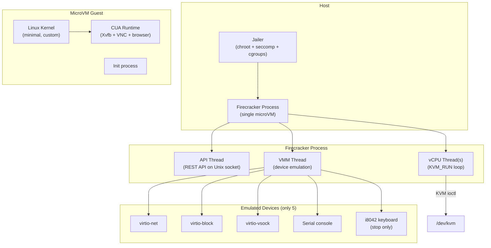

### Design Principles

| Principle | Implementation |
|---|---|
| **Minimal device model** | Only 5 emulated devices (vs ~100+ in QEMU) |
| **Minimal attack surface** | Written in Rust; small codebase (~50k LoC) |
| **Fast boot** | <125ms from API call to init process |
| **Low memory** | <5 MiB memory overhead per microVM |
| **Strong isolation** | KVM hardware virtualization + jailer hardening |

### Virtio Device Model

| Device | Purpose | CUA Use |
|---|---|---|
| **virtio-net** | Network interface (TAP-backed) | Session network connectivity (policy-controlled) |
| **virtio-block** | Block storage (file-backed) | Root filesystem, session data |
| **virtio-vsock** | Host-guest socket communication | Gateway <-> CUA runtime communication |
| **Serial console** | Text console I/O | Debugging, log export |
| **i8042 keyboard** | Keyboard controller (Ctrl+Alt+Del only) | MicroVM shutdown |

### REST API Lifecycle

```bash
# 1. Configure the microVM (before boot)
curl --unix-socket /tmp/firecracker.socket \
  -X PUT http://localhost/machine-config \
  -d '{"vcpu_count": 2, "mem_size_mib": 2048}'

# 2. Set kernel and rootfs
curl --unix-socket /tmp/firecracker.socket \
  -X PUT http://localhost/boot-source \
  -d '{"kernel_image_path": "/opt/vmlinux", "boot_args": "console=ttyS0 reboot=k panic=1"}'

curl --unix-socket /tmp/firecracker.socket \
  -X PUT http://localhost/drives/rootfs \
  -d '{"drive_id": "rootfs", "path_on_host": "/opt/rootfs.ext4", "is_root_device": true, "is_read_only": true}'

# 3. Configure network
curl --unix-socket /tmp/firecracker.socket \
  -X PUT http://localhost/network-interfaces/eth0 \
  -d '{"iface_id": "eth0", "guest_mac": "AA:FC:00:00:00:01", "host_dev_name": "tap0"}'

# 4. Boot the microVM
curl --unix-socket /tmp/firecracker.socket \
  -X PUT http://localhost/actions \
  -d '{"action_type": "InstanceStart"}'
```

### Jailer (Host Hardening)

The Firecracker jailer provides a second line of defense:

```bash
jailer --id my-microvm \
       --exec-file /usr/bin/firecracker \
       --uid 65534 --gid 65534 \
       --chroot-base-dir /srv/jailer \
       --daemonize
```

Jailer applies:
- **chroot**: Firecracker only sees its jail directory
- **Unprivileged user**: Runs as nobody/nogroup (not root)
- **Seccomp filter**: Whitelist of allowed syscalls for the VMM process
- **cgroup isolation**: CPU and memory limits enforced on the VMM
- **New PID namespace**: VMM cannot see other host processes
- **New network namespace**: VMM's TAP interfaces are isolated

### Performance Characteristics

| Metric | Value | Source |
|---|---|---|
| Boot time (API to init) | <125ms | Firecracker design spec |
| Memory overhead per VM | <5 MiB | Firecracker design spec |
| Snapshot restore | <5ms (with pre-loaded snapshot) | NSDI'20 paper |
| Network throughput | Near line-rate (virtio-net) | Benchmarks |
| Block I/O | Near native (virtio-block + io_uring) | Benchmarks |
| Max microVMs per host | Thousands (limited by host memory) | Lambda/Fargate experience |

### NSDI'20 Paper Insights

Key findings from "Firecracker: Lightweight Virtualization for Serverless Applications":
- Firecracker was designed specifically for AWS Lambda and Fargate
- The minimal device model eliminates ~90% of the QEMU attack surface
- KVM + minimal VMM provides isolation comparable to traditional VMs at container-like density
- Snapshot/restore enables sub-millisecond cold starts (pre-warmed snapshots)
- Process-per-VM model enables straightforward resource accounting and cleanup

### CUA-Specific Considerations

**Advantages for CUA**:
- Strongest practical isolation (KVM hardware boundary)
- Fast boot (<125ms + guest init time, total ~1-3 seconds for Linux desktop)
- Minimal attack surface (Rust, small codebase, 5 devices)
- Per-session isolation: each CUA session gets its own microVM
- vsock provides clean host-guest communication channel for the gateway
- Read-only root filesystem: immutable session base image

**Limitations for CUA**:
- **No GPU passthrough**: virtio-gpu not supported; must use software rendering or CPU-based VNC
- **Linux host only**: Requires /dev/kvm (Linux KVM)
- **No persistent storage by default**: Good for ephemeral sessions, but must manage state export
- **Custom kernel required**: Need to build/maintain a minimal Linux kernel for the guest
- **No display output**: Must use VNC/RDP inside the VM, streamed to host via virtio-net or vsock
- **No Windows/macOS guests**: Linux-only guest support

### CUA Desktop Session in Firecracker

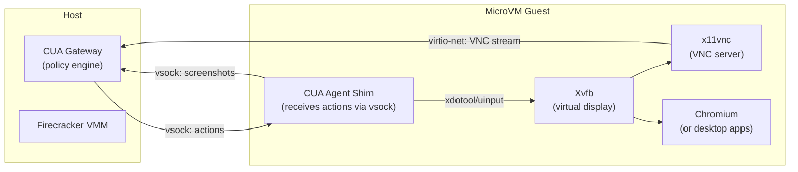

---

## 6. firecracker-containerd

### Architecture

firecracker-containerd bridges the container ecosystem with Firecracker microVMs,
enabling you to manage microVM-isolated containers using standard containerd APIs.

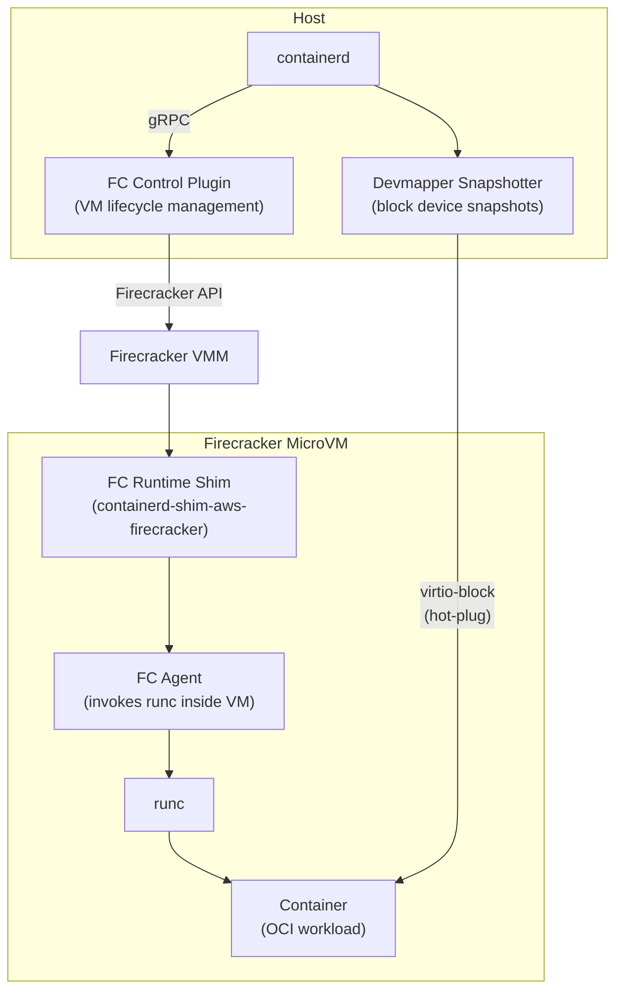

### Key Components

| Component | Role |
|---|---|
| **FC Control Plugin** | containerd plugin that manages Firecracker VM lifecycle |
| **FC Runtime (shim)** | Out-of-process shim that links containerd to the VMM |
| **FC Agent** | Runs inside the microVM; invokes runc to create containers |
| **Devmapper Snapshotter** | Creates device-mapper snapshots as block devices (required because Firecracker doesn't support filesystem sharing) |

### Snapshotter Requirement

Firecracker does not support filesystem-level sharing between host and guest.
Container rootfs must be exposed as block devices:

```
containerd image pull
    -> devmapper snapshotter creates device-mapper snapshot
    -> snapshot exposed as virtio-block device to Firecracker
    -> guest mounts block device as container rootfs
```

This is different from standard containers (which use overlayfs).

### Deployment Pattern for CUA

```bash
# Pull CUA desktop image
ctr --namespace cua images pull docker.io/clawdstrike/cua-desktop:latest

# Start a CUA session as a Firecracker-backed container
ctr --namespace cua run \
    --runtime io.containerd.firecracker.v1 \
    --rm \
    docker.io/clawdstrike/cua-desktop:latest \
    session-$(uuidgen)
```

### Practical Considerations

**Advantages over raw Firecracker**:
- Standard containerd API (familiar tooling, Kubernetes integration possible)
- Container image reuse (same OCI images for development and production)
- Snapshotter handles rootfs preparation automatically

**Limitations**:
- More complex than raw Firecracker (additional components: plugin, agent, snapshotter)
- Devmapper snapshotter requires LVM or thin-provisioning setup
- Performance overhead from the containerd -> shim -> agent -> runc chain
- Less actively maintained than Kata Containers (consider Kata as alternative)

---

## 7. Kata Containers

### Architecture

Kata Containers provides "containers that are actually lightweight VMs" --
standard OCI containers that run inside a per-pod VM for hardware isolation.

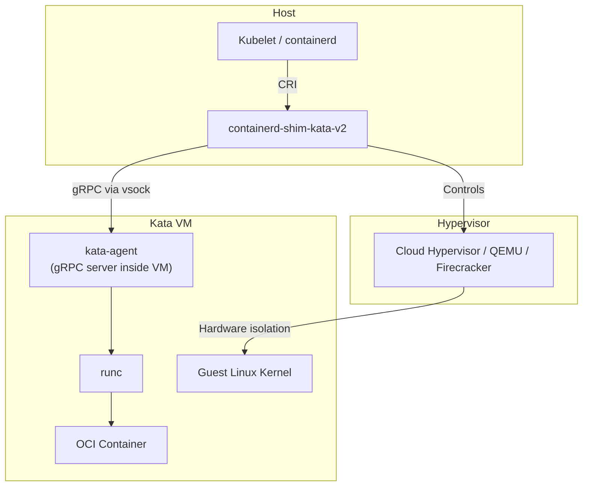

### Hypervisor Backends

| Backend | Default | Kubernetes Compat | GPU Support | Boot Time | CUA Recommendation |
|---|---|---|---|---|---|
| **Cloud Hypervisor** | Yes (recommended) | Full | Limited (VFIO) | ~150ms | Best general choice |
| **QEMU** | No | Full | Full (VFIO, virtio-gpu) | ~300ms | When GPU needed |
| **Firecracker** | No | Partial (no hotplug) | None | <125ms | When max density needed |
| **Dragonball** | No (Alibaba) | Full | Limited | ~100ms | Alibaba Cloud specific |

### OCI Compliance

Kata Containers is fully OCI-compliant:
- Same container images as standard Docker/containerd
- Same `docker run` / `ctr run` / Kubernetes Pod spec
- Transparent replacement: change RuntimeClass, keep everything else

### Kubernetes Integration

```yaml
# RuntimeClass definition
apiVersion: node.k8s.io/v1
kind: RuntimeClass
metadata:
  name: kata
handler: kata
overhead:
  podFixed:
    memory: "160Mi"
    cpu: "250m"

---
# Pod using Kata isolation
apiVersion: v1
kind: Pod
metadata:
  name: cua-session
spec:
  runtimeClassName: kata
  containers:
  - name: cua-desktop
    image: clawdstrike/cua-desktop:latest
    resources:
      limits:
        memory: "2Gi"
        cpu: "2"
```

### CUA-Specific Considerations

**Advantages for CUA**:
- Standard Kubernetes integration (RuntimeClass is the only change)
- Multiple hypervisor backends (choose based on requirements)
- Active open-source community (OpenInfra Foundation)
- VM-level isolation with container UX
- Per-pod isolation (each CUA session in its own VM)

**Limitations for CUA**:
- Higher memory overhead than gVisor (~160 MiB per pod)
- Slower startup than gVisor (~200-500ms for VM boot + container start)
- More complex than plain Docker (requires hypervisor + guest kernel)
- GPU passthrough requires QEMU backend + VFIO configuration

---

## 8. KVM

### Architecture

KVM (Kernel-based Virtual Machine) is a Linux kernel module that turns Linux into a
type-1 hypervisor. It is the foundation for Firecracker, QEMU, Kata, and Cloud Hypervisor.

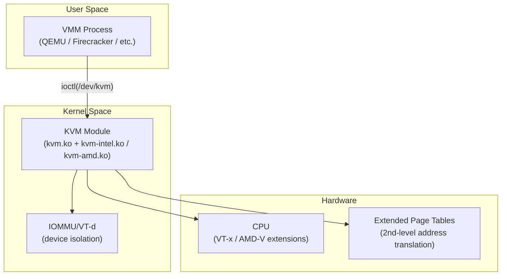

### ioctl API

The KVM API is accessed via ioctl calls on file descriptors:

```c
// 1. Open the KVM device
int kvm_fd = open("/dev/kvm", O_RDWR);

// 2. Create a VM
int vm_fd = ioctl(kvm_fd, KVM_CREATE_VM, 0);

// 3. Configure VM memory
struct kvm_userspace_memory_region region = {
    .slot = 0,
    .guest_phys_addr = 0,
    .memory_size = 256 * 1024 * 1024,  // 256 MiB
    .userspace_addr = (uint64_t)mmap(...)
};
ioctl(vm_fd, KVM_SET_USER_MEMORY_REGION, &region);

// 4. Create a vCPU
int vcpu_fd = ioctl(vm_fd, KVM_CREATE_VCPU, 0);

// 5. Run the vCPU (main loop)
while (1) {
    ioctl(vcpu_fd, KVM_RUN, 0);
    switch (run->exit_reason) {
        case KVM_EXIT_IO:        // Handle I/O port access
        case KVM_EXIT_MMIO:      // Handle MMIO access
        case KVM_EXIT_HLT:       // Guest halted
        case KVM_EXIT_SHUTDOWN:  // Guest shutdown
    }
}
```

### VFIO for Device Passthrough

VFIO (Virtual Function I/O) enables passing physical devices directly to VMs:

```bash
# 1. Unbind device from host driver
echo "0000:01:00.0" > /sys/bus/pci/devices/0000:01:00.0/driver/unbind

# 2. Bind to VFIO driver
echo "vfio-pci" > /sys/bus/pci/devices/0000:01:00.0/driver_override
echo "0000:01:00.0" > /sys/bus/pci/drivers/vfio-pci/bind

# 3. Pass to VM via QEMU
qemu-system-x86_64 -device vfio-pci,host=0000:01:00.0
```

**CUA relevance**: GPU passthrough via VFIO enables hardware-accelerated rendering
in CUA VMs. Relevant for scenarios requiring high-fidelity desktop rendering or
GPU-accelerated applications.

### Nested Virtualization

KVM supports nested virtualization (VM inside VM):
- Enable: `modprobe kvm_intel nested=1` (or `kvm_amd nested=1`)
- Use case: Running Firecracker microVMs inside a cloud VM that already uses KVM
- Performance: 5-20% overhead for nested vs bare-metal KVM
- VMCS shadowing reduces overhead on modern Intel CPUs

### CUA Relevance

KVM is the **foundation** for all Linux-based VM isolation in CUA:
- Firecracker uses KVM for microVM isolation
- QEMU uses KVM for full VM acceleration
- Kata Containers uses KVM (via any of its hypervisor backends)
- Cloud Hypervisor uses KVM
- gVisor can use KVM as its platform (for faster syscall interception)

Requirements: `/dev/kvm` must be accessible. On cloud VMs, nested virtualization
must be enabled by the cloud provider.

---

## 9. QEMU

### Architecture

QEMU is a generic machine emulator and virtualizer. When combined with KVM, it provides
near-native performance with the broadest device model of any VMM.

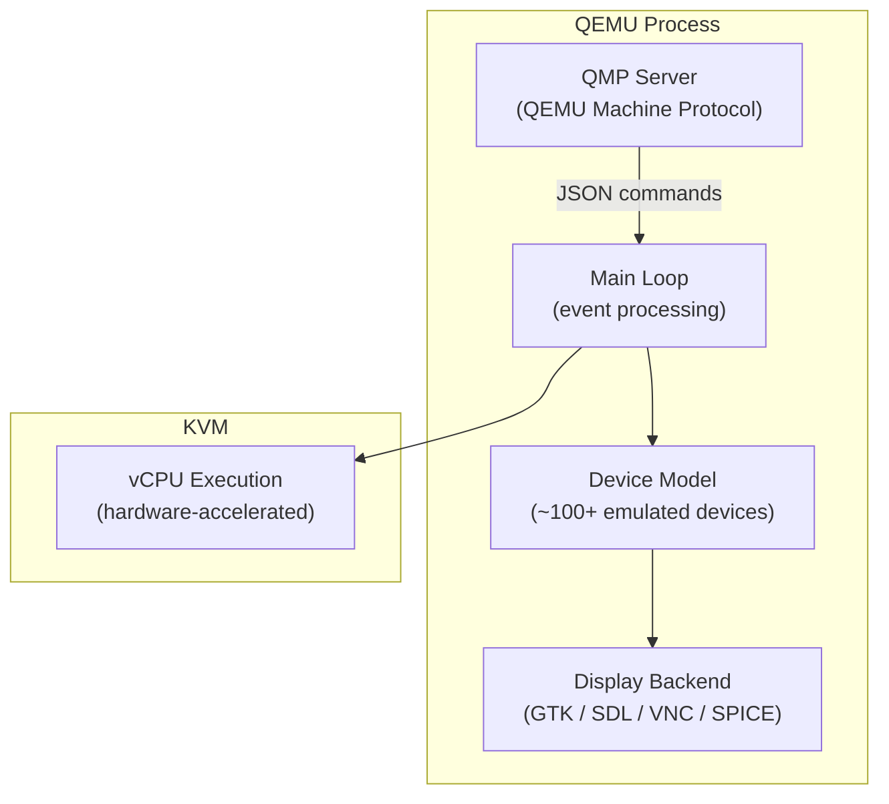

### QMP (QEMU Machine Protocol)

QMP provides a JSON-based management interface:

```json
// Query VM status
{"execute": "query-status"}
// Response: {"return": {"running": true, "singlestep": false, "status": "running"}}

// Take a screenshot
{"execute": "screendump", "arguments": {"filename": "/tmp/screenshot.ppm"}}

// Hot-plug a device
{"execute": "device_add", "arguments": {"driver": "virtio-net-pci", "id": "net1"}}

// Create a snapshot
{"execute": "savevm", "arguments": {"name": "clean-state"}}
```

### Display Options for CUA

| Display Backend | Protocol | Latency | Quality | CUA Use Case |
|---|---|---|---|---|
| **VNC** | RFB | Medium | Good | Remote access, widely supported |
| **SPICE** | SPICE | Low | Excellent (with QXL) | High-quality remote desktop |
| **virtio-gpu** | Native (guest driver) | Lowest | Best | In-guest rendering (Linux guests) |
| **GTK/SDL** | Local window | Lowest | Native | Development/debugging |
| **none/headless** | N/A | N/A | N/A | Server workloads |

For CUA, **SPICE** or **VNC** are the primary options for streaming the desktop to the gateway:

```bash
# QEMU with SPICE display
qemu-system-x86_64 \
    -enable-kvm \
    -cpu host \
    -m 4G \
    -smp 4 \
    -drive file=cua-desktop.qcow2,if=virtio \
    -device virtio-net-pci,netdev=net0 \
    -netdev tap,id=net0,ifname=tap0,script=no \
    -spice port=5900,disable-ticketing=on \
    -device qxl-vga,vgamem_mb=64 \
    -qmp unix:/tmp/qmp.sock,server=on,wait=off
```

### Windows and macOS Guest Support

| Guest OS | KVM Acceleration | Display | Input | CUA Viability |
|---|---|---|---|---|
| **Linux** | Full (native KVM) | VNC/SPICE/virtio-gpu | virtio-input | Excellent |
| **Windows** | Full (KVM + virtio drivers) | QXL+SPICE / VNC | virtio-input / USB tablet | Good (requires virtio drivers) |
| **macOS** | Partial (requires patches) | VNC / GPU passthrough | USB tablet | Experimental (licensing concerns) |

### GPU Passthrough

For CUA sessions requiring hardware-accelerated graphics:

```bash
# QEMU with GPU passthrough (VFIO)
qemu-system-x86_64 \
    -enable-kvm \
    -m 8G \
    -device vfio-pci,host=0000:01:00.0,multifunction=on \
    -device vfio-pci,host=0000:01:00.1 \
    -vga none \
    -nographic \
    -spice port=5900,disable-ticketing=on
```

### CUA-Specific Considerations

**Advantages for CUA**:
- **Broadest guest support**: Windows, Linux, macOS (experimental)
- **GPU passthrough**: VFIO enables hardware-accelerated CUA desktops
- **Mature ecosystem**: Extensive documentation, tooling, community
- **Snapshot/restore**: Save/load VM state for fast session provisioning
- **QMP automation**: Full VM lifecycle control via JSON protocol
- **Rich display options**: SPICE for high-quality remote desktop

**Limitations for CUA**:
- **Large attack surface**: ~100+ emulated devices (vs Firecracker's 5)
- **Slower boot**: ~300-500ms (vs Firecracker's <125ms)
- **Higher memory overhead**: ~30-50 MiB per VM (vs Firecracker's <5 MiB)
- **Complex configuration**: Many knobs to get right for security
- **When to use**: Windows/macOS CUA sessions, GPU passthrough requirements, development environments

---

## 10. Apple Virtualization Framework

### Architecture

Apple's Virtualization.framework provides native VM hosting on Apple Silicon Macs,
with high performance and tight macOS integration.

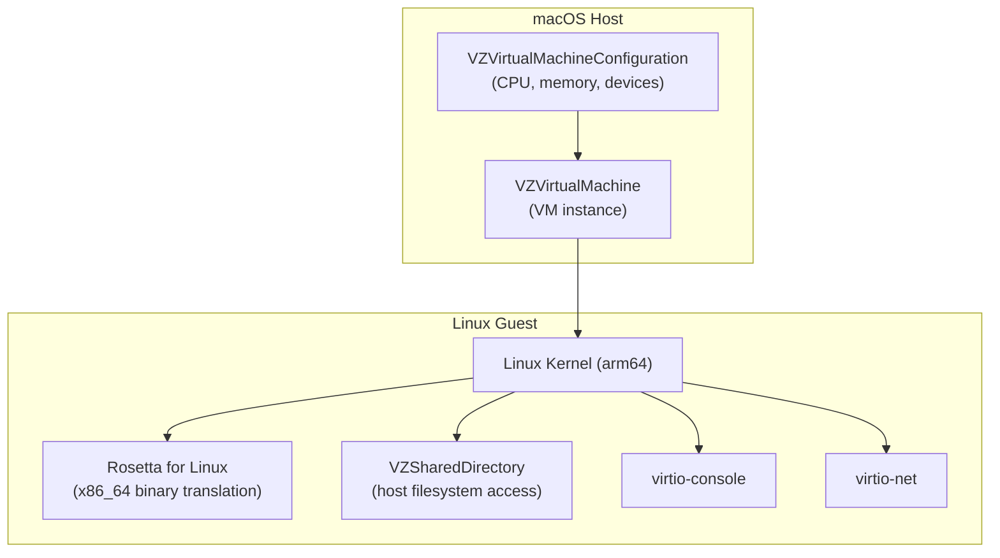

### Key Features

| Feature | Detail |
|---|---|
| **Guest OS** | Linux (arm64 native, x86_64 via Rosetta), macOS (Apple Silicon) |
| **Rosetta for Linux** | Translates x86_64 Linux binaries to ARM; registered via binfmt_misc |
| **Shared directories** | VZSharedDirectory exposes host directories to guest via virtio-fs |
| **Networking** | NAT, bridged, or file handle-based networking |
| **Display** | VZVirtualMachineView (AppKit), or headless |
| **Performance** | Near-native (Apple hypervisor, hardware-accelerated) |
| **Memory** | Balloon device for dynamic memory management |

### Configuration (Swift)

```swift
import Virtualization

let config = VZVirtualMachineConfiguration()

// CPU and memory
config.cpuCount = 4
config.memorySize = 4 * 1024 * 1024 * 1024  // 4 GiB

// Boot loader (Linux)
let bootLoader = VZLinuxBootLoader(kernelURL: kernelURL)
bootLoader.initialRamdiskURL = initrdURL
bootLoader.commandLine = "console=hvc0 root=/dev/vda1"
config.bootLoader = bootLoader

// Storage
let diskImage = try VZDiskImageStorageDeviceAttachment(url: diskURL, readOnly: false)
config.storageDevices = [VZVirtioBlockDeviceConfiguration(attachment: diskImage)]

// Network
let networkDevice = VZVirtioNetworkDeviceConfiguration()
networkDevice.attachment = VZNATNetworkDeviceAttachment()
config.networkDevices = [networkDevice]

// Shared directory (for evidence export)
let sharedDir = VZSharedDirectory(url: evidenceDirURL, readOnly: false)
let dirShare = VZSingleDirectoryShare(directory: sharedDir)
let sharingConfig = VZVirtioFileSystemDeviceConfiguration(tag: "evidence")
sharingConfig.share = dirShare
config.directorySharingDevices = [sharingConfig]

// Rosetta for x86_64 binary support
if VZLinuxRosettaDirectoryShare.availability == .installed {
    let rosettaShare = try VZLinuxRosettaDirectoryShare()
    let rosettaConfig = VZVirtioFileSystemDeviceConfiguration(tag: "rosetta")
    rosettaConfig.share = rosettaShare
    config.directorySharingDevices.append(rosettaConfig)
}

// Create and start VM
let vm = VZVirtualMachine(configuration: config)
try await vm.start()
```

### Go Bindings (`Code-Hex/vz`)

For integration with Go-based CUA gateway components:

```go
import "github.com/Code-Hex/vz/v3"

config := vz.NewVirtualMachineConfiguration(
    vz.NewLinuxBootLoader(kernelPath,
        vz.WithCommandLine("console=hvc0"),
        vz.WithInitrd(initrdPath)),
    4, // cpuCount
    4*1024*1024*1024, // memorySize
)
```

### CUA-Specific Considerations

**Advantages for CUA**:
- **Native macOS performance**: Best VM performance on Apple Silicon
- **Rosetta**: Run x86_64 CUA tools on ARM Macs seamlessly
- **Shared directories**: Easy evidence export from guest to host
- **Low overhead**: Apple's hypervisor is tightly integrated with the hardware
- **macOS guest support**: Can run macOS inside macOS (for macOS CUA sessions)

**Limitations for CUA**:
- **macOS only**: Not available on Linux or Windows hosts
- **No GPU passthrough**: No VFIO equivalent; software rendering only
- **No Windows guests**: Cannot run Windows CUA sessions
- **API is Swift/ObjC**: Requires FFI bridge for Rust gateway components
- **Limited community tooling**: Smaller ecosystem than KVM/QEMU

---

## 11. Hyper-V

### Architecture

Hyper-V is Microsoft's hypervisor, providing both traditional VM hosting and
container isolation on Windows.

### Isolation Modes

| Mode | Description | Kernel Sharing | CUA Use |
|---|---|---|---|
| **Process isolation** | Container shares host kernel (namespace-based) | Yes | Development (Windows host) |
| **Hyper-V isolation** | Container runs in a lightweight Hyper-V VM with its own kernel | No | Production (Windows CUA) |

### Process Isolation (Windows Server 2025)

```bash
# Run Windows container with process isolation
docker run --isolation=process mcr.microsoft.com/windows/servercore:ltsc2025 cmd
```

- Similar to Linux containers: namespace + job object isolation
- Faster startup, lower overhead
- Windows Server default
- New in Server 2025: cross-version process isolation (run 2022 containers on 2025 host)

### Hyper-V Isolation

```bash
# Run Windows container with Hyper-V isolation
docker run --isolation=hyperv mcr.microsoft.com/windows/servercore:ltsc2025 cmd
```

- Each container gets its own kernel (VM-level isolation)
- Hardware-level memory isolation
- Windows 10/11 default for Windows containers
- Higher overhead (~200 MiB memory, ~500ms startup)
- Stronger isolation (comparable to Firecracker/KVM on Linux)

### WSL2 Architecture

WSL2 provides Linux container support on Windows:

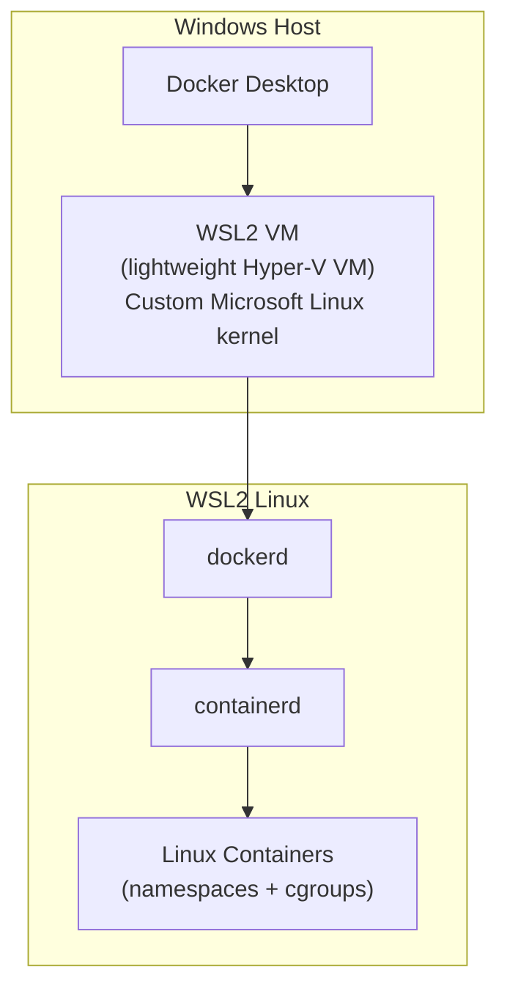

- Single VM hosts all Linux containers (shared kernel)
- Microsoft-maintained Linux kernel
- LCOW (Linux Containers on Windows) deprecated in favor of WSL2
- File system integration via 9P protocol
- GPU support via DirectX/GPU-PV (for CUDA/DirectML in containers)

### CUA-Specific Considerations

**Advantages for CUA**:
- **Windows CUA sessions**: Only option for running Windows desktop in containers
- **Hyper-V isolation**: Strong isolation comparable to KVM-based solutions
- **Cross-version support**: Server 2025 can run older Windows container images
- **WSL2 for Linux CUA**: Run Linux-based CUA sessions on Windows hosts
- **GPU-PV**: GPU acceleration available in WSL2 containers

**Limitations for CUA**:
- **Windows host only**: Cannot use on Linux/macOS hosts
- **Higher overhead**: Hyper-V isolation adds ~200 MiB and ~500ms startup
- **Windows containers are large**: Base images are 1-5 GB (vs ~50-200 MB for Linux)
- **Limited GUI**: Windows containers lack traditional desktop GUI support
  (requires Remote Desktop or similar for interactive sessions)

---

## 12. Comparison Matrix

### Isolation Technology Comparison

| Technology | Isolation Strength | Startup Time | Memory Overhead | Host Kernel Exposure | GPU Passthrough | Operational Complexity | CUA Tier |
|---|---|---|---|---|---|---|---|
| **Docker (runc)** | Weak (namespaces only) | <1s | ~10 MiB | Full (shared kernel) | NVIDIA runtime | Low | Development |
| **gVisor (runsc)** | Medium (app kernel) | 1-2s | ~100-200 MiB | Limited (~68 syscalls) | None | Low-Medium | Staging |
| **Firecracker** | Strong (KVM microVM) | 1-3s | <5 MiB (VMM) + guest | None (hardware boundary) | None | Medium | Production |
| **Kata Containers** | Strong (KVM VM) | 2-4s | ~160 MiB + guest | None (hardware boundary) | VFIO (QEMU backend) | Medium | Production |
| **QEMU/KVM** | Strong (KVM VM) | 3-10s | ~30-50 MiB + guest | None (hardware boundary) | Full VFIO | Medium-High | Production+ |
| **Apple Virtualization** | Strong (Apple HV) | 2-5s | ~50 MiB + guest | None (hardware boundary) | None | Low-Medium | macOS Dev |
| **Hyper-V isolation** | Strong (Hyper-V VM) | 2-5s | ~200 MiB + guest | None (hardware boundary) | GPU-PV (limited) | Medium | Windows Prod |

### Feature Matrix for CUA

| Feature | Docker | gVisor | Firecracker | Kata | QEMU | Apple VF | Hyper-V |
|---|---|---|---|---|---|---|---|
| Linux desktop (Xvfb) | Yes | Yes | Yes | Yes | Yes | Yes | N/A |
| Windows desktop | N/A | N/A | N/A | N/A | Yes | N/A | Yes |
| macOS desktop | N/A | N/A | N/A | N/A | Experimental | Yes | N/A |
| GPU acceleration | Yes (nvidia) | No | No | Yes (QEMU) | Yes (VFIO) | No | Limited |
| OCI image support | Native | Native | Via fc-containerd | Native | Manual | Manual | Native |
| Kubernetes integration | Native | RuntimeClass | Via fc-containerd | RuntimeClass | Manual | N/A | Windows k8s |
| VNC/RDP inside session | Yes | Yes | Yes | Yes | SPICE/VNC | VZView | RDP |
| Snapshot/restore | CRIU (limited) | No | Yes (<5ms) | No | Yes | No | Yes |
| Read-only rootfs | Yes | Yes | Yes | Yes | Yes | Yes | Yes |
| Network policy | iptables/nftables | gVisor netstack | TAP + iptables | TAP + iptables | TAP + iptables | NAT | HNS policies |

### Cost Model (Per-Session)

| Technology | CPU Overhead | Memory Cost | Storage Approach | Sessions/Host (8-core, 32GB) |
|---|---|---|---|---|
| Docker (runc) | ~0% | 10 MiB + app | overlayfs | ~15 (2GB each) |
| gVisor (runsc) | 5-10% (syscall tax) | 200 MiB + app | overlayfs | ~12 |
| Firecracker | ~1% | 5 MiB + guest | block device | ~14 |
| Kata (CH) | ~1% | 160 MiB + guest | block device | ~12 |
| QEMU/KVM | ~1% | 50 MiB + guest | qcow2 | ~13 |

---

## 13. Architecture Recommendations

### Development: Docker + gVisor

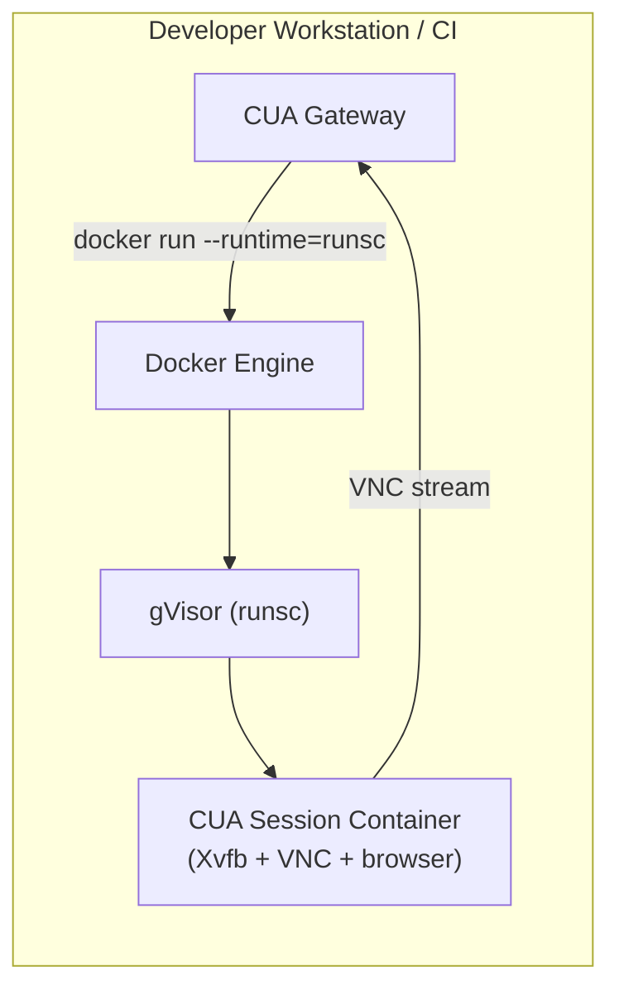

**What to deploy**:
- Docker Engine with gVisor runtime configured
- CUA desktop container image (base: Ubuntu + Xvfb + x11vnc + Chromium)
- Custom seccomp profile and AppArmor policy
- Docker bridge network with egress restrictions

**Configuration**:
```yaml
# docker-compose.yml
services:
  cua-session:
    image: clawdstrike/cua-desktop:dev
    runtime: runsc
    security_opt:
      - seccomp:profiles/cua-seccomp.json
      - no-new-privileges
    cap_drop: [ALL]
    read_only: true
    tmpfs:
      - /tmp:size=1g
      - /home/cua:size=512m
    environment:
      - DISPLAY=:99
      - VNC_PORT=5900
    ports:
      - "5900"  # Random host port for VNC
    networks:
      cua-net:
        ipv4_address: 172.28.0.10

networks:
  cua-net:
    driver: bridge
    ipam:
      config:
        - subnet: 172.28.0.0/24
```

**Why this combination**:
- Fast iteration (container images, no VM kernel to build)
- gVisor provides meaningful isolation without VM complexity
- Standard Docker tooling (compose, build, push)
- Suitable for CI/CD and developer testing

### Staging: Kata Containers (Cloud Hypervisor)

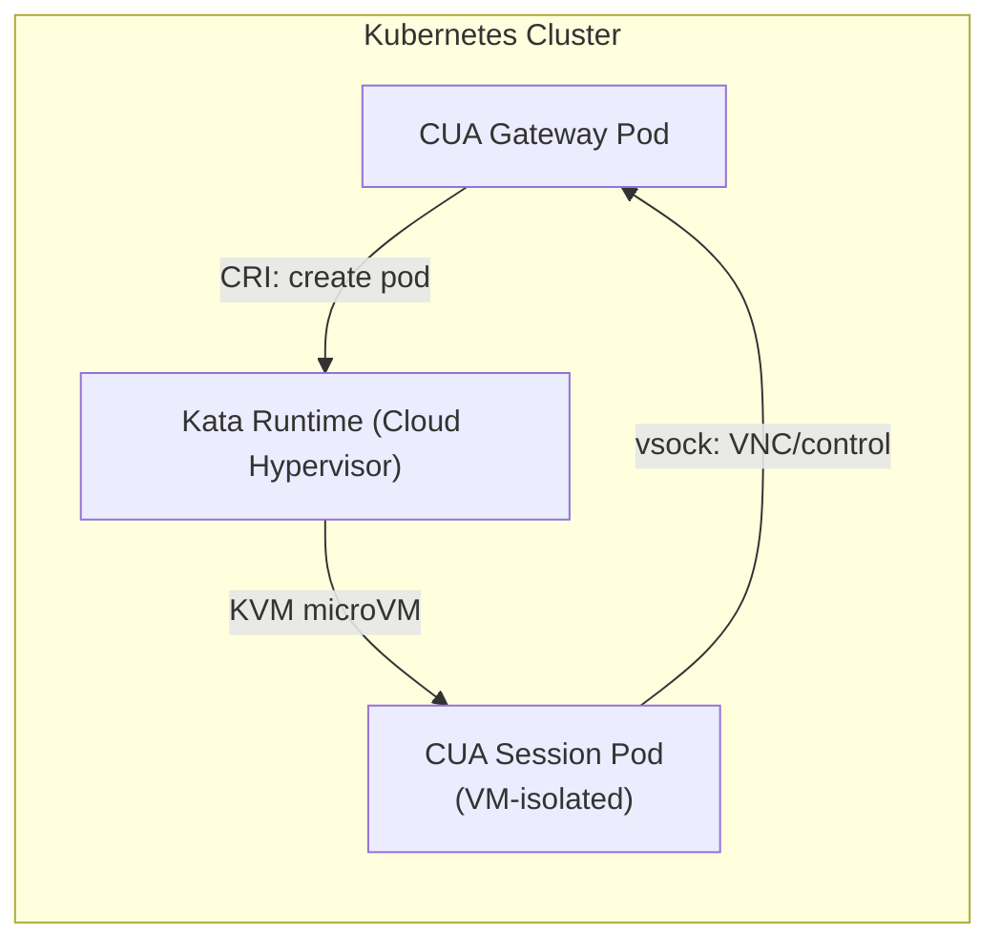

**What to deploy**:
- Kubernetes cluster with Kata Containers RuntimeClass
- Cloud Hypervisor backend (recommended default)
- CUA desktop container image (same OCI image as development)
- NetworkPolicy for per-session egress control
- PodSecurityStandard: restricted

**Kubernetes manifests**:
```yaml
apiVersion: node.k8s.io/v1
kind: RuntimeClass
metadata:
  name: kata-cua
handler: kata
overhead:
  podFixed:
    memory: "200Mi"
    cpu: "250m"
scheduling:
  nodeSelector:
    kata-enabled: "true"

---
apiVersion: v1
kind: Pod
metadata:
  name: cua-session-${SESSION_ID}
  labels:
    app: cua-session
    session-id: ${SESSION_ID}
spec:
  runtimeClassName: kata-cua
  automountServiceAccountToken: false
  securityContext:
    runAsNonRoot: true
    runAsUser: 1000
    seccompProfile:
      type: RuntimeDefault
  containers:
  - name: desktop
    image: clawdstrike/cua-desktop:latest
    resources:
      limits:
        memory: "2Gi"
        cpu: "2"
      requests:
        memory: "1Gi"
        cpu: "500m"
    readinessProbe:
      tcpSocket:
        port: 5900
      initialDelaySeconds: 3
  terminationGracePeriodSeconds: 10

---
apiVersion: networking.k8s.io/v1
kind: NetworkPolicy
metadata:
  name: cua-session-egress
spec:
  podSelector:
    matchLabels:
      app: cua-session
  policyTypes:
  - Egress
  egress:
  - to:
    - ipBlock:
        cidr: 0.0.0.0/0
        except:
        - 10.0.0.0/8      # Block internal network
        - 172.16.0.0/12
        - 192.168.0.0/16
    ports:
    - port: 443
      protocol: TCP
    - port: 80
      protocol: TCP
```

**Why this combination**:
- VM-level isolation (KVM boundary) with container UX
- Standard Kubernetes operations (scale, schedule, monitor)
- Same OCI image as development (no separate VM image build)
- NetworkPolicy for per-session egress control
- Cloud Hypervisor: good balance of security, performance, and features

### Production: Firecracker MicroVMs (Direct)

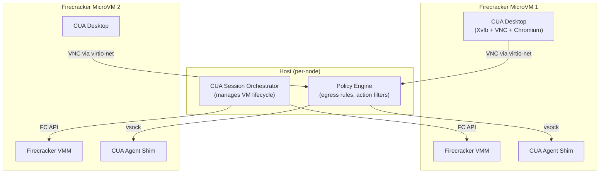

**What to deploy**:
- Custom session orchestrator managing Firecracker VMs
- Jailer for each VM (chroot + seccomp + unprivileged user)
- Pre-built guest kernel (minimal, ~5MB) + rootfs (ext4 image)
- TAP network interfaces with per-VM iptables rules
- vsock for gateway <-> session communication
- Pre-warmed snapshots for fast session start

**Session lifecycle**:

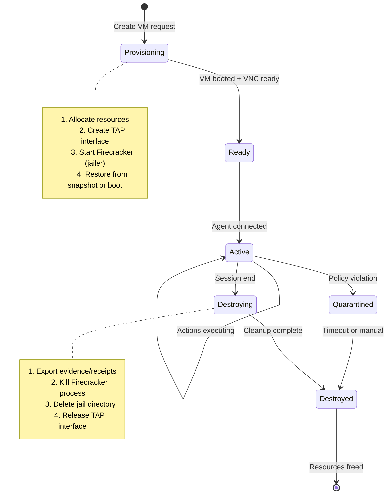

**Why Firecracker for production**:
- Strongest isolation/efficiency ratio (KVM boundary, <5 MiB overhead)
- Minimal attack surface (Rust, 5 devices, jailer hardening)
- Fast boot from snapshots (<5ms restore)
- Per-session isolation is trivial (one VM per session)
- Battle-tested at scale (AWS Lambda, Fargate)

**Additional hardening**:
- Immutable rootfs (read-only block device)
- Writable overlay tmpfs cleaned between sessions
- No internet access from VM; all egress proxied through gateway
- vsock replaces all direct network communication
- Evidence exported via vsock, not shared filesystem

### Decision Matrix

| Deployment | Technology | Isolation Level | Startup | Complexity | Best For |
|---|---|---|---|---|---|
| **Local dev** | Docker + gVisor | Medium | <2s | Low | Rapid iteration, CI |
| **Staging** | Kata (Cloud HV) | Strong (VM) | 2-4s | Medium | Pre-production testing, K8s |
| **Production (Linux CUA)** | Firecracker | Strong (microVM) | 1-3s | Medium | Highest density, lowest overhead |
| **Production (K8s)** | Kata (Cloud HV) | Strong (VM) | 2-4s | Medium | Kubernetes-native operations |
| **Windows CUA** | QEMU/KVM or Hyper-V | Strong (VM) | 5-10s | High | Windows desktop sessions |
| **macOS CUA (dev)** | Apple VF | Strong (HV) | 2-5s | Low-Medium | macOS-hosted development |
| **GPU-required CUA** | QEMU + VFIO | Strong (VM) | 3-10s | High | GPU-accelerated desktop sessions |

### Session Image Strategy

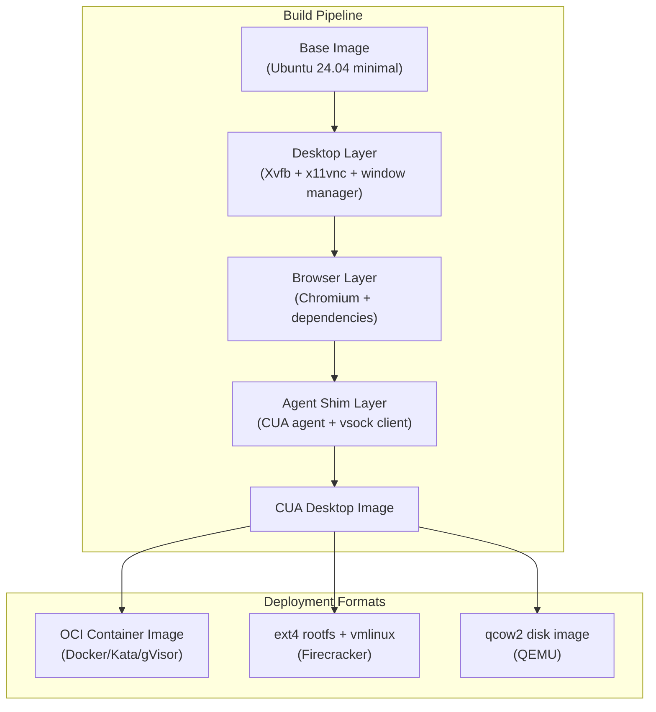

**Image build**:
1. Single Dockerfile defines the CUA desktop environment
2. Build as OCI image (works with Docker, gVisor, Kata)
3. Convert to ext4 for Firecracker: `docker export | mkfs.ext4`
4. Convert to qcow2 for QEMU: `qemu-img convert`
5. Sign with cosign for supply chain integrity
6. Include image digest in receipt metadata

---

## References

### Container Runtimes
- [Docker Engine Security](https://docs.docker.com/engine/security/)
- [Docker Seccomp Profiles](https://docs.docker.com/engine/security/seccomp/)
- [Docker AppArmor Profiles](https://docs.docker.com/engine/security/apparmor/)
- [OWASP Docker Security Cheat Sheet](https://cheatsheetseries.owasp.org/cheatsheets/Docker_Security_Cheat_Sheet.html)
- [containerd Architecture](https://containerd.io/)
- [containerd Runtime v2 and Shim Architecture](https://github.com/containerd/containerd/blob/main/core/runtime/v2/README.md)
- [containerd Plugin Documentation](https://github.com/containerd/containerd/blob/main/docs/PLUGINS.md)

### gVisor
- [gVisor Documentation](https://gvisor.dev/docs/)
- [gVisor Security Model](https://gvisor.dev/docs/architecture_guide/security/)
- [gVisor Architecture Introduction](https://gvisor.dev/docs/architecture_guide/intro/)
- [The True Cost of Containing: A gVisor Case Study (HotCloud '19)](https://www.usenix.org/system/files/hotcloud19-paper-young.pdf)
- [gVisor GitHub](https://github.com/google/gvisor)

### Firecracker
- [Firecracker Official Site](https://firecracker-microvm.github.io/)
- [Firecracker Design Document](https://github.com/firecracker-microvm/firecracker/blob/main/docs/design.md)
- [Firecracker NSDI'20 Paper](https://www.usenix.org/system/files/nsdi20-paper-agache.pdf)
- [Firecracker GitHub](https://github.com/firecracker-microvm/firecracker)
- [firecracker-containerd GitHub](https://github.com/firecracker-microvm/firecracker-containerd)
- [Firecracker vs Docker Technical Boundary](https://huggingface.co/blog/agentbox-master/firecracker-vs-docker-tech-boundary)

### Kata Containers
- [Kata Containers Official Site](https://katacontainers.io/)
- [Kata Containers Virtualization Design](https://github.com/kata-containers/kata-containers/blob/main/docs/design/virtualization.md)
- [Kata with Cloud Hypervisor](https://katacontainers.io/blog/kata-containers-with-cloud-hypervisor/)
- [Enhancing K8s with Kata Containers - AWS Blog](https://aws.amazon.com/blogs/containers/enhancing-kubernetes-workload-isolation-and-security-using-kata-containers/)
- [Kata vs Firecracker vs gVisor Comparison](https://northflank.com/blog/kata-containers-vs-firecracker-vs-gvisor)

### KVM
- [KVM API Documentation - Linux Kernel](https://www.kernel.org/doc/html/v5.13/virt/kvm/api.html)
- [VFIO Documentation - Linux Kernel](https://docs.kernel.org/driver-api/vfio.html)
- [KVM ArchWiki](https://wiki.archlinux.org/title/KVM)
- [PCI Passthrough via OVMF - ArchWiki](https://wiki.archlinux.org/title/PCI_passthrough_via_OVMF)

### QEMU
- [QEMU Documentation](https://www.qemu.org/docs/master/system/qemu-manpage.html)
- [QMP Reference Manual](https://qemu-project.gitlab.io/qemu/interop/qemu-qmp-ref.html)
- [QEMU Guest Graphics Acceleration - ArchWiki](https://wiki.archlinux.org/title/QEMU/Guest_graphics_acceleration)
- [GPU Virtualization with QEMU/KVM - Ubuntu](https://documentation.ubuntu.com/server/how-to/graphics/gpu-virtualization-with-qemu-kvm/)

### Apple Virtualization Framework
- [Virtualization Framework - Apple Developer](https://developer.apple.com/documentation/virtualization)
- [Create macOS or Linux VMs - WWDC22](https://developer.apple.com/videos/play/wwdc2022/10002/)
- [VZLinuxRosettaDirectoryShare - Apple Developer](https://developer.apple.com/documentation/virtualization/vzlinuxrosettadirectoryshare)
- [Code-Hex/vz - Go Bindings](https://github.com/Code-Hex/vz)

### Hyper-V
- [Isolation Modes - Windows Containers](https://learn.microsoft.com/en-us/virtualization/windowscontainers/manage-containers/hyperv-container)
- [Docker Container in Server 2025 - 4sysops](https://4sysops.com/archives/docker-container-in-server-2025-windows-vs-hyper-v-vs-wsl2/)
- [Security for Windows Containers with Hyper-V - Azure](https://azure.github.io/AppService/2020/09/29/Security-for-Windows-containers-using-Hyper-V-Isolation.html)

### Performance Comparisons
- [Firebench: Performance Analysis of KVM-based MicroVMs](https://dreadl0ck.net/papers/Firebench.pdf)
- [Container Security Fundamentals Part 5 - Datadog](https://securitylabs.datadoghq.com/articles/container-security-fundamentals-part-5/)
