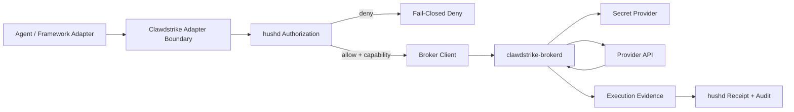
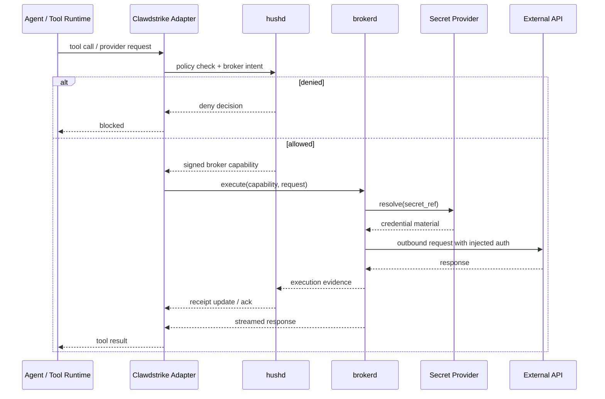

# Spec 19: Secret-Broker Egress Tier

> **Status:** Draft | **Date:** 2026-03-12
> **Author:** Codex
> **Branch:** `feat/secret-broker-specs`
> **Audience:** platform, adapter, daemon, cloud, and enterprise product teams

## 1. Summary / Objective

Design a **brokered egress tier** for Clawdstrike that prevents agents from ever handling raw
provider credentials while preserving Clawdstrike's existing fail-closed policy, identity,
posture, and receipt model.

This feature is not a generic "secret vault." It is an **execution-plane control** for outbound
actions where the act of materializing a credential is itself policy-governed and auditable.

The brokered egress tier should:

1. authorize outbound requests through `hushd`
2. resolve secrets by reference, not by raw value
3. inject credentials inside the broker, never in the caller
4. emit evidence tying request execution back to Clawdstrike policy and session identity
5. work as an explicit provider-scoped broker before any generic transparent proxying is attempted

## 2. Motivation

Clawdstrike already evaluates `network_egress` and related actions, but the current enforcement
surface stops at the policy boundary. The actual outbound request still happens in the caller's
runtime, where:

- credentials may already exist in environment variables or config files
- SDK clients may materialize secrets before Clawdstrike sees the final request
- post-decision evidence is weaker than it could be
- there is no first-class cryptographic binding between "egress approved" and "credential used"

The broker closes that gap.

## 3. Non-Goals

This spec does **not** define:

1. a browser-wide interception layer
2. a universal local root CA / transparent MITM product in v1
3. a general-purpose secrets manager for arbitrary human operators
4. replacement of existing Clawdstrike guard evaluation with a network appliance
5. direct return of raw secrets to adapters, tools, or agent code

## 4. Design Invariants

1. **No raw secret leaves the broker.**
2. **Every credential materialization is preceded by policy authorization.**
3. **Broker execution is bound to a short-lived capability issued by Clawdstrike.**
4. **Destination scope is exact and fail-closed**: method, host, path, and secret alias must match.
5. **Remote broker use is sender-constrained**: a capability must not act like a reusable bearer
   token when `brokerd` is reached over the network.
6. **Evidence is required** for successful execution and attached to the audit trail.
7. **Provider-scoped explicit brokering ships first**. Generic transparent proxying is deferred.
8. **Open source and proprietary boundaries stay explicit**. Protocols and client hooks can be
   public; managed secret backends and hosted multi-tenant broker operations may remain commercial.

## 5. Product Definition

The Secret-Broker Egress Tier introduces a new execution path:



### 5.1 Core components

| Component | Role |
| --- | --- |
| `hushd` | Policy decision authority, capability issuer, receipt signer, evidence sink |
| `clawdstrike-brokerd` | Executes outbound requests, resolves secret references, injects credentials |
| broker client | Adapter-facing library that obtains capabilities and invokes broker endpoints |
| secret provider | Backing store for secret references; may be local, enterprise, or managed cloud |
| provider integration | Typed execution logic for OpenAI, Anthropic, GitHub, Slack, or generic HTTPS |

## 6. Open Core Boundary

### 6.1 Public / open components

- capability token schema
- broker client protocol
- adapter-core broker hooks
- hushd capability issuance and evidence ingestion
- typed provider execution interfaces
- test fixtures and conformance vectors

### 6.2 Commercial / proprietary candidates

- hosted multi-tenant broker control plane
- enterprise secret backends and secret lifecycle UI
- managed compliance evidence storage and retention
- policy packs for broker-scoped controls

The design should not force a proprietary backend in order to prove the architecture. A minimal
in-memory or file-based secret provider is acceptable for open development and tests.

## 7. Execution Model

### 7.1 Request lifecycle



### 7.2 Broker execution modes

| Mode | Description | Priority |
| --- | --- | --- |
| explicit provider mode | adapter or SDK intentionally calls broker for named provider operations | v1 |
| explicit HTTPS mode | adapter supplies method/url/body to broker under strict destination policy | v1.5 |
| transparent proxy mode | generic network interception / TLS mediation | post-v1 |

### 7.3 Repository integration handoff

The current TypeScript adapter-core already supports:

- rewritten dispatch input
- rewritten dispatch parameters
- synthetic execution results via `replacementResult`

Because of that, the recommended v1 path is:

1. keep `PolicyEngineLike` unchanged
2. add broker-aware wrapper/config surfaces around it
3. let explicit provider/framework wrappers call `hushd` for capabilities and `brokerd` for
   execution
4. return brokered results through the existing interceptor pipeline so output sanitization and
   audit behavior still apply
5. sender-constrain remote broker calls using a DPoP-like proof, mutual TLS, or workload identity
   binding rather than treating the capability as a pure bearer token

If that wrapper-owned model becomes too awkward, a later version can introduce an explicit broker
directive in adapter-core rather than overloading `replacementResult` forever.

## 8. Data Model

### 8.1 `CredentialRef`

```ts
interface CredentialRef {
  id: string;
  provider: "openai" | "anthropic" | "github" | "slack" | "generic_https";
  tenantId?: string;
  environment?: "dev" | "staging" | "prod";
  labels?: Record<string, string>;
}
```

### 8.2 `BrokerCapability`

```ts
interface BrokerCapability {
  capabilityId: string;
  issuedAt: string;
  expiresAt: string;
  policyHash: string;
  sessionId?: string;
  endpointAgentId?: string;
  runtimeAgentId?: string;
  runtimeAgentKind?: string;
  originFingerprint?: string;
  secretRef: CredentialRef;
  proofBinding?: {
    mode: "loopback" | "dpop" | "mtls" | "spiffe";
    keyThumbprint?: string;
    workloadId?: string;
  };
  destination: {
    scheme: "https";
    host: string;
    method: "GET" | "POST" | "PUT" | "PATCH" | "DELETE";
    exactPaths: string[];
  };
  requestConstraints: {
    allowedHeaders?: string[];
    maxBodyBytes?: number;
    requireRequestBodySha256?: boolean;
    allowRedirects?: false;
    streamResponse?: boolean;
  };
  evidenceRequired: boolean;
}
```

### 8.3 `BrokerExecuteRequest`

```ts
interface BrokerExecuteRequest {
  capability: string; // JWS or equivalent signed capability envelope
  request: {
    url: string;
    method: "GET" | "POST" | "PUT" | "PATCH" | "DELETE";
    headers?: Record<string, string>;
    body?: string;
    bodySha256?: string;
  };
}
```

### 8.4 `BrokerExecutionEvidence`

```ts
interface BrokerExecutionEvidence {
  capabilityId: string;
  executedAt: string;
  destination: {
    url: string;
    host: string;
    method: string;
  };
  request?: {
    bodySha256?: string;
  };
  response: {
    status: number;
    contentType?: string;
    bodySha256?: string;
  };
  network: {
    remoteCertSha256?: string;
    bytesSent?: number;
    bytesReceived?: number;
  };
  secretUse: {
    secretRefId: string;
    injectionMode: "authorization_header" | "header" | "query" | "provider_native";
  };
}
```

## 9. Policy Surface

Clawdstrike policy needs a broker-aware section that complements existing egress guards rather than
replacing them.

```yaml
version: "1.5.0"
name: "brokered-openai"

guards:
  egress_allowlist:
    allow:
      - "api.openai.com"

broker:
  default_mode: "deny"
  providers:
    openai:
      enabled: true
      secret_ref: "cred_openai_prod"
      allow:
        - method: "POST"
          host: "api.openai.com"
          exact_paths:
            - "/v1/responses"
            - "/v1/chat/completions"
```

This example intentionally uses a **future** schema version. The current repo supports policy
schema versions through `1.4.0`, so adding a top-level `broker:` block should be treated as a new
schema extension rather than backfilled into `1.2.0`.

### 9.1 Relationship to existing guards

- `egress_allowlist` still blocks destinations outside policy
- `secret_leak` still protects outputs and stored artifacts
- broker policy governs **which credential reference may be materialized for which destination**
- output sanitization still runs on model/tool outputs returned to the caller

## 10. API Surface

### 10.1 hushd additions

| Endpoint | Purpose |
| --- | --- |
| `POST /api/v1/broker/capabilities` | issue a short-lived broker capability after policy evaluation |
| `POST /api/v1/broker/evidence` | ingest broker execution evidence for receipts and audit |
| `GET /api/v1/broker/providers` | optional discovery for configured provider modes |

### 10.2 brokerd additions

| Endpoint | Purpose |
| --- | --- |
| `POST /v1/execute` | perform one brokered outbound request under a capability |
| `GET /health` | health check |
| `GET /v1/providers` | supported provider execution modes |

## 11. Repository Integration Strategy

### 11.1 Existing repo seams

| Area | Current files | Planned role |
| --- | --- | --- |
| adapter-core preflight | `packages/adapters/clawdstrike-adapter-core/src/base-tool-interceptor.ts` | derive broker intent and optionally return a synthetic broker result |
| adapter-core wrappers | `packages/adapters/clawdstrike-adapter-core/src/framework-tool-boundary.ts`, `packages/adapters/clawdstrike-adapter-core/src/secure-tool-wrapper.ts` | first wrapper-based broker adoption path |
| adapter contracts | `packages/adapters/clawdstrike-adapter-core/src/adapter.ts`, `packages/adapters/clawdstrike-adapter-core/src/interceptor.ts`, `packages/adapters/clawdstrike-adapter-core/src/engine.ts` | host opt-in broker config while keeping the core evaluation contract stable |
| framework adoption | `packages/adapters/clawdstrike-openai/src/secure-tools.ts`, `packages/adapters/clawdstrike-openai/src/tool-boundary.ts` | first likely framework adopter |
| policy authority | `crates/services/hushd/src/api/mod.rs`, `crates/services/hushd/src/api/check.rs`, `crates/services/hushd/src/state.rs` | add capability issuance and evidence ingestion |
| policy schema | `crates/libs/clawdstrike/src/policy.rs` | add broker-aware policy surface |
| local packaging | `apps/agent/src-tauri/src/settings.rs`, `apps/agent/scripts/prepare-bundled-hushd.sh` | future local broker deployment mode |

### 11.2 Failure and degraded behavior

- broker-required actions fail closed if `hushd` cannot issue a capability
- broker-required actions fail closed if `brokerd` is unavailable
- existing degraded/offline eval behavior for ordinary checks does not imply permission to
  materialize secrets offline
- evidence persistence is part of the execution contract, not an optional afterthought
- remote broker calls should use sender-constrained proof instead of bearer-only capability use

## 12. Security Properties

### 12.1 Threats reduced

- agent prompt or tool logic exfiltrating raw API keys
- accidental credential logging in application code
- direct use of broader-than-necessary credentials in agent runtimes
- unbound "allow egress" decisions that cannot prove what was actually executed

### 12.2 Threats not eliminated

- destination compromise after a legitimate request is sent
- malicious provider SDK behavior inside the broker if the provider integration itself is unsafe
- data exfiltration using otherwise-approved destinations and schemas
- abuse of user-approved broker policies

## 13. Decision

Clawdstrike should build a **brokered egress execution tier** because it extends the existing
policy-and-receipt model into the credential materialization boundary. It should **not** start as
a generic transparent MITM proxy.

The first implementation should target:

1. explicit provider-scoped broker execution
2. capability issuance in `hushd`
3. evidence-return and receipt binding
4. a small set of providers with clear enterprise demand

## 14. Open Questions

1. Should broker capabilities be signed receipts, JWS documents, or a distinct envelope type?
2. Does evidence ingestion mutate the original receipt or create a linked execution receipt?
3. Which secret backends ship in open source versus enterprise builds?
4. Should local developer mode run brokerd inside the desktop agent, beside `hushd`, or as a
   standalone daemon?
5. How much generic HTTPS support is necessary before provider-specific coverage is considered
   sufficient for initial release?
